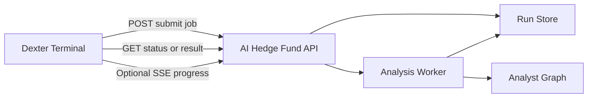
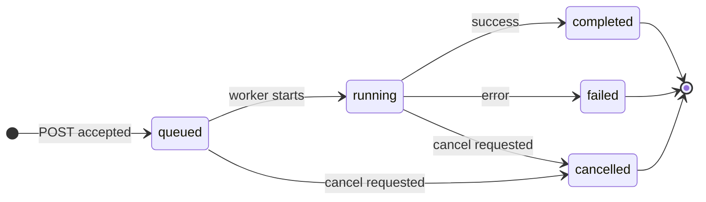

# PRD: Dexter to AI Hedge Fund Integration

**Status:** Draft  
**Last updated:** 2026-03-08  
**Owner:** Product / Engineering

---

## 1. Problem statement and rationale

### 1.1 Goal

Enable [Dexter](https://github.com/eliza420ai-beep/dexter) (the primary thesis-driven researcher) to trigger second-opinion analysis from the AI Hedge Fund without shelling out to this repo or running the CLI manually. Dexter defines the thesis, sleeves, and candidate names; AI Hedge Fund runs the 18-agent committee plus risk and portfolio management. The integration should support **asynchronous job execution**: Dexter submits a run, receives a run identifier, and polls or subscribes until completion so the terminal is not blocked for long-running analyses.

### 1.2 Non-goals (for this PRD)

- Replacing Dexter as the portfolio architect or changing AI Hedge Fund’s role as the second-opinion layer.
- Full multi-tenant auth, rate limiting, or tenant isolation in the first phase.
- Real-time streaming as the only integration path; polling is the baseline.

### 1.3 Rationale for async HTTP job API

Using an **asynchronous HTTP job API** (submit → poll status/result, optional SSE) is the right fit because:

- **Existing backend patterns:** The repo already has a FastAPI backend ([`app/backend/main.py`](../app/backend/main.py)), long-running analysis with SSE progress in [`app/backend/routes/hedge_fund.py`](../app/backend/routes/hedge_fund.py), and a persisted run-resource model in [`app/backend/routes/flow_runs.py`](../app/backend/routes/flow_runs.py) and [`app/backend/database/models.py`](../app/backend/database/models.py) (`HedgeFundFlowRun`). The PRD anchors on these instead of introducing ad hoc CLI bridging or a separate job queue.
- **Industry standard:** Long-running inference and agent orchestration commonly use “submit job → return resource ID → poll or stream” so clients are not blocked and runs survive disconnects. Same pattern is used by model APIs, workflow engines, and internal tools.
- **Reuse:** Execution orchestration behind `POST /hedge-fund/run` (graph build, `run_graph_async`, progress handler, SSE) can be extracted into a shared service used by both the web UI and the new Dexter-triggered job API. Second-opinion runs should align with the existing flow-run style (status, timestamps, request_data, results, error_message) rather than a one-off execution record.

---

## 2. Architecture and data flow

### 2.1 High-level flow

- **Dexter** is the caller and orchestrator; it decides when to request a second opinion (e.g. after defining a sleeve or reviewing The Fund).
- **AI Hedge Fund API** accepts job submission, persists a run resource, starts the analysis worker, and exposes status, result, and optional event stream.
- **Run store** persists run metadata and results (align with existing `HedgeFundFlowRun`-style tables or a dedicated second-opinion run table).
- **Analysis worker** reuses the same graph compilation and `run_graph_async` logic used by `POST /hedge-fund/run`, so behavior stays identical for web and Dexter.

### 2.2 Job state machine

States are deterministic and stored on the run resource: `queued`, `running`, `completed`, `failed`, `cancelled`. Terminal states are `completed`, `failed`, `cancelled`.

---

## 3. API contract

### 3.1 Base URL and versioning

- Base path: `/api/v1/second-opinion`
- All second-opinion job endpoints live under this path so they can be versioned and extended independently.

### 3.2 Endpoints

| Method | Path | Purpose |
|--------|------|---------|
| POST   | `/api/v1/second-opinion/runs` | Submit a new second-opinion run (returns 202 + run_id). |
| GET    | `/api/v1/second-opinion/runs/{run_id}` | Get run metadata and status. |
| GET    | `/api/v1/second-opinion/runs/{run_id}/events` | Optional SSE stream of progress events. |
| GET    | `/api/v1/second-opinion/runs/{run_id}/result` | Get final result (only when status is `completed`). |
| POST   | `/api/v1/second-opinion/runs/{run_id}/cancel` | Request cancellation (idempotent for terminal states). |

### 3.3 Submit request and response

**Request body (POST `/api/v1/second-opinion/runs`):**

- `tickers` (required): list of ticker symbols.
- `portfolio_snapshot` (optional): initial cash, margin requirement, positions (align with existing `HedgeFundRequest` / `create_portfolio` inputs).
- `thesis_context_ref` (optional): reference to SOUL.md path or session id for traceability.
- `analyst_selection` (optional): list of analyst ids, or “all”; defaults to all.
- `model_name` / `model_provider` (optional): override default model.
- `idempotency_key` (optional): client-generated key; if a run with this key already exists, return 200 with that run instead of creating a new one.
- `trace_metadata` (optional): map (e.g. `sleeve`, `session_id`) for tying the run back to Dexter sessions.

**Response (202 Accepted):**

- `run_id`: unique run identifier (UUID or integer per existing schema).
- `status`: `queued`.
- `status_url`: URL for `GET /api/v1/second-opinion/runs/{run_id}`.
- `result_url`: URL for `GET /api/v1/second-opinion/runs/{run_id}/result`.
- `events_url`: URL for optional SSE `GET /api/v1/second-opinion/runs/{run_id}/events`.

If `idempotency_key` is supplied and matches an existing run, return **200 OK** with that run’s summary (same fields as 202) so Dexter can safely retry.

### 3.4 Status response (GET run)

- `run_id`, `status` (`queued` | `running` | `completed` | `failed` | `cancelled`), `created_at`, `started_at`, `completed_at`.
- If `failed` or `cancelled`: `error_message` or `cancel_reason` when applicable.
- No heavy result payload on status; that lives under `/result`.

### 3.5 Result response (GET result)

- Only available when `status == completed`; otherwise 404 or 409 with current status.
- Body: same shape as the current “complete” SSE payload: e.g. `decisions`, `analyst_signals`, `current_prices` (see [`app/backend/models/events.py`](../app/backend/models/events.py) `CompleteEvent` and [`app/backend/routes/hedge_fund.py`](../app/backend/routes/hedge_fund.py) parsing). Optionally include a terminal-friendly summary (e.g. per-ticker BUY/SELL/HOLD and confidence).

### 3.6 Events stream (GET events, optional)

- SSE stream of events compatible with existing event types: `start`, `progress`, `error`, `complete` (see [`app/backend/models/events.py`](../app/backend/models/events.py)).
- Client can disconnect anytime; run continues and result remains available via GET result.

### 3.7 Cancel (POST cancel)

- Idempotent: if run is already `cancelled` or in another terminal state, return 200 with current status.
- If run is `queued` or `running`, transition to `cancelled` and stop the worker if possible.

### 3.8 Error model

- **4xx:** Invalid request (e.g. missing tickers, invalid idempotency key format). Return a small JSON body with `code` and `message`.
- **5xx:** Server/worker failure. Attach error details to the run resource (`error_message`) so Dexter can fetch them via GET run after the fact.
- Run-level errors are always stored on the run; clients can poll status and then fetch result or error_message.

---

## 4. Idempotency

- **Submit:** If the request includes `idempotency_key`, the server checks whether a run with that key already exists (e.g. in a dedicated column or idempotency key store). If yes, return 200 with that run’s summary; if no, create a new run and return 202. Key scope can be global or per-“client” if we introduce a minimal client id later.
- **Cancel:** Multiple cancel requests for the same run are safe and return 200 with current status once in a terminal state.

---

## 5. Security model

### 5.1 Phase 1: Localhost single-user

- **Trust assumption:** The API runs on the same machine as Dexter, or on a private loopback/private network; the only caller is the local user or a local Dexter process.
- **Binding:** Server binds to `127.0.0.1` (or configurable host) so it is not exposed to the network unless explicitly configured.
- **Auth:** No mandatory auth in phase 1. Optional: a single shared secret (e.g. env `AIHF_DEXTER_SECRET`) sent in a header (e.g. `X-Dexter-Secret`) so that only Dexter (or a script that has the secret) can call the API. Reject requests without the secret if the env is set.
- **No rate limiting** in phase 1 beyond protecting the process from accidental DoS (e.g. one concurrent run per “second-opinion” queue if desired).

### 5.2 Future phase: Private network / team

- **Auth:** API key or JWT per client (or per user). Validate on every request; store keys or issuers in config/DB.
- **Rate limiting:** Per-client or per-user limits on submit and on GET to avoid abuse.
- **Tenant isolation:** If multiple teams use the same deployment, associate runs with a tenant or user id and filter all endpoints by that identity. Not required for single-team private network.

### 5.3 Not in scope for this PRD

- Public internet deployment, CAPTCHA, or advanced abuse prevention.
- Encryption in transit (handled by deployment: TLS at load balancer or reverse proxy).

---

## 6. Observability

- **Request ID:** Generate a request id (e.g. `X-Request-Id`) for each incoming request; log it and optionally return it in response headers so Dexter can pass it back for support.
- **Run ID:** Every run has a stable `run_id`; all logs and events for that run should include `run_id`.
- **Structured logs:** Log submit, status transitions, completion, failure, and cancel with `run_id`, `status`, and duration. Use structured fields (JSON or key-value) so log aggregation can query by run_id or status.
- **Metrics (optional in phase 1):** Count of runs by status, latency from submit to completed/failed, cancel count. Can be added later without changing the API.

---

## 7. Failure modes and operator runbook

| Failure | Behavior | Operator action |
|--------|----------|-----------------|
| Worker crash mid-run | Run status set to `failed`; `error_message` or logs contain exception. | Inspect run via GET run; check server logs; fix config or code and resubmit if needed. |
| Server restart with queued/running jobs | On startup, mark runs that were `running` as `failed` (or re-queue if a job queue is introduced). | Document in runbook; consider persisting worker state in a later phase. |
| Dexter timeout / disconnect | Run continues; result available via GET result. | No action; Dexter can poll status/result when back. |
| Duplicate submit (same idempotency key) | Return 200 with existing run. | None. |
| Invalid request (e.g. empty tickers) | 400 with message. | Fix request in Dexter or client. |
| DB or storage unavailable | 503 on submit or on GET. | Check DB/storage; restart service. |

---

## 8. Rollout phases and acceptance criteria

### 8.1 Phase 1: Localhost single-user

- **Scope:** One machine; Dexter and AI Hedge Fund backend on same host or trusted private network.
- **Deliverables:**
  - Implement `POST /api/v1/second-opinion/runs` (202 + run_id; idempotency key supported).
  - Implement `GET /api/v1/second-opinion/runs/{run_id}` (status, timestamps, error_message).
  - Implement `GET /api/v1/second-opinion/runs/{run_id}/result` (when completed).
  - Implement `POST /api/v1/second-opinion/runs/{run_id}/cancel`.
  - Optional: `GET /api/v1/second-opinion/runs/{run_id}/events` (SSE).
  - Extract or reuse execution logic from `hedge_fund.run` so one code path runs the graph for both web UI and second-opinion jobs.
  - Persist second-opinion runs (new table or reuse/align with `HedgeFundFlowRun` pattern).
  - Bind to loopback by default; optional `X-Dexter-Secret` when env is set.
- **Acceptance criteria:**
  - Dexter can submit a second-opinion run for a sleeve or ticker basket without shelling into this repo.
  - Dexter can poll status and read final results in terminal-friendly form.
  - Submitting twice with the same idempotency key does not create duplicate runs.
  - A failed or cancelled run is inspectable (GET run returns status and error_message).
  - Integration path is compatible with a future private-network deployment (no hardcoded localhost-only assumptions in the API contract).

### 8.2 Phase 2: Private network / team (future)

- **Scope:** Service on private network; optional auth and rate limiting.
- **Deliverables:** Auth (API key or JWT), rate limiting, optional tenant/user association for runs.
- **Acceptance criteria:** Only authenticated clients can submit or read runs; rate limits enforced; runs can be attributed to a user or tenant.

---

## 9. Why this design is idiomatic

- **Submit returns a job resource, not a blocking payload** — Clients get a run_id and URLs; they do not hold an open connection for the full analysis. This matches common patterns for inference APIs, workflow engines, and batch jobs.
- **Progress and result retrieval are decoupled** — Status and result are separate endpoints; optional SSE is an enhancement, not required for correctness.
- **Cancellation is explicit** — Cancel is a first-class action; idempotent so callers can retry safely.
- **Errors are attached to the run** — Failed runs store `error_message` (and optionally stack trace or logs reference) so debugging does not depend on the client still being connected.
- **Same API can serve multiple clients** — Local CLI, web UI, and Dexter (or other agents) can all use the same submit/status/result/cancel contract without redesign.

---

## 10. References

- Existing FastAPI app: [`app/backend/main.py`](../app/backend/main.py)
- Hedge fund run and SSE: [`app/backend/routes/hedge_fund.py`](../app/backend/routes/hedge_fund.py)
- Flow run resource pattern: [`app/backend/routes/flow_runs.py`](../app/backend/routes/flow_runs.py), [`app/backend/repositories/flow_run_repository.py`](../app/backend/repositories/flow_run_repository.py)
- Run and event schemas: [`app/backend/models/schemas.py`](../app/backend/models/schemas.py), [`app/backend/models/events.py`](../app/backend/models/events.py)
- DB models: [`app/backend/database/models.py`](../app/backend/database/models.py)
- README (Dexter second-opinion and FastAPI): [README.md](../README.md)
