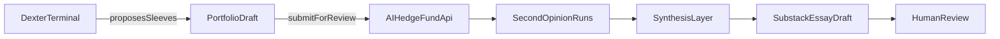

# PRD: North Star — Dexter Portfolio, Second Opinion, Substack Essay

**Status:** Draft  
**Last updated:** 2026-03-08  
**Owner:** Product / Engineering  
**Extends:** [PRD-DEXTER-AI-HEDGE-FUND-INTEGRATION.md](PRD-DEXTER-AI-HEDGE-FUND-INTEGRATION.md) (transport and execution layer)

---

## 1. Problem statement and north-star vision

### 1.1 Vision

The north-star workflow is: **Dexter suggests the portfolios; AI Hedge Fund gives a second opinion on every selected asset; the combined output is turned into a Substack essay draft for human review and publication.**

As described in [The Researcher Who Thinks](https://ikigaistudio.substack.com/p/the-researcher-who-thinks), [Dexter](https://github.com/eliza420ai-beep/dexter) is a thesis-driven researcher that reads `SOUL.md`, reasons from identity and thesis inward, and defines the target structure for the fund. As described in [The Fund](https://ikigaistudio.substack.com/p/the-fund), that thesis expresses itself through **two sleeves with zero overlap**: a Tastytrade sleeve (picks-and-shovels, traditional equity rails) and a Hyperliquid sleeve (foundry, tokenization rails, regime hedges). This repo ([AI Hedge Fund](https://github.com/eliza420ai-beep/ai-hedge-fund)) exists to be the **adversarial committee** around that process: a structured second opinion on the names, sizing, and regime assumptions coming out of Dexter.

The north star is not only to run second opinions ad hoc, but to **automate the full loop**: portfolio proposal → committee review on every asset → synthesis into a publishable narrative. The essay is the artifact that ties thesis, committee challenge, and human judgment together for the Substack audience.

### 1.2 Why this workflow exists

- **Thesis-first, then challenge.** Dexter owns the thesis (e.g. [SOUL.md](../SOUL.md) layers, conviction tiers, sizing rules). AI Hedge Fund does not replace that; it pressures it with 18 analyst agents, risk and portfolio management, and traditional lenses (fundamentals, valuation, technicals, sentiment). The README states: *"The output we care about is disagreement."*
- **Two sleeves, first-class.** Both the Tastytrade sleeve and the Hyperliquid sleeve are in scope. Every asset selected for either sleeve is sent through the committee so conviction is challenged before it becomes portfolio truth.
- **Essay as output.** The Fund essay and similar Substack pieces document the construction logic, the regime playbook, and the edge. Automating a draft from thesis + second-opinion data keeps the narrative aligned with the process and makes the disagreement visible in prose.

### 1.3 Goals

- Dexter proposes both sleeves in a **structured format** (assets, weights, rationale, thesis refs) suitable for downstream automation.
- AI Hedge Fund runs second-opinion analysis on **every asset** in both sleeves via the existing async FastAPI integration (see [PRD-DEXTER-AI-HEDGE-FUND-INTEGRATION.md](PRD-DEXTER-AI-HEDGE-FUND-INTEGRATION.md)).
- A **synthesis layer** (in Dexter, in this repo, or shared) turns thesis intent + committee results into a **Substack essay draft** that surfaces agreement, disagreement, and open questions.
- **Human review remains the publication gate**: draft generation is mostly automated; publishing is not.

### 1.4 Non-goals

- Replacing Dexter as portfolio architect or AI Hedge Fund as second-opinion engine.
- Full automation of publishing (no auto-publish to Substack).
- Redefining the transport layer: the existing second-opinion run API (submit → poll/SSE → result) remains the execution path.
- Supporting more than two sleeves in the first version (Tastytrade + Hyperliquid only).

---

## 2. Actors and responsibilities

| Actor | Responsibility |
|-------|----------------|
| **Dexter** | Primary researcher and portfolio architect. Reads SOUL.md, proposes Tastytrade and Hyperliquid sleeves (assets, target weights, rationale). Triggers second-opinion runs via FastAPI. Consumes committee results and (with or without a shared synthesis step) drives essay draft generation. |
| **AI Hedge Fund** | Second-opinion engine. Exposes async job API; runs 18 analyst agents + risk + portfolio manager per run. Returns per-asset decisions, analyst signals, confidence, and reasoning. Does not select the portfolio; it evaluates what Dexter proposes. |
| **Synthesis layer** | Converts portfolio draft + second-opinion results into a structured essay brief and prose draft. May live in Dexter, in this repo as a separate service, or in a shared CLI/script. |
| **Human editor / publisher** | Reviews the essay draft, edits as needed, and publishes to Substack. No automated publish. |

Role boundaries from the [README](../README.md) are preserved: *"This repo is not meant to replace Dexter. It is meant to challenge it."* FastAPI remains the trigger surface from the Dexter terminal into this repo.

---

## 3. End-to-end workflow

### 3.1 High-level flow

### 3.2 Stage description

1. **Dexter proposes sleeves**  
   From SOUL.md and any session context, Dexter produces a **PortfolioDraft** for the Tastytrade sleeve and one for the Hyperliquid sleeve. Each draft includes asset list, target weights, rationale, and optional thesis refs (layer, tier, regime).

2. **Submit for second opinion**  
   For each sleeve (or for the combined set), Dexter submits one or more second-opinion jobs to the AI Hedge Fund API (`POST /api/v1/second-opinion/runs`). Each job includes the tickers for that sleeve, optional portfolio snapshot, thesis context ref, and trace metadata (e.g. `sleeve: tastytrade`). The API returns a run_id; Dexter polls (or uses SSE) until completion.

3. **AI Hedge Fund runs**  
   The existing analysis worker runs the 18-agent graph plus risk and portfolio management. Results include per-asset decisions (BUY/SELL/HOLD etc.), analyst signals, confidence, and reasoning. These are returned via `GET .../runs/{run_id}/result` when status is `completed`.

4. **Synthesis**  
   A synthesis layer takes the PortfolioDraft(s) and the second-opinion result(s) and builds:
   - A machine-readable **comparison** (thesis intent vs committee stance per asset).
   - An **EssayBrief** (headline thesis, sleeve sections, agreement/disagreement highlights, regime notes, benchmark context, open questions).
   - A **Substack essay draft** (prose) suitable for human editing.

5. **Human review**  
   The human editor reviews the draft, edits for voice and clarity, and publishes to Substack when ready. Publication is always human-gated.

---

## 4. Product-level data contracts

These artifacts define the handoffs between stages. They are product-level; the actual API request/response shapes for second-opinion runs remain as in [PRD-DEXTER-AI-HEDGE-FUND-INTEGRATION.md](PRD-DEXTER-AI-HEDGE-FUND-INTEGRATION.md).

### 4.1 PortfolioDraft

Produced by Dexter. Represents one sleeve (Tastytrade or Hyperliquid) proposed for second opinion.

| Field | Type | Description |
|-------|------|-------------|
| `sleeve` | string | `tastytrade` or `hyperliquid`. |
| `assets` | array | List of `{ symbol, target_weight_pct?, rationale? }`. |
| `thesis_ref` | string? | Reference to SOUL layer/tier or short label (e.g. "equipment", "tokenization rails"). |
| `regime_note` | string? | Optional regime context (e.g. "trending-bull", "mean-reverting"). |
| `trace_metadata` | object? | Session id, run id from Dexter, etc., for tying back to thesis sessions. |

### 4.2 SecondOpinionSummary

Derived from AI Hedge Fund run result. One per asset (or aggregated from the run result).

| Field | Type | Description |
|-------|------|-------------|
| `symbol` | string | Ticker/symbol. |
| `committee_stance` | string | e.g. BUY, SELL, HOLD, SHORT, COVER. |
| `confidence` | number? | Aggregate or PM confidence. |
| `analyst_disagreement` | string? | Summary of where analysts diverge. |
| `risk_notes` | string? | Notable risk or position-limit messages. |
| `sleeve` | string? | Which sleeve this asset belongs to (from trace_metadata). |

The full run result may include more (e.g. per-analyst signals, reasoning); SecondOpinionSummary is the minimal product view needed for agreement/disagreement and essay synthesis.

### 4.3 EssayBrief

Structured input for the Substack draft. Produced by the synthesis layer.

| Field | Type | Description |
|-------|------|-------------|
| `headline_thesis` | string | One-line thesis (e.g. "Two sleeves, one thesis, zero overlap"). |
| `sleeve_sections` | array | Per-sleeve: name, role, key assets, thesis intent, committee summary (agree/disagree highlights). |
| `agreement_highlights` | array | Assets where thesis and committee align; short bullets. |
| `disagreement_highlights` | array | Assets where thesis and committee diverge; short bullets and suggested narrative. |
| `regime_notes` | string? | Current regime and sizing implications. |
| `benchmark_context` | string? | Optional: SPY, BTC, etc., for performance framing. |
| `open_questions` | array | Items left for human judgment or follow-up. |

The essay draft (prose) is generated from the EssayBrief plus VOICE.md-style guidelines so the draft matches the intended tone and structure.

---

## 5. Output artifact: Substack essay draft

- **Format:** Markdown (or Substack-ready HTML) with title, subhead, sections per sleeve, and optional benchmark/regime section.
- **Content sources:** EssayBrief + (optionally) selected quotes from analyst reasoning or risk notes.
- **Voice:** Consistent with VOICE.md / brand (e.g. [The Fund](https://ikigaistudio.substack.com/p/the-fund) style). The synthesis layer should take a voice/profile input so the draft is recognizable.
- **Human edits:** The draft is explicitly a starting point. Sections that need nuance, caveats, or updated numbers are left for the human editor. Open questions from the EssayBrief can be called out in the draft as "TBD" or "Editor note."

The core artifact is not only the essay; it is the **machine-readable comparison** (thesis vs committee per asset) so that future runs can reuse it for attribution, reporting, or different narrative formats.

---

## 6. Operational flow, retries, and review checkpoints

- **Second-opinion runs:** Follow the existing integration PRD: async submit, poll or SSE, idempotency key for retries. If a run fails, Dexter (or the operator) can resubmit with the same idempotency key or fix inputs and submit a new run.
- **Synthesis:** If synthesis runs in Dexter, it can retry on transient failures (e.g. missing run result). If synthesis runs in this repo, it should consume completed run results from the run store and produce the EssayBrief and draft; failures can be logged and the human can re-run or fix data.
- **Review checkpoints:** (1) After PortfolioDraft: human can optionally review sleeve proposal before submitting to AI Hedge Fund. (2) After second-opinion result: human can inspect agreement/disagreement before synthesis. (3) After draft: human must review before publish. The PRD assumes checkpoint (3) is mandatory; (1) and (2) are optional.

---

## 7. Rollout phases and acceptance criteria

### 7.1 Phase 1: Structured proposal + second opinion (no essay yet)

- **Scope:** Dexter produces a structured PortfolioDraft (both sleeves). Dexter (or a script) submits second-opinion job(s) to AI Hedge Fund for all assets. Results are consumed and displayed (e.g. terminal or simple report). No automated essay draft yet.
- **Deliverables:**
  - Dexter (or shared spec) defines and emits PortfolioDraft format for Tastytrade and Hyperliquid.
  - Second-opinion runs are triggered per sleeve or combined, using existing `/api/v1/second-opinion/runs` API.
  - A minimal comparison view (thesis intent vs committee stance per asset) is available (e.g. in Dexter terminal or a small script).
- **Acceptance criteria:**
  - Dexter can propose both sleeves in a structured format suitable for automation.
  - AI Hedge Fund evaluates every selected asset without manual re-entry.
  - Operator can see agreement/disagreement per asset.

### 7.2 Phase 2: Essay draft generation

- **Scope:** Synthesis layer implemented. It takes PortfolioDraft(s) + second-opinion result(s) and produces an EssayBrief and a Substack essay draft. Human reviews and publishes.
- **Deliverables:**
  - EssayBrief and draft generation from PortfolioDraft + run result(s).
  - Draft references thesis intent and committee challenge; surfaces agreement and disagreement.
  - Human review and edit before publish; no auto-publish.
- **Acceptance criteria:**
  - System produces a draft Substack essay that references both thesis intent and committee challenge.
  - Draft surfaces where Dexter and the committee agree, where they diverge, and what still needs human judgment.
  - Design remains compatible with the async FastAPI integration in [PRD-DEXTER-AI-HEDGE-FUND-INTEGRATION.md](PRD-DEXTER-AI-HEDGE-FUND-INTEGRATION.md).

### 7.3 Phase 3 (future): Polish and reuse

- **Scope:** Voice tuning, template variants, reuse of comparison artifact for other outputs (e.g. investor letter, weekly summary).
- **Acceptance criteria:** Draft quality and reuse paths are defined when needed.

---

## 8. Why this approach is idiomatic and industry-standard

- **Asynchronous job resources:** Second-opinion execution stays non-blocking and resilient (submit → poll/SSE → result). Same pattern as inference APIs and workflow engines; no long-lived blocking calls from Dexter.
- **Decoupled draft generation:** Synthesis consumes completed run results and portfolio metadata. It does not need to be in the same process as the analysis worker; it can run in Dexter, in this repo, or in a shared script. Clear separation between "run the committee" and "turn results into narrative."
- **Human-gated publishing:** Automated draft, human publish. Standard for editorial and compliance: the system proposes content; the human approves.
- **Reusable machine-readable artifacts:** PortfolioDraft, SecondOpinionSummary, and EssayBrief are structured so they can drive the essay today and other outputs later (attribution reports, investor letters, comparison tables). The essay is one view over the same data.
- **Both sleeves first-class:** Tastytrade and Hyperliquid are treated symmetrically in the workflow and in the data contracts, matching [The Fund](https://ikigaistudio.substack.com/p/the-fund) and the README.
- **Disagreement as primary value:** The design prioritizes surfacing where thesis and committee diverge, which is the core product claim of the second-opinion layer.

---

## 9. References

- [README.md](../README.md) — Dexter as primary researcher, AI Hedge Fund as second-opinion, FastAPI as trigger surface.
- [SOUL.md](../SOUL.md) — Thesis layers, conviction tiers, sizing rules.
- [PRD-DEXTER-AI-HEDGE-FUND-INTEGRATION.md](PRD-DEXTER-AI-HEDGE-FUND-INTEGRATION.md) — Async second-opinion API, run lifecycle, idempotency, security.
- [The Researcher Who Thinks](https://ikigaistudio.substack.com/p/the-researcher-who-thinks) — Dexter identity and SOUL.md.
- [The Fund](https://ikigaistudio.substack.com/p/the-fund) — Two sleeves, zero overlap, construction logic, regime playbook.
