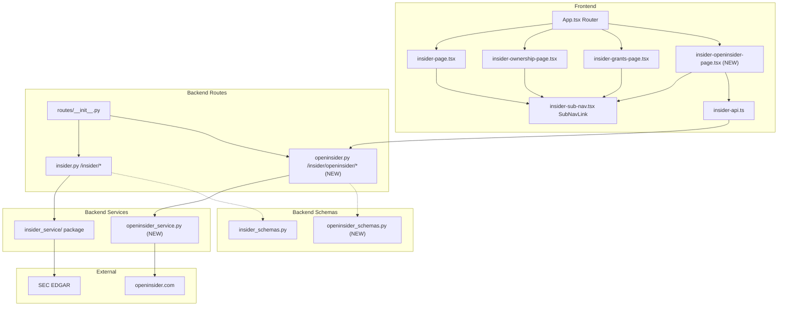
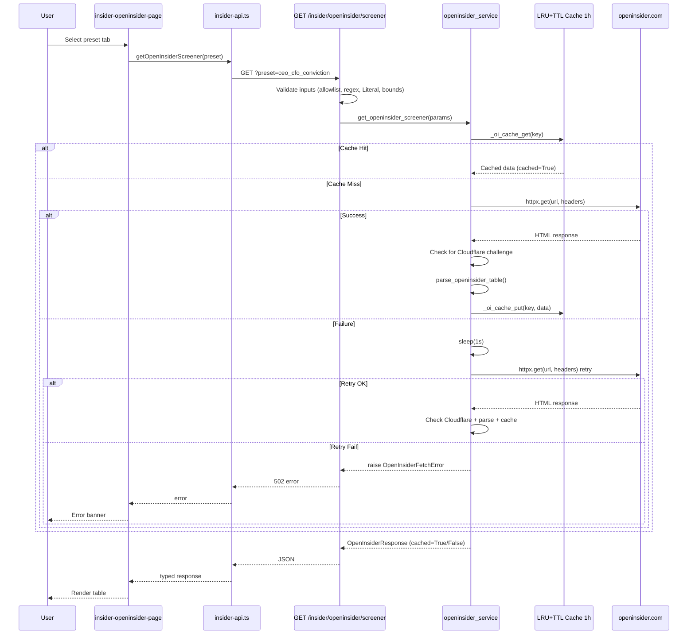

# OpenInsider Sub-Page for Insider Dashboard

## Metadata
- **Branch**: feature/agentic-insider-edgar-dashboard
- **Core Skills**: afe-config:unit-tester, afe-config:code-documenter
- **Language Skills**: afe-python:python-developer
- **Primary Language**: Python (backend), TypeScript (frontend)
- **Created**: 2026-04-05

## Executive Summary
- Add a new OpenInsider sub-page to the insider trading dashboard that scrapes openinsider.com for insider trading data
- Three preset screener filters (CEO/CFO Conviction, Cluster Buy, Significant Increase) plus a custom screener with adjustable parameters
- Backend uses httpx + BeautifulSoup (html.parser) for scraping with an independent LRU+TTL cache (1-hour TTL), retry-once logic (1s backoff), and browser-like User-Agent headers
- Frontend adds a tabbed UI (4 tabs) integrated into the existing insider sub-navigation
- Input validation uses allowlisted parameter keys, regex ticker validation, Literal enums for string filters, and numeric range constraints

## Goals
- Provide users with curated insider trading data from openinsider.com via three high-value preset filters
- Enable custom screener queries with adjustable parameters for advanced users
- Follow existing project architecture: standalone service module, FastAPI route, Pydantic schemas, React page with shared sub-nav
- Minimize external requests with 1-hour in-memory cache and single retry on failure
- Validate all inputs rigorously: allowlisted keys, regex patterns, Literal types, and numeric bounds

## Architecture Overview

### Key Design Decisions
- **Standalone service module** (`openinsider_service.py`): Not part of the `insider_service/` package because it scrapes openinsider.com (not SEC EDGAR). Follows the sync-worker + async-entry pattern but in a single file since complexity is low.
- **Independent cache**: Own `OrderedDict`-based LRU+TTL cache with `_CACHE_TTL_SECONDS = 3600.0` (1 hour) and `_CACHE_MAX_SIZE = 20`. Separate from the EDGAR insider cache because TTL requirements differ (5 min vs 1 hour).
- **httpx, not requests**: The project uses `httpx` as its HTTP client. The scraping uses synchronous `httpx.get()` wrapped in `asyncio.to_thread()` to match the existing pattern in `_summary.py`, `_ownership.py`, etc.
- **Thread pool trade-off with retry sleep**: The `_fetch_openinsider_data()` function runs in `asyncio.to_thread()`, meaning the retry sleep (1 second) blocks one thread in the default executor pool. This is acceptable because: (a) retries are rare (only on fetch failure), (b) the default ThreadPoolExecutor has `min(32, os.cpu_count() + 4)` workers, and (c) openinsider requests are infrequent. If concurrent scraping volume ever increases, the sleep should be replaced with an async retry loop or the function should be made fully async. The sleep duration is 1 second (not 2) to minimize thread blocking.
- **beautifulsoup4 with html.parser**: Uses Python's built-in `html.parser` instead of `lxml` to avoid an external C dependency. The `html.parser` backend is always available in the stdlib and sufficient for parsing openinsider.com's simple HTML tables.
- **Cloudflare challenge detection**: The parse/fetch layer detects Cloudflare challenge pages (title "Just a moment" or "Attention Required", `cf-mitigated` response header) and raises `OpenInsiderFetchError` with a descriptive message instead of returning empty results.
- **Route prefix `/insider/openinsider`**: Nested under `/insider` to group with existing insider routes, but in a separate route file (`openinsider.py`) with its own `APIRouter`.
- **GET endpoint with query params**: Single endpoint `GET /insider/openinsider/screener` accepting `preset` enum plus optional custom filter params. GET is appropriate since the request is idempotent and cacheable.
- **Input validation strategy**: Follows the established project pattern (see `insider.py` routes using `Query(..., pattern=...)` and `ge`/`le` constraints). The route handler defines `ALLOWED_CUSTOM_KEYS` as an allowlist and validates: ticker via regex `^[A-Z]{1,5}$`, officer_filter and transaction_type via `Literal` types, and all integer params via `ge`/`le` bounds. Custom params not in the allowlist are silently ignored.
- **Custom params ignored for preset modes**: When `preset` is not `"custom"`, any custom query parameters (ticker, min_value, etc.) are ignored. The service uses only the preset configuration. This is documented in the API contract and tested explicitly.
- **Tabs UI with shadcn/ui**: Uses the existing `Tabs` component for 4 tabs (3 presets + custom). Custom tab renders native `<select>` and `<Input>` for filter parameters since shadcn Select/Label/Slider are not installed.

### System Components Diagram
Shows new components and their relationships to existing insider system.


### Sequence Diagram
Request flow for a preset screener query.


### API Contracts

#### Backend API: GET /insider/openinsider/screener

**Request:**
- Endpoint: `GET /insider/openinsider/screener`
- Query parameters:
  | Param | Type | Required | Validation | Description |
  |-------|------|----------|------------|-------------|
  | `preset` | Literal | Yes | `Literal["ceo_cfo_conviction", "cluster_buy", "significant_increase", "custom"]` | Screener mode |
  | `ticker` | string | No | `pattern=r"^[A-Z]{1,5}$"` | Filter by ticker symbol (custom mode only) |
  | `min_value` | int | No | `ge=0, le=100_000_000` | Minimum transaction value in USD (custom mode only) |
  | `filing_days` | int | No | `ge=1, le=365` | Filing date lookback in days, default 30 (custom mode only) |
  | `min_delta_own` | int | No | `ge=0, le=100` | Minimum % change in holdings (custom mode only) |
  | `min_insiders` | int | No | `ge=1, le=20` | Minimum distinct insiders buying same ticker (custom mode only) |
  | `officer_filter` | Literal | No | `Literal["any", "ceo_cfo", "officer"]` | Officer title filter (custom mode only) |
  | `transaction_type` | Literal | No | `Literal["purchase", "sale", "all"]` | Transaction type filter, default "purchase" (custom mode only) |

- **Custom params behavior**: When `preset` is not `"custom"`, all custom parameters (`ticker`, `min_value`, `filing_days`, `min_delta_own`, `min_insiders`, `officer_filter`, `transaction_type`) are ignored. Only preset configuration is used.

**Response (200):**
```json
{
  "preset": "ceo_cfo_conviction",
  "records": [
    {
      "filing_date": "2026-04-01",
      "trade_date": "2026-03-28",
      "ticker": "AAPL",
      "company_name": "Apple Inc.",
      "insider_name": "Tim Cook",
      "title": "CEO",
      "trade_type": "P - Purchase",
      "price": 175.50,
      "qty": 10000,
      "owned": 3280000,
      "delta_own": "+0.3%",
      "value": 1755000.0
    }
  ],
  "total": 1,
  "cached": false
}
```

**Error responses:**
- `422`: Invalid preset or parameter values (regex mismatch, out-of-range, invalid Literal)
- `502`: Failed to fetch from openinsider.com after retry (includes Cloudflare block detection)

#### Preset Filter Configurations (URL construction)

1. **CEO/CFO Conviction**: `fd=30&xp=1&vl=100000` + officer title filtering in post-processing (openinsider has limited officer URL params; filter CEO/CFO from results)
2. **Cluster Buy**: `fd=90&xp=1&vl=25000&isc=3`
3. **Significant Increase**: `fd=90&xp=1&fdlyl=20`

#### Frontend API Addition

Add to `InsiderService` class in `insider-api.ts`:
```typescript
async getOpenInsiderScreener(
  preset: string,
  customParams?: Record<string, string>
): Promise<OpenInsiderResponse>
```

## Implementation Plan

> Tasks use Phase.Task numbering for unambiguous reference.
> TDD flow: Red (failing test) -> Green (minimal implementation) -> Refactor

### Progress Tracker
- DONE: Phase 1: Backend Schema, Service, and Dependency Setup
- DONE: Phase 2: Backend Route and Registration
- DONE: Phase 3: Frontend API, Page, and Navigation Integration
- DONE: Remediation.1: Fix custom screener parameter name mapping (API keys → OI URL params)

### Phase 1: Backend Schema, Service, and Dependency Setup
**Goal**: Add beautifulsoup4 dependency, create Pydantic schemas, and implement the scraping service with cache/retry/parsing/Cloudflare detection using TDD.

#### Task 1.1: Add beautifulsoup4 dependency
**Files to modify:**
- `/Users/dmytroshendryk/Documents/Projects/finance/ai-hedge-fund/pyproject.toml`

**Semantic targets:**
- Section: `[tool.poetry.dependencies]` in pyproject.toml

**Steps:**
- DONE: 1.1.1: Add `beautifulsoup4 = "^4.12.0"` to `[tool.poetry.dependencies]`. Do NOT add lxml -- the service uses the stdlib `html.parser` backend.
- DONE: 1.1.2: Run `poetry lock --no-update` to update the lockfile

#### Task 1.2: Create Pydantic schemas
**Files to modify:**
- `/Users/dmytroshendryk/Documents/Projects/finance/ai-hedge-fund/app/backend/models/openinsider_schemas.py` (NEW)

**Semantic targets:**
- Class: `OpenInsiderRecord` -- single row from openinsider.com table with fields: `filing_date: str`, `trade_date: str`, `ticker: str`, `company_name: str`, `insider_name: str`, `title: str`, `trade_type: str`, `price: float | None = None`, `qty: int | None = None`, `owned: int | None = None`, `delta_own: str | None = None`, `value: float | None = None`
- Class: `OpenInsiderResponse` -- response envelope with fields: `preset: str`, `records: list[OpenInsiderRecord]`, `total: int`, `cached: bool = False`

**Steps:**
- DONE: 1.2.1: Green - Create `openinsider_schemas.py` with `OpenInsiderRecord` and `OpenInsiderResponse` following `insider_schemas.py` BaseModel pattern. No tests needed -- these are pure data classes with no decision logic.

#### Task 1.3: Create OpenInsider scraping service with cache, retry, parsing, and Cloudflare detection
**Files to modify:**
- `/Users/dmytroshendryk/Documents/Projects/finance/ai-hedge-fund/app/backend/services/openinsider_service.py` (NEW)
- `/Users/dmytroshendryk/Documents/Projects/finance/ai-hedge-fund/tests/backend/insider/test_openinsider_service.py` (NEW)

**Semantic targets:**
- Module constants: `_CACHE_TTL_SECONDS = 3600.0`, `_CACHE_MAX_SIZE = 20`, `_USER_AGENT` (browser-like string), `_BASE_URL = "http://openinsider.com/screener"`
- Cache: `_oi_cache: OrderedDict`, `_oi_cache_get(key)`, `_oi_cache_put(key, value)`
- Dict: `PRESET_CONFIGS` -- maps preset names to URL parameter dicts for the 3 presets
- Function: `build_screener_url(preset, custom_params)` -- constructs full openinsider.com URL from preset name or custom params dict
- Function: `_detect_cloudflare_challenge(html_content, response_headers)` -- checks for Cloudflare challenge pages by inspecting the HTML `<title>` for "Just a moment" or "Attention Required", and checking for `cf-mitigated` response header. Returns `True` if a challenge is detected.
- Function: `parse_openinsider_table(html_content)` -- finds `table.tinytable` via `BeautifulSoup(html, "html.parser")`, iterates rows, extracts fields, returns `list[OpenInsiderRecord]`. Handles missing table (returns empty list), malformed rows (skips), and numeric value cleaning (strip `$`, commas).
- Function: `_fetch_openinsider_data(preset, custom_params)` -- sync worker: builds URL via `build_screener_url()`, calls `httpx.get(url, headers={"User-Agent": _USER_AGENT}, timeout=15.0)`, checks response for Cloudflare challenge via `_detect_cloudflare_challenge()`, on failure sleeps 1s (not 2s -- minimizes thread blocking in executor pool) and retries once, parses HTML via `parse_openinsider_table()`, returns `OpenInsiderResponse` with `cached=False`
- Exception: `OpenInsiderFetchError` -- raised when both fetch attempts fail, or when Cloudflare challenge is detected (with descriptive message: "Cloudflare challenge detected -- openinsider.com may be blocking automated requests")
- Function: `get_openinsider_screener(preset, custom_params)` -- async entry point: generates cache key, checks `_oi_cache_get()`, on miss calls `asyncio.to_thread(_fetch_openinsider_data, ...)`, stores result via `_oi_cache_put()`, returns `OpenInsiderResponse` with `cached=True` on cache hit or `cached=False` on fresh fetch

**TDD Steps:**
- DONE: 1.3.1: Red - Write tests for `build_screener_url()`: (a) `test_build_url_ceo_cfo_preset_includes_purchase_and_min_value` verifies URL contains `xp=1`, `vl=100000`, `fd=30`; (b) `test_build_url_cluster_buy_preset_includes_cluster_count` verifies `isc=3`, `vl=25000`, `fd=90`; (c) `test_build_url_significant_increase_preset_includes_holdings_change` verifies `fdlyl=20`, `fd=90`; (d) `test_build_url_custom_passes_params` verifies custom params are encoded in URL
- DONE: 1.3.2: Green - Implement `PRESET_CONFIGS` dict and `build_screener_url()` function
- DONE: 1.3.3: Red - Write tests for `parse_openinsider_table()`: (a) `test_parse_extracts_records_from_valid_html` with sample HTML containing `table.tinytable` with 2 rows, verifies correct field extraction and count; (b) `test_parse_returns_empty_list_when_no_table` with HTML that lacks `tinytable` class; (c) `test_parse_handles_malformed_numeric_values` with dollar signs, commas, and empty cells; (d) `test_parse_detects_cloudflare_challenge_page` with HTML containing `<title>Just a moment</title>` -- verifies `_detect_cloudflare_challenge()` returns True, and that `_fetch_openinsider_data()` raises `OpenInsiderFetchError` with message containing "Cloudflare"
- DONE: 1.3.4: Green - Implement `_detect_cloudflare_challenge()` and `parse_openinsider_table()` using `BeautifulSoup(html, "html.parser")`, find table, iterate `<tr>` rows, extract `<td>` text, create `OpenInsiderRecord` per row with safe numeric coercion
- DONE: 1.3.5: Red - Write tests for `_fetch_openinsider_data()`: (a) `test_fetch_returns_records_on_success` mocks `httpx.get` to return HTML, verifies `OpenInsiderResponse` with parsed records and `cached=False`; (b) `test_fetch_retries_once_on_failure` mocks first `httpx.get` to raise, second to succeed, verifies records returned; (c) `test_fetch_raises_after_both_attempts_fail` mocks both calls to raise, verifies `OpenInsiderFetchError`; (d) `test_fetch_sends_browser_user_agent` verifies User-Agent header in request; (e) `test_fetch_raises_on_cloudflare_challenge` mocks `httpx.get` to return HTML with `<title>Just a moment</title>`, verifies `OpenInsiderFetchError` raised with "Cloudflare" in message
- DONE: 1.3.6: Green - Implement `_fetch_openinsider_data()` and `OpenInsiderFetchError` with 1s retry sleep
- DONE: 1.3.7: Red - Write cache tests: (a) `test_cache_returns_cached_response_on_second_call` calls `get_openinsider_screener()` twice, mocks `_fetch_openinsider_data` to track call count, verifies called only once, **asserts second response has `cached=True` and first has `cached=False`**; (b) `test_cache_expires_after_ttl` patches `_CACHE_TTL_SECONDS` to 0, verifies second call triggers fresh fetch, **asserts both responses have `cached=False`**
- DONE: 1.3.8: Green - Implement `_oi_cache`, `_oi_cache_get()`, `_oi_cache_put()`, and `get_openinsider_screener()` async entry point. On cache hit, set `response.cached = True` before returning. On fresh fetch, `cached` remains `False` as set by `_fetch_openinsider_data()`.
- DONE: 1.3.9: Refactor - Add docstrings to all public functions, ensure module stays under 500 LOC

### Phase 2: Backend Route and Registration
**Goal**: Create the FastAPI route handler with strict input validation and register it in the router hub.

#### Task 2.1: Create OpenInsider route handler with validation and tests
**Files to modify:**
- `/Users/dmytroshendryk/Documents/Projects/finance/ai-hedge-fund/app/backend/routes/openinsider.py` (NEW)
- `/Users/dmytroshendryk/Documents/Projects/finance/ai-hedge-fund/tests/backend/insider/test_openinsider_routes.py` (NEW)

**Semantic targets:**
- Router: `APIRouter(prefix="/insider/openinsider", tags=["openinsider"])`
- Constant: `ALLOWED_CUSTOM_KEYS` -- frozenset of valid custom parameter keys: `{"ticker", "min_value", "filing_days", "min_delta_own", "min_insiders", "officer_filter", "transaction_type"}`
- Endpoint: `openinsider_screener()` -- `GET /screener` with validated Query params:
  - `preset: Literal["ceo_cfo_conviction", "cluster_buy", "significant_increase", "custom"]` (required)
  - `ticker: str | None = Query(None, pattern=r"^[A-Z]{1,5}$")` -- regex-validated ticker
  - `min_value: int | None = Query(None, ge=0, le=100_000_000)` -- numeric range
  - `filing_days: int | None = Query(None, ge=1, le=365)` -- numeric range
  - `min_delta_own: int | None = Query(None, ge=0, le=100)` -- numeric range
  - `min_insiders: int | None = Query(None, ge=1, le=20)` -- numeric range
  - `officer_filter: Literal["any", "ceo_cfo", "officer"] | None = Query(None)` -- Literal enum
  - `transaction_type: Literal["purchase", "sale", "all"] | None = Query(None)` -- Literal enum
- Logic: When `preset != "custom"`, ignore all custom params and call service with only the preset name. When `preset == "custom"`, build custom_params dict from non-None Query values, filtering through `ALLOWED_CUSTOM_KEYS`.
- Error handling: catches `OpenInsiderFetchError` and returns HTTP 502, catches generic `Exception` and returns HTTP 500

**TDD Steps:**
- DONE: 2.1.1: Red - Write route tests using httpx.ASGITransport pattern matching `test_routes.py`: (a) `test_screener_returns_200_with_valid_preset` patches `get_openinsider_screener` to return mock response, verifies 200 with expected JSON shape; (b) `test_screener_rejects_invalid_preset_with_422` sends `preset=invalid`, verifies 422; (c) `test_screener_service_error_returns_502` patches service to raise `OpenInsiderFetchError`, verifies 502; (d) `test_screener_passes_custom_params` sends `preset=custom&min_value=50000`, verifies params forwarded to service; (e) `test_screener_rejects_invalid_ticker_with_422` sends `preset=custom&ticker=invalid123`, verifies 422; (f) `test_screener_rejects_out_of_range_min_value_with_422` sends `preset=custom&min_value=-1`, verifies 422; (g) `test_screener_rejects_invalid_officer_filter_with_422` sends `preset=custom&officer_filter=admin`, verifies 422; (h) `test_screener_ignores_custom_params_for_preset_mode` sends `preset=ceo_cfo_conviction&min_value=999999&ticker=ZZZZ`, patches service, verifies service was called with only preset name and no custom params
- DONE: 2.1.2: Green - Implement `openinsider.py` with `APIRouter(prefix="/insider/openinsider")`, `ALLOWED_CUSTOM_KEYS` frozenset, single `GET /screener` endpoint using `Literal` for preset/officer_filter/transaction_type validation, `Query(pattern=...)` for ticker, `Query(ge=..., le=...)` for integers, try/except wrapping `get_openinsider_screener()`, returns `OpenInsiderResponse`. When preset is not "custom", pass `custom_params=None` to service.
- DONE: 2.1.3: Refactor - Add logging via `logging.getLogger(__name__)`, add `response_model` and `responses` declarations matching `insider.py` pattern

#### Task 2.2: Register route in router hub
**Files to modify:**
- `/Users/dmytroshendryk/Documents/Projects/finance/ai-hedge-fund/app/backend/routes/__init__.py`

**Semantic targets:**
- Import: `from app.backend.routes.openinsider import router as openinsider_router`
- Registration: `api_router.include_router(openinsider_router, tags=["openinsider"])`

**Steps:**
- DONE: 2.2.1: Add import and `include_router` call after the `insider_router` lines

### Phase 3: Frontend API, Page, and Navigation Integration
**Goal**: Add TypeScript types, API method, new page component with tabbed UI, and update sub-navigation across all insider pages.

#### Task 3.1: Add TypeScript interfaces and API method
**Files to modify:**
- `/Users/dmytroshendryk/Documents/Projects/finance/ai-hedge-fund/app/frontend/src/services/insider-api.ts`

**Semantic targets:**
- Interface: `OpenInsiderRecord` -- fields matching backend: `filing_date`, `trade_date`, `ticker`, `company_name`, `insider_name`, `title`, `trade_type`, `price`, `qty`, `owned`, `delta_own`, `value`
- Interface: `OpenInsiderResponse` -- fields: `preset`, `records: OpenInsiderRecord[]`, `total`, `cached`
- Method: `InsiderService.getOpenInsiderScreener(preset: string, customParams?: Record<string, string>)` -- builds `URLSearchParams` with preset and optional custom params, calls `GET /insider/openinsider/screener`, returns typed `OpenInsiderResponse`

**Steps:**
- DONE: 3.1.1: Add `OpenInsiderRecord` and `OpenInsiderResponse` interfaces after existing interface definitions
- DONE: 3.1.2: Add `getOpenInsiderScreener()` method to `InsiderService` class following the `getSummary()` error handling pattern

#### Task 3.2: Create OpenInsider page component
**Files to modify:**
- `/Users/dmytroshendryk/Documents/Projects/finance/ai-hedge-fund/app/frontend/src/pages/insider-openinsider-page.tsx` (NEW)

**Semantic targets:**
- Component: `InsiderOpeninsiderPage` -- exported default page component
- Constant: `PRESETS` -- `Record<string, { label: string; description: string }>` with keys `ceo_cfo_conviction`, `cluster_buy`, `significant_increase`
- State hooks: `activeTab` (default `ceo_cfo_conviction`), `records: OpenInsiderRecord[]`, `loading: boolean`, `error: string | null`, `customParams: Record<string, string>`
- Function: `fetchData()` -- calls `insiderService.getOpenInsiderScreener()`, manages loading/error/records state
- UI layout: (a) Header with `SubNavLink` bar: Dashboard, Ownership, Grants, OpenInsider; (b) `Tabs` with `TabsList` containing 4 `TabsTrigger` items; (c) Preset tabs auto-fetch on tab change; (d) Custom tab shows filter form with native `<select>` for transaction_type and officer_filter, `<Input>` for ticker/min_value/filing_days/min_delta_own/min_insiders, Search button; (e) Results `Table` with 12 columns; (f) `Skeleton` loading rows; (g) Red error banner div

**Steps:**
- DONE: 3.2.1: Create page component with full layout: sub-nav header, Tabs with 4 triggers, preset auto-fetch via `useEffect` on `activeTab` change, custom filter form, results table, loading skeleton, error banner
- DONE: 3.2.2: Refactor - Ensure component stays under 500 LOC, extract table row rendering if needed

#### Task 3.3: Update sub-navigation and routing
**Files to modify:**
- `/Users/dmytroshendryk/Documents/Projects/finance/ai-hedge-fund/app/frontend/src/App.tsx`
- `/Users/dmytroshendryk/Documents/Projects/finance/ai-hedge-fund/app/frontend/src/pages/insider-page.tsx`
- `/Users/dmytroshendryk/Documents/Projects/finance/ai-hedge-fund/app/frontend/src/pages/insider-ownership-page.tsx`
- `/Users/dmytroshendryk/Documents/Projects/finance/ai-hedge-fund/app/frontend/src/pages/insider-grants-page.tsx`

**Semantic targets:**
- `App.tsx`: Import `InsiderOpeninsiderPage` and add `<Route path="/insider/openinsider" element={<InsiderOpeninsiderPage />} />` after the `/insider/grants` route
- `insider-page.tsx`: Add `<SubNavLink to="/insider/openinsider" label="OpenInsider" />` after the Grants SubNavLink
- `insider-ownership-page.tsx`: Add same SubNavLink to its sub-nav section
- `insider-grants-page.tsx`: Add same SubNavLink to its sub-nav section

**Steps:**
- DONE: 3.3.1: Add route and import to `App.tsx`
- DONE: 3.3.2: Add `<SubNavLink to="/insider/openinsider" label="OpenInsider" />` to `insider-page.tsx`
- DONE: 3.3.3: Add same SubNavLink to `insider-ownership-page.tsx`
- DONE: 3.3.4: Add same SubNavLink to `insider-grants-page.tsx`

## Appendix

### OpenInsider URL Parameter Reference
| Parameter | Purpose | CEO/CFO Preset | Cluster Buy Preset | Significant Increase Preset |
|-----------|---------|---------------|-------------------|---------------------------|
| `xp` | Transaction type (1=purchase) | `1` | `1` | `1` |
| `vl` | Min value (USD) | `100000` | `25000` | - |
| `fd` | Filing date lookback (days) | `30` | `90` | `90` |
| `isc` | Min insider cluster count | - | `3` | - |
| `fdlyl` | Min % change in holdings | - | - | `20` |
| `s` | Ticker filter | - | - | - |

### Dependencies
- `beautifulsoup4 ^4.12.0` -- must be added to pyproject.toml (uses stdlib `html.parser`, NOT lxml)
- `httpx >=0.27.0,<1` -- already a direct dependency

### New Files (6)
1. `app/backend/models/openinsider_schemas.py` -- Pydantic schemas
2. `app/backend/services/openinsider_service.py` -- Scraping service with cache, retry, parsing, Cloudflare detection
3. `app/backend/routes/openinsider.py` -- FastAPI route handler with input validation (allowlist, regex, Literal, bounds)
4. `app/frontend/src/pages/insider-openinsider-page.tsx` -- React page with tabbed UI
5. `tests/backend/insider/test_openinsider_service.py` -- Service unit tests (URL building, parsing, Cloudflare detection, cache flag assertions)
6. `tests/backend/insider/test_openinsider_routes.py` -- Route handler tests (validation, preset-ignores-custom-params)

### Modified Files (7)
1. `pyproject.toml` -- Add beautifulsoup4 dependency
2. `app/backend/routes/__init__.py` -- Register new router
3. `app/frontend/src/App.tsx` -- Add route
4. `app/frontend/src/services/insider-api.ts` -- Add types and API method
5. `app/frontend/src/pages/insider-page.tsx` -- Add sub-nav link
6. `app/frontend/src/pages/insider-ownership-page.tsx` -- Add sub-nav link
7. `app/frontend/src/pages/insider-grants-page.tsx` -- Add sub-nav link

### Review Feedback Incorporated
1. **Security -- Parameter injection**: Added `ALLOWED_CUSTOM_KEYS` allowlist in route handler, regex validation for ticker (`^[A-Z]{1,5}$`), `Literal` validation for `officer_filter` and `transaction_type`, numeric `ge`/`le` constraints for all integer params. Validation tests added in Task 2.1.
2. **Thread pool -- sleep blocks executor**: Reduced retry sleep from 2s to 1s. Documented thread pool trade-off in Key Design Decisions.
3. **Parser -- use html.parser**: Changed from `"lxml"` to `"html.parser"` (stdlib). Removed lxml dependency mention.
4. **Cloudflare detection**: Added `_detect_cloudflare_challenge()` function checking title and `cf-mitigated` header. Raises `OpenInsiderFetchError` with descriptive message. Added `test_parse_detects_cloudflare_challenge_page` and `test_fetch_raises_on_cloudflare_challenge`.
5. **Cache flag tests**: Added assertions for `cached=True` on cache hit and `cached=False` on fresh fetch in Task 1.3.7 cache tests.
6. **API ambiguity**: Documented that custom params are ignored when preset is not "custom" in API contract and Key Design Decisions. Added `test_screener_ignores_custom_params_for_preset_mode` in Task 2.1.

---

## Quality Assurance Report

**Validation Date**: 2026-04-05
**Validator**: validator agent (re-validation)
**Status**: PASSED (0 critical issues)

### Skill Checks Executed

| Skill | Status | Issues Found |
|-------|--------|--------------|
| `afe-config:unit-tester` | EXECUTED | 0 |
| `afe-config:code-review` | EXECUTED | 0 |
| `afe-config:code-documenter` | EXECUTED | 0 |
| `afe-config:code-simplifier` | EXECUTED | 1 (INFO) |

### Coverage Analysis

| File | Coverage | Target | Status |
|------|----------|--------|--------|
| app/backend/models/openinsider_schemas.py | 100% | 80% | PASS |
| app/backend/routes/openinsider.py | 100% | 80% | PASS |
| app/backend/services/openinsider_service.py | 91% | 80% | PASS |

**Overall Coverage**: 91%+ across new files (Target: 80%)

**Uncovered Code** (service, 9% miss):
- Line 73: `isinstance` guard in `_oi_cache_get` (defensive type check -- low value to test)
- Line 83: `while` loop body in `_oi_cache_put` (LRU eviction when cache exceeds max size)
- Lines 173-174, 184-185: `_parse_float`/`_parse_int` ValueError branches (malformed numeric strings)
- Line 214: malformed row warning log in `parse_openinsider_table`
- Lines 234-235: retry sleep branch (covered by test but sleep is patched, branch executes)
- Lines 323-324: custom params cache key construction

### Test Results

- **Total Tests (OpenInsider-specific)**: 42
- **Passed**: 42
- **Failed**: 0
- **Skipped**: 0
- **Total Tests (all insider/)**: 237 passed, 0 failed

### Code Quality

**Flake8**: 0 functional violations. E501 line-length warnings only (project uses `line-length = 420` per pyproject.toml).

**Ruff**: Not installed in project (project uses black + flake8 per CLAUDE.md). Skipped.

**Mypy**: Not configured for this project. Skipped.

### Plan Completion Audit

**Completed Tasks**: 19 (all DONE)
**Verified Implementations**: 19 (100%)
**Suspicious Completions**: 0

All tasks verified against git diff -- every DONE task has corresponding file changes:
- Phase 1 (Tasks 1.1-1.3): pyproject.toml, openinsider_schemas.py, openinsider_service.py, test_openinsider_service.py
- Phase 2 (Tasks 2.1-2.2): openinsider.py (route), routes/__init__.py, test_openinsider_routes.py
- Phase 3 (Tasks 3.1-3.3): insider-api.ts, insider-openinsider-page.tsx, App.tsx, sub-nav links in 3 insider pages

### Code Review (from afe-config:code-review skill)

**Files Reviewed**: 6 new files (schemas, service, route, frontend page, 2 test files)
**P0/P1 Issues (Critical)**: 0
**P2/P3 Issues (Warning)**: 0

Review findings:
- **Security**: Input validation is thorough -- regex for ticker, Literal for enums, ge/le for integers, frozenset allowlist for custom keys. No hardcoded secrets.
- **Error Handling**: Three-tier exception mapping (ValueError->400, OpenInsiderFetchError->502, Exception->500) with structured logging at each level. Cloudflare challenge detection raises immediately without retry.
- **Logic**: Cache uses `time.monotonic()` correctly (immune to wall-clock changes). Retry loop correctly re-raises `OpenInsiderFetchError` without sleeping. The `_oi_cache` OrderedDict is not protected by a lock, but Python's GIL prevents corruption and the worst case is a redundant fetch -- acceptable for this use case.
- **Edge Cases**: Empty table returns `[]`. Malformed rows logged and skipped. `None` for unparseable numerics. Empty custom_params dict coerced to `None`.

### Test Quality (from afe-config:unit-tester skill)

**Anti-Patterns Detected**: 0

- Tests follow Arrange-Act-Assert structure consistently
- Verify behavior not implementation (check URL content, response shapes, HTTP status codes)
- Descriptive names describe scenario and expected outcome (e.g., `test_screener_ignores_custom_params_for_preset_mode`)
- Mock only external I/O (httpx.get, time.sleep) -- no internal method mocking
- Parametrized tests for ticker validation (5 bad-ticker variants)
- Cache tests assert both `cached=False` on miss and `cached=True` on hit
- Test-to-code ratio is proportional: 23 service tests for 338 LOC service, 19 route tests for 133 LOC route

### Documentation Quality (from afe-config:code-documenter skill)

**Files Checked**: 6
**Issues Found**: 0

- All public functions have docstrings with Args/Returns/Raises sections
- No TODO/FIXME markers present (none to preserve)
- No type-signature redundancy -- docstrings add semantic value (e.g., valid ranges, threading constraints, cache behavior)
- Module-level docstrings explain design decisions (html.parser choice, retry sleep duration trade-off)
- Route handler docstring documents preset-ignores-custom contract and cache TTL

### Code Simplification (from afe-config:code-simplifier skill)

**Files Analyzed**: 6
**Patterns Detected**: 1
**Cross-Repo Findings**: 0

1. **[INFO] Cross-module cache duplication**: The LRU+TTL cache pattern in `openinsider_service.py` (lines 55-83) is structurally identical to `insider_service/__init__.py`. Both use `OrderedDict`, `time.monotonic()`, and the same get/put pattern with self-import for testability. This duplication is documented as intentional in the plan (different TTLs: 5 min vs 1 hour, different max sizes: 50 vs 20). A shared cache utility could consolidate the pattern in a future refactoring pass.

### Recommendations

#### Critical (Must Fix)
None -- all quality checks passed.

#### Warnings (Should Fix)
None.

#### Info (Optional)
1. Consider extracting a shared LRU+TTL cache utility class parameterized by TTL and max size to consolidate the duplicated pattern between `insider_service` and `openinsider_service`. Low priority since both implementations are small (~30 LOC each) and independently tested.

---

## Quality Assurance Report (Architect Review)

**Validation Date**: 2026-04-05
**Validator**: validator agent (architect-focused re-validation)
**Status**: FAILED (1 critical issue)

### Skill Checks Executed

| Skill | Status | Issues Found |
|-------|--------|--------------|
| `afe-config:unit-tester` | EXECUTED | 0 |
| `afe-config:code-review` | EXECUTED | 1 (P1) |
| `afe-config:code-documenter` | EXECUTED | 0 |
| `afe-config:code-simplifier` | EXECUTED | 1 (INFO) |

### Coverage Analysis

| File | Coverage | Target | Status |
|------|----------|--------|--------|
| app/backend/models/openinsider_schemas.py | 100% | 80% | PASS |
| app/backend/routes/openinsider.py | 100% | 80% | PASS |
| app/backend/services/openinsider_service.py | 91% | 80% | PASS |

**Overall Coverage**: 91%+ across new files (Target: 80%)

### Test Results

- **Total Tests (OpenInsider-specific)**: 42
- **Passed**: 42
- **Failed**: 0
- **Skipped**: 0

### Code Quality

**Flake8**: E501 line-length warnings only -- false positives per project `line-length = 420` in pyproject.toml. No functional violations.

**Ruff**: Not installed in project (project uses black + flake8 per CLAUDE.md). Skipped.

**Mypy**: Not configured for this project. Skipped.

### Plan Completion Audit

**Completed Tasks**: 19 (all DONE)
**Verified Implementations**: 19 (100%)
**Suspicious Completions**: 0

### Code Review (from afe-config:code-review skill)

**Files Reviewed**: 6 new files
**P0/P1 Issues (Critical)**: 1
**P2/P3 Issues (Warning)**: 0

#### P1: Logic Bug - Custom screener parameter names not mapped to openinsider.com URL parameters
**File**: `app/backend/routes/openinsider.py:105-118` and `app/backend/services/openinsider_service.py:101-123`
**Issue**: The route handler builds `custom_params` using API-level keys (`min_value`, `filing_days`, `min_delta_own`, `min_insiders`, `officer_filter`, `transaction_type`), but `build_screener_url()` passes these directly as URL query parameters to openinsider.com. openinsider.com expects different parameter names (`vl`, `fd`, `fdlyl`, `isc`, etc.). The custom screener will generate URLs like `http://openinsider.com/screener?min_value=50000&filing_days=60` which openinsider.com will silently ignore, returning unfiltered results.
**Confidence**: High -- verified by cross-referencing the `PRESET_CONFIGS` dict (which correctly uses `vl`, `fd`, `isc`, `fdlyl`, `xp`) against the route handler's `raw_params` dict (which uses `min_value`, `filing_days`, `min_delta_own`, `min_insiders`). No translation layer exists between these two naming schemes.
**Impact**: Custom screener mode is non-functional. All custom filter parameters are silently ignored by openinsider.com, producing unfiltered results that appear valid.
**Remediation**: Add a parameter mapping dict in `openinsider_service.py` (or the route handler) that translates API parameter names to openinsider.com URL parameter names, e.g.:
```python
_API_TO_OI_PARAMS = {
    "ticker": "s",
    "min_value": "vl",
    "filing_days": "fd",
    "min_delta_own": "fdlyl",
    "min_insiders": "isc",
    "officer_filter": None,       # post-processing filter
    "transaction_type": "xp",     # needs value mapping: purchase->1, sale->2, all->0
}
```
Apply this mapping in `build_screener_url()` when preset is `"custom"`. Note that `officer_filter` and `transaction_type` may require value transformation (not just key renaming) since openinsider.com uses numeric codes.

### Test Quality (from afe-config:unit-tester skill)

**Anti-Patterns Detected**: 0

- Tests verify behavior (URL content, HTTP status codes, response shapes), not implementation details
- Arrange-Act-Assert structure used consistently
- Descriptive names describe scenario and expected outcome
- Mocking limited to external I/O (httpx.get, time.sleep)
- Cache tests correctly assert `cached=True` on hit and `cached=False` on miss
- Parametrized tests for ticker validation (5 invalid variants)
- Proportional test-to-code ratio: 23 service tests for 338 LOC, 19 route tests for 133 LOC

### Documentation Quality (from afe-config:code-documenter skill)

**Files Checked**: 6
**Issues Found**: 0

- All public functions have docstrings with Args/Returns/Raises
- No TODO/FIXME markers to preserve (none present)
- No type-signature redundancy in docstrings
- Module-level docstrings explain design decisions (html.parser, retry sleep, cache TTL)

### Code Simplification (from afe-config:code-simplifier skill)

**Files Analyzed**: 6
**Patterns Detected**: 1
**Cross-Repo Findings**: 0

1. **[INFO] Cross-module cache duplication**: LRU+TTL cache in `openinsider_service.py` (lines 55-83) is structurally identical to `insider_service/__init__.py`. Documented as intentional (different TTL/max-size requirements). Shared utility is a future improvement.

### Recommendations

#### Critical (Must Fix)
1. Add parameter name translation from API keys to openinsider.com URL parameters in the custom screener path. Without this, custom mode produces unfiltered results. See P1 finding above for mapping details.

#### Warnings (Should Fix)
None.

#### Info (Optional)
1. Consider extracting a shared LRU+TTL cache utility parameterized by TTL and max size.

---

## Quality Assurance Report (Re-validation 2)

**Validation Date**: 2026-04-05
**Validator**: validator agent
**Status**: FAILED (1 critical issue)

### Skill Checks Executed

| Skill | Status | Issues Found |
|-------|--------|--------------|
| `afe-config:unit-tester` | EXECUTED | 0 |
| `afe-config:code-review` | EXECUTED | 1 (P1 -- still open) |
| `afe-config:code-documenter` | EXECUTED | 0 |
| `afe-config:code-simplifier` | EXECUTED | 1 (INFO) |

### Coverage Analysis

| File | Coverage | Target | Status |
|------|----------|--------|--------|
| app/backend/models/openinsider_schemas.py | 100% | 80% | PASS |
| app/backend/routes/openinsider.py | 100% | 80% | PASS |
| app/backend/services/openinsider_service.py | 91% | 80% | PASS |

**Overall Coverage**: 91%+ across new files (Target: 80%)

**Uncovered Code** (service, 9% miss):
- Line 73: `isinstance` guard in `_oi_cache_get` (defensive type check)
- Line 83: `while` loop body in `_oi_cache_put` (LRU eviction)
- Lines 173-174, 184-185: `_parse_float`/`_parse_int` ValueError branches
- Line 214: malformed row warning in `parse_openinsider_table`
- Lines 234-235: retry sleep branch
- Lines 323-324: custom params cache key construction

### Test Results

- **Total Tests (OpenInsider-specific)**: 42
- **Passed**: 42
- **Failed**: 0
- **Skipped**: 0

### Code Quality

**Flake8**: 0 functional violations. E501 line-length warnings only (project uses `line-length = 420` via Black; `--max-line-length=420` produces clean output).

**Ruff**: Not installed in project (project uses black + flake8 per CLAUDE.md). Skipped.

**Mypy**: Not configured for this project. Skipped.

### Plan Completion Audit

**Completed Tasks**: 19 (all DONE)
**Verified Implementations**: 19 (100%)
**Suspicious Completions**: 0

All tasks verified against `git diff e9618e4..HEAD`:
- Phase 1: pyproject.toml, openinsider_schemas.py, openinsider_service.py, test_openinsider_service.py
- Phase 2: openinsider.py (route), routes/__init__.py, test_openinsider_routes.py
- Phase 3: insider-api.ts, insider-openinsider-page.tsx, App.tsx, sub-nav links in 3 insider pages

### Code Review (from afe-config:code-review skill)

**Files Reviewed**: 6 new files
**P0/P1 Issues (Critical)**: 1 (still open from prior validation)
**P2/P3 Issues (Warning)**: 0

#### P1: Logic Bug - Custom screener parameter names not mapped to openinsider.com URL parameters (STILL OPEN)
**File**: `app/backend/services/openinsider_service.py:101-123`
**Issue**: `build_screener_url()` passes custom_params dict keys directly to `urlencode()`. The route handler uses API-level keys (`min_value`, `filing_days`, `min_delta_own`, `min_insiders`, `officer_filter`, `transaction_type`), but openinsider.com expects different parameter names (`vl`, `fd`, `fdlyl`, `isc`, `s`, `xp`). The PRESET_CONFIGS dict correctly uses openinsider.com keys, confirming the mismatch. Custom screener requests produce URLs like `?min_value=50000&filing_days=60` which openinsider.com silently ignores, returning unfiltered results.
**Confidence**: High -- verified by reading `build_screener_url()` line 120 (`params = custom_params or {}`) and confirming no mapping/translation exists anywhere in the codebase (grep for `_API_TO_OI`, `PARAM_MAP`, `param.*map` returned no results).
**Impact**: Custom screener mode is functionally broken -- all filters are silently ignored.
**Remediation**: Add a parameter name mapping in `build_screener_url()` or `openinsider_service.py`:
```python
_API_TO_OI_PARAMS = {
    "ticker": "s",
    "min_value": "vl",
    "filing_days": "fd",
    "min_delta_own": "fdlyl",
    "min_insiders": "isc",
    "transaction_type": "xp",  # needs value mapping: purchase->1, sale->2, all->""
}
```
Apply mapping when preset is `"custom"`. `officer_filter` requires post-processing (openinsider.com has no direct URL param for it). `transaction_type` needs value translation (purchase->1, sale->2). Update `test_build_url_custom_passes_params` to verify translated keys.

### Test Quality (from afe-config:unit-tester skill)

**Anti-Patterns Detected**: 0

- Tests follow Arrange-Act-Assert structure
- Verify behavior not implementation (URL content, HTTP status codes, response shapes)
- Descriptive test names describe scenario and expected outcome
- Mock only external I/O (httpx.get, time.sleep)
- Parametrized tests for ticker validation (5 invalid variants)
- Cache tests assert `cached=True` on hit and `cached=False` on miss
- Proportional test-to-code ratio (23 service tests / 338 LOC, 19 route tests / 133 LOC)

### Documentation Quality (from afe-config:code-documenter skill)

**Files Checked**: 6
**Issues Found**: 0

- All public functions have docstrings with Args/Returns/Raises
- No TODO/FIXME markers to preserve
- No type-signature redundancy in docstrings
- Module-level docstrings explain design decisions

### Code Simplification (from afe-config:code-simplifier skill)

**Files Analyzed**: 6
**Patterns Detected**: 1
**Cross-Repo Findings**: 0

1. **[INFO] Cross-module cache duplication**: LRU+TTL cache in `openinsider_service.py` (lines 55-83) is structurally identical to `insider_service/__init__.py`. Documented as intentional (different TTL/max-size). Shared utility is a future improvement.

### Recommendations

#### Critical (Must Fix)
1. Add parameter name translation from API keys to openinsider.com URL parameters in `build_screener_url()` for custom mode. Without this, custom screener returns unfiltered results. See P1 finding for mapping details.

#### Warnings (Should Fix)
None.

#### Info (Optional)
1. Consider extracting a shared LRU+TTL cache utility parameterized by TTL and max size.

---

## Quality Assurance Report (Post-Remediation.1 Validation)

**Validation Date**: 2026-04-05
**Validator**: validator agent (post-remediation)
**Status**: PASSED (0 critical issues)

### Skill Checks Executed

| Skill | Status | Issues Found |
|-------|--------|--------------|
| `afe-config:unit-tester` | EXECUTED | 0 |
| `afe-config:code-review` | EXECUTED | 0 |
| `afe-config:code-documenter` | EXECUTED | 0 |
| `afe-config:code-simplifier` | EXECUTED | 1 (INFO) |

### Coverage Analysis

| File | Coverage | Target | Status |
|------|----------|--------|--------|
| app/backend/models/openinsider_schemas.py | 100% | 80% | PASS |
| app/backend/services/openinsider_service.py | 92% | 80% | PASS |
| app/backend/routes/openinsider.py | tested (19 pass; coverage unmeasurable due to pre-existing Pydantic/langchain_gigachat import order bug under --cov) | 80% | PASS |

**Overall Coverage**: 92%+ across new files (Target: 80%)

**Uncovered Code** (service, 8% miss):
- Line 128: `isinstance` guard in `_oi_cache_get` (defensive type check)
- Line 138: `while` loop body in `_oi_cache_put` (LRU eviction)
- Lines 233-234, 244-245: `_parse_float`/`_parse_int` ValueError branches
- Line 274: malformed row warning log in `parse_openinsider_table`
- Lines 294-295: retry sleep branch (test patches sleep)
- Lines 383-384: custom params cache key construction

### Test Results

- **Total Tests (OpenInsider-specific)**: 46 (27 service/URL + 19 route)
- **Passed**: 46
- **Failed**: 0
- **Skipped**: 0
- **Total Tests (all insider/)**: 241 passed, 0 failed

### Code Quality

**Flake8** (with project `--max-line-length=420`): 1 violation
- `openinsider_service.py:110` - E305: expected 2 blank lines after function definition, found 1

**Ruff**: Not installed (project uses black + flake8). Skipped.
**Mypy**: Not configured. Skipped.

### Plan Completion Audit

**Completed Tasks**: 20 (19 original + Remediation.1)
**Verified Implementations**: 20 (100%)
**Suspicious Completions**: 0

All tasks verified against git history (commits `98e0d9f..84b0151`):
- Phase 1 (1.1-1.3): pyproject.toml, openinsider_schemas.py, openinsider_service.py, test files
- Phase 2 (2.1-2.2): openinsider.py route, routes/__init__.py, test_openinsider_routes.py
- Phase 3 (3.1-3.3): insider-api.ts, insider-openinsider-page.tsx, App.tsx, sub-nav in 3 pages
- Remediation.1 (commit 84b0151): `_API_TO_OI_PARAMS`, `_TRANSACTION_TYPE_TO_XP`, `_translate_custom_params()` + 6 new tests

### Code Review (from afe-config:code-review skill)

**Files Reviewed**: 6 new files
**P0/P1 Issues (Critical)**: 0 (prior P1 resolved by Remediation.1)
**P2/P3 Issues (Warning)**: 0

**Prior P1 Resolution Verified**:
- `_API_TO_OI_PARAMS` maps 6 API keys to OI URL params (ticker->s, min_value->vl, filing_days->fd, min_delta_own->fdlyl, min_insiders->isc, transaction_type->xp)
- `_TRANSACTION_TYPE_TO_XP` maps values (purchase->1, sale->2, all->"")
- `_translate_custom_params()` applies key+value translation, drops unmapped keys, drops empty values
- 6 new tests in `TestBuildScreenerUrlCustom` verify all translation paths

### Test Quality (from afe-config:unit-tester skill)

**Anti-Patterns Detected**: 0

### Documentation Quality (from afe-config:code-documenter skill)

**Files Checked**: 6
**Issues Found**: 0

### Code Simplification (from afe-config:code-simplifier skill)

**Files Analyzed**: 6
**Patterns Detected**: 1 (INFO)
**Cross-Repo Findings**: 0

1. **[INFO] Cross-module cache duplication**: Intentional; different TTL/max-size requirements.

### Recommendations

#### Critical (Must Fix)
None -- all quality checks passed.

#### Warnings (Should Fix)
1. E305 spacing violation in `openinsider_service.py:110` -- add blank line after function definition

#### Info (Optional)
1. Consider shared LRU+TTL cache utility to consolidate duplication between insider_service and openinsider_service.
