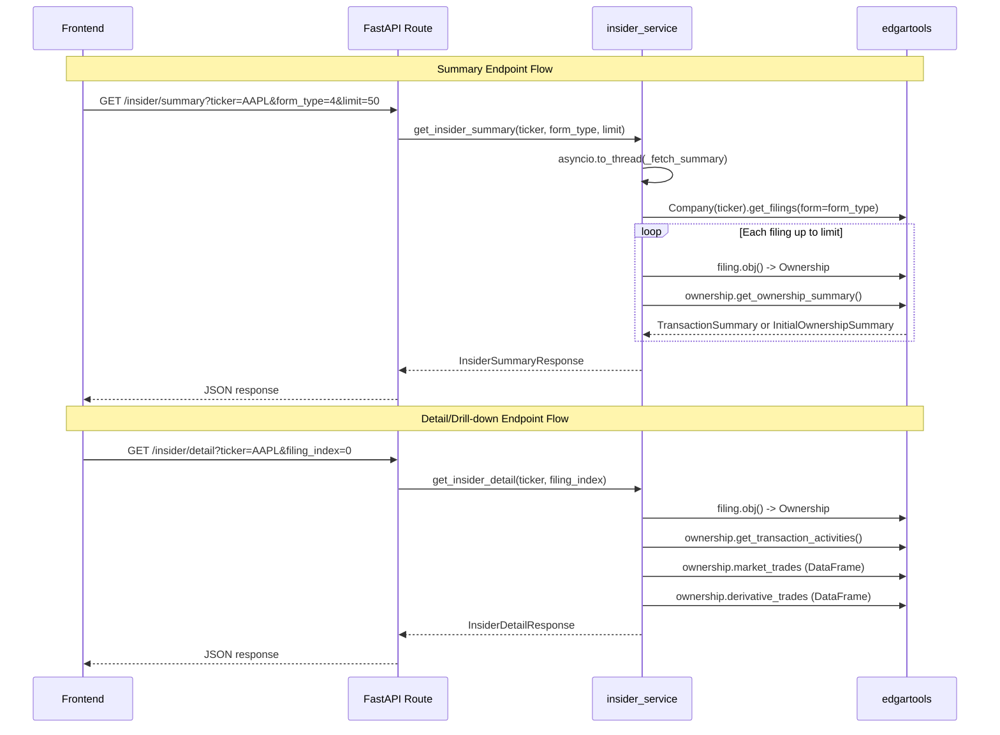

# Research: Insider Trading Dashboard with edgartools

## Metadata
- **Requested By**: orchestrator
- **Created**: 2026-03-29
- **Scope**: Analyze codebase patterns and edgartools API to support rewriting the Insider page as a rich SEC EDGAR dashboard

## Executive Summary
- The existing insider feature has a single endpoint returning flat transaction rows; it needs two endpoints (summary + drill-down) and support for Forms 3, 4, and 5.
- edgartools v5.27.0 provides a rich `Ownership` class with `get_ownership_summary()` returning either `TransactionSummary` (Forms 4/5) or `InitialOwnershipSummary` (Form 3), plus `to_dataframe()` with both detailed and summary modes. All three form types (Form3, Form4, Form5) are thin subclasses of `Ownership` with identical APIs.
- **No charting library is currently installed** in the frontend -- recharts, chart.js, or similar must be added to `package.json`.
- The frontend uses shadcn/ui with Card, Tabs, Table, Badge, Skeleton, Button, Input, Checkbox components available. No dedicated Chart component exists.
- The news-page.tsx provides the best dashboard reference pattern: tabbed layout with Cards for summary data, lazy-loaded tabs, and skeleton loading states.
- The `financialdatasets.ai` fallback should be removed per requirements.

## Relevant Files

### Backend (existing)
- `/Users/dmytroshendryk/Documents/Projects/finance/ai-hedge-fund/app/backend/services/insider_service.py` -- Current service (264 lines), uses edgartools Form 4 only, has financialdatasets fallback
- `/Users/dmytroshendryk/Documents/Projects/finance/ai-hedge-fund/app/backend/models/insider_schemas.py` -- Current schemas (27 lines), single InsiderTransaction + InsiderTransactionsResponse
- `/Users/dmytroshendryk/Documents/Projects/finance/ai-hedge-fund/app/backend/routes/insider.py` -- Current route (29 lines), single GET /insider/transactions endpoint
- `/Users/dmytroshendryk/Documents/Projects/finance/ai-hedge-fund/app/backend/routes/__init__.py` -- Router registration (line 14, 31)

### Frontend (existing)
- `/Users/dmytroshendryk/Documents/Projects/finance/ai-hedge-fund/app/frontend/src/pages/insider-page.tsx` -- Current page (205 lines), simple table view
- `/Users/dmytroshendryk/Documents/Projects/finance/ai-hedge-fund/app/frontend/src/services/insider-api.ts` -- Current API service (41 lines), single getTransactions method
- `/Users/dmytroshendryk/Documents/Projects/finance/ai-hedge-fund/app/frontend/src/App.tsx` -- Route registration (line 10, 24)
- `/Users/dmytroshendryk/Documents/Projects/finance/ai-hedge-fund/app/frontend/src/components/navigation/app-navbar.tsx` -- Nav item (line 11)

### Reference patterns
- `/Users/dmytroshendryk/Documents/Projects/finance/ai-hedge-fund/app/frontend/src/pages/news-page.tsx` -- Dashboard pattern with Cards, Tabs, lazy-loading (717 lines)
- `/Users/dmytroshendryk/Documents/Projects/finance/ai-hedge-fund/app/frontend/src/pages/screener-page.tsx` -- Tabs pattern with filter UI (547 lines)
- `/Users/dmytroshendryk/Documents/Projects/finance/ai-hedge-fund/app/backend/services/screener_service.py` -- asyncio.to_thread pattern (117 lines)
- `/Users/dmytroshendryk/Documents/Projects/finance/ai-hedge-fund/app/backend/models/screener_schemas.py` -- Schema pattern (25 lines)
- `/Users/dmytroshendryk/Documents/Projects/finance/ai-hedge-fund/app/backend/routes/screener.py` -- Route pattern with GET and POST (52 lines)

### edgartools source (installed package)
- `/Users/dmytroshendryk/Library/Caches/pypoetry/virtualenvs/ai-hedge-fund-U06eZBFM-py3.11/lib/python3.11/site-packages/edgar/ownership/ownershipforms.py` -- Core ownership module (2279 lines)
- `/Users/dmytroshendryk/Library/Caches/pypoetry/virtualenvs/ai-hedge-fund-U06eZBFM-py3.11/lib/python3.11/site-packages/edgar/ownership/core.py` -- Utility functions including detect_10b5_1_plan

### shadcn/ui components available
- `/Users/dmytroshendryk/Documents/Projects/finance/ai-hedge-fund/app/frontend/src/components/ui/card.tsx` -- Card, CardHeader, CardTitle, CardDescription, CardContent, CardFooter
- `/Users/dmytroshendryk/Documents/Projects/finance/ai-hedge-fund/app/frontend/src/components/ui/tabs.tsx` -- Tabs, TabsList, TabsTrigger, TabsContent
- `/Users/dmytroshendryk/Documents/Projects/finance/ai-hedge-fund/app/frontend/src/components/ui/table.tsx` -- Table, TableHeader, TableBody, TableRow, TableHead, TableCell
- `/Users/dmytroshendryk/Documents/Projects/finance/ai-hedge-fund/app/frontend/src/components/ui/badge.tsx` -- Badge
- `/Users/dmytroshendryk/Documents/Projects/finance/ai-hedge-fund/app/frontend/src/components/ui/skeleton.tsx` -- Skeleton
- `/Users/dmytroshendryk/Documents/Projects/finance/ai-hedge-fund/app/frontend/src/components/ui/button.tsx` -- Button
- `/Users/dmytroshendryk/Documents/Projects/finance/ai-hedge-fund/app/frontend/src/components/ui/input.tsx` -- Input
- `/Users/dmytroshendryk/Documents/Projects/finance/ai-hedge-fund/app/frontend/src/components/ui/checkbox.tsx` -- Checkbox
- `/Users/dmytroshendryk/Documents/Projects/finance/ai-hedge-fund/app/frontend/src/components/ui/accordion.tsx` -- Accordion

## Systems and Components

### Key Discoveries

- **Discovery 1 -- edgartools `get_ownership_summary()` provides exactly the rich data needed**: The `Ownership.get_ownership_summary()` method (line 1935 of ownershipforms.py) returns `TransactionSummary` for Forms 4/5 and `InitialOwnershipSummary` for Form 3. `TransactionSummary` has computed properties: `net_change` (int), `net_value` (float), `primary_activity` (str), `has_10b5_1_plan` (Optional[bool]), `transaction_types` (List[str]), `remaining_shares` (Optional[int]), and `has_derivative_transactions` (bool).

- **Discovery 2 -- `to_dataframe(detailed=False)` returns a rich summary row**: When called with `detailed=False`, TransactionSummary.to_dataframe() (line 1502) returns a single-row DataFrame with columns: Date, Form, Issuer, Ticker, Insider, Position, Transaction Count, Net Change, Net Value, Remaining Shares, Primary Activity, plus per-type columns like "Purchase Count", "Purchase Shares", "Purchase Value", "Avg Purchase Price", "Sale Count", "Sale Shares", "Sale Value", "Avg Sale Price".

- **Discovery 3 -- `to_dataframe(detailed=True)` returns per-transaction rows**: When called with `detailed=True` (default), it returns one row per transaction with columns: Transaction Type, Code, Description, Shares, Price, Value, and optionally Date, Form, Issuer, Ticker, Insider, Position, Remaining Shares.

- **Discovery 4 -- `TransactionActivity` is the core transaction data class**: Found at line 1095 of ownershipforms.py. Key fields: `transaction_type` (str), `code` (str), `shares` (Any), `value` (Any), `price_per_share` (Any), `security_type` ("non-derivative" or "derivative"), `security_title` (str), `underlying_security` (str), `exercise_date`, `expiration_date`, `footnote_ids`, `footnotes_text`. Properties: `shares_numeric`, `value_numeric`, `price_numeric`, `is_derivative`, `is_10b5_1_plan`.

- **Discovery 5 -- Form3, Form4, Form5 are identical thin subclasses**: All three (lines 2249-2279) simply extend `Ownership` with no additional methods. All Ownership methods (get_ownership_summary, get_transaction_activities, market_trades, derivative_trades, to_dataframe) work on all form types.

- **Discovery 6 -- No charting library installed in frontend**: `package.json` at `/Users/dmytroshendryk/Documents/Projects/finance/ai-hedge-fund/app/frontend/package.json` has no recharts, chart.js, nivo, victory, visx, or d3 dependency. `package-lock.json` also has no recharts. A charting library must be added for the buy/sell activity chart requirement.

- **Discovery 7 -- Card-based dashboard pattern exists in news-page.tsx**: The `MarketIndexCard` component (line 158 of news-page.tsx) shows a Card with price, change, and change_percent using green/red color coding. This is the closest pattern to summary cards needed for the insider dashboard. Uses `Card > CardContent` with nested divs.

- **Discovery 8 -- Tabs pattern with lazy loading in news-page.tsx**: The news page uses `handleTabChange` callback (line 353) that loads data on first tab visit using a `loadedTabs` Set state. This is the reference for tabbed Form 3/4/5 UI.

- **Discovery 9 -- Existing insider service already handles SEC identity and parsing**: The `_ensure_identity()` function (line 21), `_parse_owner_info()` (line 32), and `_check_10b5_1()` (line 57) in the current service can be reused/refactored. The current approach of iterating filings one-by-one and calling `filing.obj()` is the correct edgartools pattern.

- **Discovery 10 -- Company.get_filings() supports form parameter as string or list**: The current service uses `company.get_filings(form="4")` (line 194). To support Forms 3, 4, and 5, this can be called with `form=["3", "4", "5"]` or called separately per form type.

- **Discovery 11 -- TransactionCode.DESCRIPTIONS provides all code mappings**: At line 160 of ownershipforms.py: P=Open market purchase, S=Open market sale, A=Grant/award, M=Exercise of exempt derivative, F=Payment of exercise price or tax, G=Gift, C=Conversion, plus others.

### Component Diagram
The current and target architecture for the insider feature:

```mermaid
graph TD
    subgraph Frontend
        IP[InsiderPage]
        IA[insider-api.ts]
        IP --> IA
    end

    subgraph "Backend Routes"
        RT[/insider/transactions GET/]
        RS[/insider/summary GET - NEW/]
        RD[/insider/detail GET - NEW/]
    end

    subgraph "Backend Service"
        IS[insider_service.py]
    end

    subgraph "edgartools"
        CO[Company]
        FI[Filings]
        OW[Ownership / Form3 / Form4 / Form5]
        TS[TransactionSummary]
        IOS[InitialOwnershipSummary]
        TA[TransactionActivity]
    end

    IA -->|HTTP| RT
    IA -->|HTTP NEW| RS
    IA -->|HTTP NEW| RD
    RT --> IS
    RS --> IS
    RD --> IS
    IS -->|asyncio.to_thread| CO
    CO --> FI
    FI -->|filing.obj\(\)| OW
    OW -->|get_ownership_summary\(\)| TS
    OW -->|get_ownership_summary\(\)| IOS
    TS --> TA
```

### Interaction Diagram
Sequence for the two new endpoints:



## Contracts and Interfaces

### edgartools API Surface (Key Types and Methods)

**`edgar.Company(ticker)`** -- constructor, requires `set_identity()` first
- `company.get_filings(form="4")` -- returns iterable of Filing objects
- `company.get_filings(form=["3", "4", "5"])` -- multiple form types

**`Filing` object**
- `filing.filing_date` -- date string
- `filing.obj()` -- returns Form3/Form4/Form5 instance (subclass of Ownership)

**`Ownership` class** (base for Form3, Form4, Form5) -- line 1732 of ownershipforms.py
- `ownership.form` -- str ("3", "4", or "5")
- `ownership.issuer` -- Issuer(cik, name, ticker)
- `ownership.reporting_owners` -- ReportingOwners with .owners list
- `ownership.reporting_period` -- str date
- `ownership.remarks` -- str
- `ownership.footnotes` -- Footnotes
- `ownership.no_securities` -- bool (Form 3 specific)
- `ownership.insider_name` -- property, returns owner name string
- `ownership.position` -- property, returns position string
- `ownership.market_trades` -- cached_property, returns DataFrame or None (columns: Security, Date, Code, AcquiredDisposed, Shares, Price, Remaining)
- `ownership.derivative_trades` -- cached_property, returns derivative DataFrame
- `ownership.common_stock_purchases` -- property, filtered market_trades where AcquiredDisposed=='A'
- `ownership.common_stock_sales` -- property, filtered market_trades where AcquiredDisposed=='D'
- `ownership.option_exercises` -- property, exercised trades
- `ownership.get_transaction_activities()` -- returns List[TransactionActivity]
- `ownership.get_ownership_summary()` -- returns TransactionSummary (Form 4/5) or InitialOwnershipSummary (Form 3)
- `ownership.to_dataframe(detailed=True/False, include_metadata=True/False)` -- DataFrame output

**`TransactionSummary`** (dataclass) -- line 1401
- Fields: reporting_date, issuer_name, issuer_ticker, insider_name, position, form_type, remarks, transactions (List[TransactionActivity]), remaining_shares (Optional[int]), has_derivative_transactions (bool)
- Properties: `net_change` (int), `net_value` (float), `primary_activity` (str), `has_10b5_1_plan` (Optional[bool]), `transaction_types` (List[str]), `has_only_derivatives` (bool), `has_non_derivatives` (bool)
- Methods: `to_dataframe(detailed=True/False)`, `to_summary_dataframe()`

**`InitialOwnershipSummary`** (dataclass) -- line 1239
- Fields: same base + holdings (List[SecurityHolding]), no_securities (bool)
- Properties: `total_shares` (int), `has_derivatives` (bool)

**`TransactionActivity`** (dataclass) -- line 1095
- Fields: transaction_type, code, shares, value, price_per_share, description, security_type, security_title, underlying_security, exercise_date, expiration_date, footnote_ids, footnotes_text
- Properties: shares_numeric, value_numeric, price_numeric, is_derivative, is_10b5_1_plan

**`TransactionCode.DESCRIPTIONS`** (dict) -- line 160
```python
{'A': 'Grant or award', 'C': 'Conversion of derivative', 'D': 'Disposition to the issuer',
 'E': 'Expiration of short position', 'F': 'Payment of exercise price or tax', 'G': 'Gift',
 'H': 'Expiration of long position', 'I': 'Disposition otherwise than to the issuer',
 'M': 'Exercise or conversion of exempt derivative', 'O': 'Exercise of out-of-the-money derivative',
 'P': 'Open market or private purchase', 'S': 'Open market or private sale',
 'U': 'Disposition pursuant to a tender of shares', 'X': 'Exercise of in-the-money or at-the-money derivative',
 'Z': 'Deposit or withdrawal from voting trust'}
```

### Existing Backend Route Pattern
- Routes use `APIRouter(prefix="/insider", tags=["insider"])`
- GET endpoints with Query parameters for simple fetches (see insider.py, screener.py `/filters`)
- POST endpoints with request body for complex queries (see screener.py `/search`)
- Error handling: try/except wrapping service calls, raising HTTPException(500) with detail string
- Services use `asyncio.to_thread()` to run blocking edgartools code off the event loop

### Existing Frontend API Pattern
- Service class with `baseUrl` derived from `VITE_API_URL` env var
- Methods return typed Promise results
- Error handling: check `response.ok`, parse error body, throw Error with detail
- Singleton export: `export const insiderService = new InsiderService()`

## Code Overview

### Architecture and Design
- **Backend**: FastAPI with service layer pattern. Routes in `app/backend/routes/`, services in `app/backend/services/`, schemas in `app/backend/models/`. All blocking I/O wrapped in `asyncio.to_thread()`.
- **Frontend**: React 18 + Vite + TypeScript. Pages in `src/pages/`, services in `src/services/`. Uses shadcn/ui (Radix-based) components with Tailwind CSS. State managed with React hooks (no Redux/Zustand).
- **Navigation**: Flat route structure in App.tsx, navbar items defined as array in app-navbar.tsx.

### Dependencies
- **Backend**: edgartools v5.27.0, FastAPI, Pydantic, Python 3.11+
- **Frontend**: React 18, react-router-dom v7, @radix-ui (tabs, checkbox, etc.), lucide-react icons, tailwind-merge, class-variance-authority, sonner (toasts)
- **Missing**: No charting library in frontend

### Data Flow
1. User enters ticker in frontend search input
2. Frontend calls backend API endpoint(s) via fetch
3. Backend service uses `asyncio.to_thread()` to call edgartools synchronously
4. edgartools fetches SEC EDGAR XML, parses into Ownership objects
5. Service extracts needed data from Ownership/TransactionSummary
6. Pydantic schemas serialize response as JSON
7. Frontend renders data in tables, cards, and (future) charts

## Constraints and Risks

### Constraints
- **edgartools is synchronous**: All edgartools calls must be wrapped in `asyncio.to_thread()` (already done in current service). Each `filing.obj()` call makes an HTTP request to SEC EDGAR -- iterating many filings is slow.
- **No charting library**: recharts (recommended for React/shadcn ecosystem) or similar must be added as a new npm dependency for the buy/sell activity chart requirement.
- **SEC EDGAR rate limiting**: `set_identity()` is required and should use a real email. Heavy usage may hit rate limits. The current `_ensure_identity()` pattern uses env var `EDGAR_IDENTITY`.
- **Form 3 has no transactions**: `InitialOwnershipSummary` has `holdings` not `transactions`. The UI tabs must handle this structural difference.

### Risks
- **Performance**: Fetching 50+ filings sequentially (each requiring `filing.obj()` HTTP call) can be slow. Consider limiting default fetch count or implementing caching.
- **edgartools version pinning**: Pinned at v5.27.0. The `get_ownership_summary()` API, `TransactionSummary`, and `TransactionActivity` classes may change in future versions.
- **Derivative transactions**: Many insider filings contain only derivative transactions (option exercises, etc.). The `has_only_derivatives` property exists to detect this. The UI must handle filings with no market trades gracefully.
- **Data quality**: Some fields in edgartools use `Any` type for shares/value/price (can be strings with footnote references like "1000[F1]"). The `safe_numeric()` utility handles conversion but `None` values are common.

### Open Questions
1. Should the two endpoints (summary + detail) share cached filing data, or fetch independently? Fetching the same filing twice for summary then detail is wasteful.
2. What charting library should be used? recharts is the most common choice for React/shadcn projects and is lightweight. shadcn/ui has a "chart" component that wraps recharts in newer versions, but it is not currently installed.
3. For the "buy/sell activity chart over time", should this aggregate data by day, week, or month? And should it show share count or dollar value?

## Appendix

### to_dataframe(detailed=False) Summary Row Columns
From TransactionSummary.to_dataframe() at line 1545-1578 of ownershipforms.py:
- `Date` (datetime)
- `Form` (str, e.g., "Form 4")
- `Issuer` (str)
- `Ticker` (str)
- `Insider` (str)
- `Position` (str)
- `Remarks` (str)
- `Transaction Count` (int)
- `Net Change` (int)
- `Net Value` (float)
- `Remaining Shares` (Optional[int])
- `Primary Activity` (str)
- Per-type dynamic columns: `{Type} Count`, `{Type} Shares`, `{Type} Value`, `Avg {Type} Price`

### to_dataframe(detailed=True) Detail Row Columns
From TransactionSummary.to_dataframe() at line 1516-1544 of ownershipforms.py:
- `Transaction Type` (str, e.g., "Purchase", "Sale")
- `Code` (str, e.g., "P", "S")
- `Description` (str)
- `Shares` (Any)
- `Price` (float or None)
- `Value` (float or None)
- With include_metadata=True: + Date, Form, Issuer, Ticker, Insider, Position, Remaining Shares

### market_trades DataFrame Columns
From NonDerivativeTable parsing: Security, Date, Code, AcquiredDisposed, Shares, Price, Remaining, footnotes

### Available shadcn/ui Components (19 total)
accordion, badge, button, card, checkbox, command, dialog, input, llm-selector, popover, resizable, separator, sheet, sidebar, skeleton, sonner, table, tabs, tooltip
