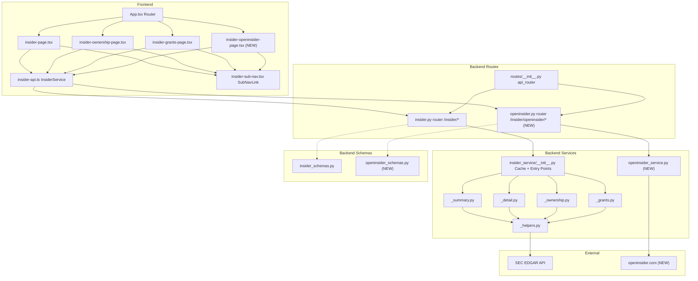
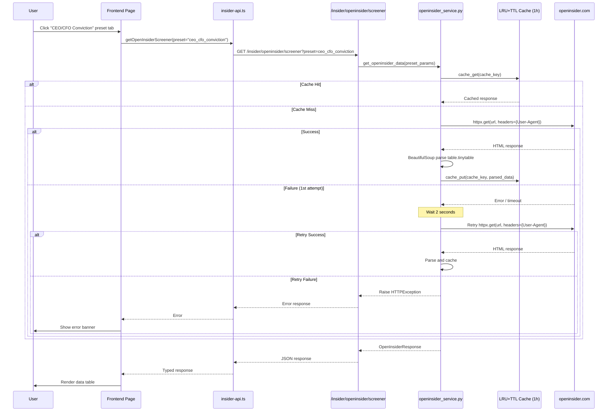

# Research: OpenInsider Sub-Page for Insider Dashboard

## Metadata
- **Requested By**: orchestrator
- **Created**: 2026-04-04
- **Scope**: Analyze existing insider dashboard architecture, caching, routing, and UI patterns to inform adding an OpenInsider scraping sub-page

## Executive Summary
- The insider dashboard follows a well-established package architecture: `insider_service/` with sub-modules (`_summary`, `_detail`, `_ownership`, `_grants`), shared helpers, and a centralized LRU+TTL cache in `__init__.py`
- All insider sub-pages share an identical UI layout pattern: header with sub-nav links, search bar, loading skeleton, error banner, results table
- Frontend routing uses flat `/insider/*` paths in `App.tsx`; sub-navigation uses `SubNavLink` components rendered identically on each page
- `httpx` is available as a direct dependency; `beautifulsoup4` and `lxml` exist as transitive dependencies in the lockfile but are NOT declared in `pyproject.toml` -- they must be added as explicit dependencies
- `pandas` is a direct dependency and `pd.read_html()` is available for HTML table parsing as an alternative to manual BeautifulSoup row iteration
- The existing cache uses `OrderedDict` with monotonic timestamps, 5-min TTL, max 50 entries -- the new OpenInsider service needs its own cache with 1-hour TTL
- Backend services use `asyncio.to_thread()` to wrap synchronous scraping/fetching in async endpoints
- The existing scraping service (`scraping_service.py`) uses `crawl4ai` (headless browser), which is a heavier approach than what is needed here; the OpenInsider scraping should use simple `httpx` + `BeautifulSoup` instead

## Relevant Files

### Backend - Service Layer
- `/Users/dmytroshendryk/Documents/Projects/finance/ai-hedge-fund/app/backend/services/insider_service/__init__.py` -- Package init with LRU+TTL cache, async entry points
- `/Users/dmytroshendryk/Documents/Projects/finance/ai-hedge-fund/app/backend/services/insider_service/_helpers.py` -- Shared helpers (coercion, identity, filing iteration)
- `/Users/dmytroshendryk/Documents/Projects/finance/ai-hedge-fund/app/backend/services/insider_service/_summary.py` -- Summary fetch pattern (sync worker + async entry with cache)
- `/Users/dmytroshendryk/Documents/Projects/finance/ai-hedge-fund/app/backend/services/insider_service/_ownership.py` -- Ownership fetch worker
- `/Users/dmytroshendryk/Documents/Projects/finance/ai-hedge-fund/app/backend/services/insider_service/_grants.py` -- Grants fetch worker
- `/Users/dmytroshendryk/Documents/Projects/finance/ai-hedge-fund/app/backend/services/insider_service/_detail.py` -- Detail fetch worker
- `/Users/dmytroshendryk/Documents/Projects/finance/ai-hedge-fund/app/backend/services/screener_service.py` -- Screener service (different pattern: simple module, global cache without TTL)
- `/Users/dmytroshendryk/Documents/Projects/finance/ai-hedge-fund/app/backend/services/scraping_service.py` -- Existing scraping service using crawl4ai (NOT reusable for OpenInsider; uses headless browser)

### Backend - Schemas & Routes
- `/Users/dmytroshendryk/Documents/Projects/finance/ai-hedge-fund/app/backend/models/insider_schemas.py` -- Pydantic response models for all insider endpoints
- `/Users/dmytroshendryk/Documents/Projects/finance/ai-hedge-fund/app/backend/models/screener_schemas.py` -- Screener schemas (simpler pattern with dict-based rows)
- `/Users/dmytroshendryk/Documents/Projects/finance/ai-hedge-fund/app/backend/routes/insider.py` -- Insider routes (4 GET endpoints with Query validation)
- `/Users/dmytroshendryk/Documents/Projects/finance/ai-hedge-fund/app/backend/routes/screener.py` -- Screener routes (GET filters + POST search)
- `/Users/dmytroshendryk/Documents/Projects/finance/ai-hedge-fund/app/backend/routes/__init__.py` -- Router registration hub

### Frontend - Pages & Components
- `/Users/dmytroshendryk/Documents/Projects/finance/ai-hedge-fund/app/frontend/src/App.tsx` -- Route definitions
- `/Users/dmytroshendryk/Documents/Projects/finance/ai-hedge-fund/app/frontend/src/pages/insider-page.tsx` -- Dashboard page (main insider page)
- `/Users/dmytroshendryk/Documents/Projects/finance/ai-hedge-fund/app/frontend/src/pages/insider-ownership-page.tsx` -- Ownership sub-page
- `/Users/dmytroshendryk/Documents/Projects/finance/ai-hedge-fund/app/frontend/src/pages/insider-grants-page.tsx` -- Grants sub-page
- `/Users/dmytroshendryk/Documents/Projects/finance/ai-hedge-fund/app/frontend/src/pages/screener-page.tsx` -- Screener page (has presets + custom filter pattern)
- `/Users/dmytroshendryk/Documents/Projects/finance/ai-hedge-fund/app/frontend/src/components/insider/insider-sub-nav.tsx` -- SubNavLink component
- `/Users/dmytroshendryk/Documents/Projects/finance/ai-hedge-fund/app/frontend/src/components/insider/skipped-count-banner.tsx` -- Shared error banner
- `/Users/dmytroshendryk/Documents/Projects/finance/ai-hedge-fund/app/frontend/src/services/insider-api.ts` -- Insider API service class + TypeScript interfaces
- `/Users/dmytroshendryk/Documents/Projects/finance/ai-hedge-fund/app/frontend/src/services/screener-api.ts` -- Screener API service class
- `/Users/dmytroshendryk/Documents/Projects/finance/ai-hedge-fund/app/frontend/src/utils/format.ts` -- Shared formatting utilities (formatNumber, formatValue, formatPrice)
- `/Users/dmytroshendryk/Documents/Projects/finance/ai-hedge-fund/app/frontend/src/components/navigation/app-navbar.tsx` -- Top-level navigation bar

### Configuration
- `/Users/dmytroshendryk/Documents/Projects/finance/ai-hedge-fund/pyproject.toml` -- Python dependencies

### Tests
- `/Users/dmytroshendryk/Documents/Projects/finance/ai-hedge-fund/tests/backend/insider/conftest.py` -- Test fixtures and helpers
- `/Users/dmytroshendryk/Documents/Projects/finance/ai-hedge-fund/tests/backend/insider/test_routes.py` -- Route handler tests (httpx + ASGITransport pattern)
- `/Users/dmytroshendryk/Documents/Projects/finance/ai-hedge-fund/tests/backend/insider/test_cache.py` -- Cache tests

## Systems and Components

### Key Discoveries

1. **Cache architecture is module-level, not centralized**: The LRU+TTL cache (`_insider_cache`, `_cache_get`, `_cache_put`) is defined in `insider_service/__init__.py` (line 49-75) with `_CACHE_TTL_SECONDS = 300.0` (5 minutes) and `_CACHE_MAX_SIZE = 50`. It uses `time.monotonic()` for TTL checks and `OrderedDict` for LRU eviction. The OpenInsider service needs its own independent cache instance with a 1-hour TTL. The screener service uses a simpler `_filters_cache: dict | None` global without TTL (line 8 of `screener_service.py`).

2. **All insider service modules follow the sync-worker + async-entry pattern**: Each sub-module defines a `_fetch_*` synchronous worker function and a corresponding `get_*` async entry point that wraps it with `asyncio.to_thread()`. For example, `_summary.py` line 178: `_fetch_summaries(ticker, form_type, limit, offset)` (sync) and line 206: `get_insider_summary(...)` (async with cache check). The OpenInsider scraping service should follow this same pattern.

3. **Dependency gap -- beautifulsoup4 not declared**: `beautifulsoup4` and `lxml` are NOT listed in `pyproject.toml` (line 12-42) as direct dependencies. They exist only as transitive deps (via `crawl4ai` or `finvizfinance`) in `poetry.lock`. They MUST be added to `pyproject.toml` for the scraping service. `httpx` is already a direct dependency (`>=0.27.0,<1` at line 34). `pandas` IS a direct dependency (`^2.1.0` at line 21), so `pd.read_html()` is available for HTML table parsing.

4. **Sub-navigation pattern is duplicated across all insider pages**: Each insider page independently renders the same sub-nav block. See `insider-page.tsx` lines 369-372, `insider-ownership-page.tsx` lines 271-274, `insider-grants-page.tsx` lines 221-224. All use:
   ```tsx
   <SubNavLink to="/insider" label="Dashboard" />
   <SubNavLink to="/insider/ownership" label="Ownership" />
   <SubNavLink to="/insider/grants" label="Grants" />
   ```
   A new "OpenInsider" link must be added to ALL existing pages plus the new page.

5. **Route registration follows a flat import pattern**: `routes/__init__.py` imports each router and includes it in `api_router`. A new `openinsider.py` route file needs to be added and registered here (line 14 pattern + line 31 pattern).

6. **Frontend routing is flat, not nested**: `App.tsx` uses `<Route path="/insider/ownership" .../>` (line 27), not nested routes. The new page would follow as `<Route path="/insider/openinsider" element={<InsiderOpeninsiderPage />} />`.

7. **Screener page provides the preset + custom filter UI pattern**: `screener-page.tsx` defines `PRESETS` as a `Record<string, Preset>` (lines 23-77) with `label`, `description`, `filters`, `signal`, and `view` fields. Preset buttons switch active filters. A custom filter section renders all available filter dropdowns in a grid layout (FILTER_CATEGORIES lines 80-157). This pattern directly applies to the OpenInsider custom screener.

8. **API service class pattern**: All frontend API services follow a class-based singleton pattern. `InsiderService` class (insider-api.ts line 142-238) with `baseUrl`, async methods returning typed interfaces, and error handling via `.json().catch(() => null)`. Exported as `export const insiderService = new InsiderService()`.

9. **Insider route endpoints use GET with Query validation**: All 4 existing insider endpoints are GET with `Query(...)` validation using regex patterns (`^[A-Z]{1,5}$` for ticker). The OpenInsider endpoint can follow a different pattern since it does not require a ticker -- it uses preset names or custom filter parameters.

10. **Test pattern uses httpx.AsyncClient with ASGITransport**: Tests in `test_routes.py` create a standalone `FastAPI()` app, include the router, and use `httpx.ASGITransport` for testing (lines 30-44). Service functions are patched at the route module level (e.g., `"app.backend.routes.insider.get_insider_summary"`).

11. **Existing scraping service is NOT reusable**: `scraping_service.py` uses `crawl4ai.AsyncWebCrawler` (a headless browser solution) with semaphores, BFS crawling, and database persistence. This is far heavier than what OpenInsider scraping needs. The OpenInsider service should be a standalone module using `httpx` + `BeautifulSoup` with no dependency on the existing scraping infrastructure.

12. **No select/label/slider shadcn/ui components installed**: The `app/frontend/src/components/ui/` directory does NOT contain `select.tsx`, `label.tsx`, or `slider.tsx`. For the custom screener filter form, the implementation must use either native HTML `<select>` elements (as done in `insider-ownership-page.tsx` line 317-329) or `<Input>` components for text-based filter values. The shadcn/ui `Tabs` component IS available and should be used for preset/custom tab switching.

### Component Diagram

Overview of the existing insider system and where OpenInsider fits.



### Interaction Diagram

Sequence for a preset screener request to OpenInsider.



## Contracts and Interfaces

### OpenInsider URL Construction Pattern

The openinsider.com screener uses URL query parameters to filter results. The base URL is `http://openinsider.com/screener`. Key parameters observed:

| Parameter | Purpose | Example Values |
|-----------|---------|---------------|
| `s` | Ticker symbol filter | `AAPL`, empty for all |
| `o` | Officer filter | empty, specific codes |
| `pl` | Price low | `5` |
| `ph` | Price high | empty |
| `ll` | Shares low | empty |
| `lh` | Shares high | empty |
| `fd` | Filing date (days ago) | `30`, `90`, `365` |
| `fdr` | Filing date range | date range |
| `td` | Trade date (days ago) | `30`, `90` |
| `tdr` | Trade date range | date range |
| `fdlyl` | % change in holdings low | `20` |
| `fdlyh` | % change in holdings high | empty |
| `dtefrom` | Date from | `mm/dd/yyyy` |
| `dteto` | Date to | `mm/dd/yyyy` |
| `xp` | Transaction type filter | `1` for purchases |
| `vl` | Value low | `100000`, `25000` |
| `vh` | Value high | empty |
| `isc` | Insider cluster count | `3` |

### Proposed Backend API Surface

Based on existing patterns, the new endpoints should be:

**GET /insider/openinsider/screener**
- Query params: `preset` (enum: `ceo_cfo_conviction`, `cluster_buy`, `significant_increase`, `custom`) + individual filter params for custom mode
- Response: `OpenInsiderResponse` with list of `OpenInsiderRecord` and metadata

**Three Preset Filter Configurations:**

1. **CEO/CFO Conviction**: `xp=1` (purchase), officer=CEO/CFO, `vl=100000`, `fd=30`
2. **Cluster Buy**: `xp=1` (purchase), `isc=3` (3+ insiders), `vl=25000`, `fd=90`
3. **Significant Increase**: `xp=1` (purchase), any officer, `fdlyl=20` (>20% change), `fd=90`

### Proposed Schema Models

Based on openinsider.com table structure (`class="tinytable"`), the table columns are:
- X (row marker), Filing Date, Trade Date, Ticker, Company Name, Insider Name, Title, Trade Type, Price, Qty, Owned, Delta Own, Value

```python
# Pattern matches insider_schemas.py
class OpenInsiderRecord(BaseModel):
    filing_date: str
    trade_date: str
    ticker: str
    company_name: str
    insider_name: str
    title: str
    trade_type: str
    price: float | None = None
    qty: int | None = None
    owned: int | None = None
    delta_own: str | None = None  # e.g. "+15%"
    value: float | None = None

class OpenInsiderResponse(BaseModel):
    preset: str  # preset name or "custom"
    records: list[OpenInsiderRecord]
    total: int
    cached: bool = False
```

### Frontend API Addition to InsiderService

Following the existing pattern in `insider-api.ts`:

```typescript
// Add to InsiderService class
async getOpenInsiderScreener(
  preset: string,
  customParams?: Record<string, string>
): Promise<OpenInsiderResponse> {
  const params = new URLSearchParams({ preset });
  if (customParams) {
    for (const [k, v] of Object.entries(customParams)) {
      if (v) params.set(k, v);
    }
  }
  const response = await fetch(`${this.baseUrl}/openinsider/screener?${params}`);
  // ... error handling pattern from existing methods ...
  return response.json();
}
```

## Code Overview

### Architecture & Design
- **Backend pattern**: Package-based service (`insider_service/`) with sub-modules. Each sub-module has a sync `_fetch_*` worker and an async `get_*` entry point. Cache is centralized in `__init__.py`.
- **Route pattern**: `APIRouter(prefix="/insider")` with GET endpoints, `Query(...)` validators, and try/except wrapping service calls into HTTP errors.
- **Frontend pattern**: Page components with `useState` for state management, class-based API service singletons, shared UI components (Table, Badge, Skeleton, Card, Tabs from shadcn/ui).
- **Screener preset pattern**: Object map of presets with label + description + filter params, rendered as clickable buttons that populate filter state.

### Dependencies
- **Direct (pyproject.toml)**: `httpx >=0.27.0,<1`, `fastapi ^0.104.0`, `pydantic ^2.4.2`, `pandas ^2.1.0`
- **Transitive (in lockfile but NOT in pyproject.toml)**: `beautifulsoup4` (lockfile line 316), `lxml` (lockfile line 3030) -- MUST be added as explicit deps
- **NOT available**: `requests` is NOT in pyproject.toml; use `httpx` instead
- **Frontend**: React, React Router DOM, shadcn/ui components (see UI components list below), Recharts, Lucide icons, Tailwind CSS

### Data Flow
1. User selects preset tab or configures custom filters on frontend
2. Frontend sends GET request to `/insider/openinsider/screener?preset=...`
3. Route handler calls service function
4. Service checks LRU+TTL cache (1-hour TTL)
5. On cache miss: builds openinsider.com URL from parameters, fetches via httpx with browser User-Agent
6. On failure: retries once after 2-second delay
7. Parses HTML with BeautifulSoup, extracts `table.tinytable` rows
8. Returns structured response, caches it
9. Frontend renders data in table

## Constraints and Risks

### Dependency Constraint
- **Evidence**: `beautifulsoup4` is NOT in `pyproject.toml` lines 12-42, only in `poetry.lock` line 316 as a transitive dependency. Must be explicitly added: `beautifulsoup4 = "^4.12.0"`.
- **Evidence**: `requests` is NOT available at all. The requirements mention `requests` but the project uses `httpx` (`>=0.27.0,<1` at pyproject.toml line 34). The scraping service must use `httpx` instead.

### Scraping Fragility
- **Risk**: openinsider.com HTML structure (`table.tinytable`) could change without notice, breaking the parser.
- **Mitigation needed**: Robust error handling around table parsing; fallback to empty results with error message rather than 500.

### Rate Limiting / Blocking Risk
- **Risk**: openinsider.com may block requests without browser-like headers or if request frequency is too high.
- **Evidence**: The requirements specify browser-like User-Agent headers and 1-hour TTL cache to minimize requests.
- **Mitigation needed**: User-Agent header, retry once with 2-second delay, cache aggressively.

### Sub-Navigation Update Scope
- **Evidence**: Sub-nav links are hardcoded in 3 separate page files (insider-page.tsx:369-372, insider-ownership-page.tsx:271-274, insider-grants-page.tsx:221-224). Adding "OpenInsider" requires modifying all 3 existing files plus the new page. Consider extracting sub-nav links to a shared constant or component to reduce duplication (not in current scope but a maintenance concern).

### Cache Isolation
- **Constraint**: The existing insider cache in `__init__.py` has 5-min TTL and 50-entry max. The OpenInsider feature needs 1-hour TTL. These should be separate cache instances. The service should NOT share the existing `_insider_cache` -- it should define its own `OrderedDict`-based cache following the same pattern but with `_CACHE_TTL_SECONDS = 3600.0`.

### No `requests` Library
- **Constraint**: The project uses `httpx` (line 34 of pyproject.toml), not `requests`. The scraping service should use `httpx` (synchronous client `httpx.Client` or `httpx.get()`) wrapped in `asyncio.to_thread()`, matching the existing pattern. Alternatively, use `httpx.AsyncClient` directly since the route handler is already async.

### No select/slider UI Components
- **Constraint**: The `app/frontend/src/components/ui/` directory does NOT contain `select.tsx`, `label.tsx`, or `slider.tsx`. Custom screener form inputs must use native HTML `<select>` (as in `insider-ownership-page.tsx` lines 317-329) or shadcn `<Input>` components. The `Tabs` component IS available for preset/custom tab switching.

### Existing Scraping Service Not Reusable
- **Constraint**: `scraping_service.py` uses `crawl4ai.AsyncWebCrawler` (headless browser with semaphores, BFS crawling, DB persistence). This is architecturally incompatible with simple HTTP scraping. The OpenInsider service must be a standalone module.

## Appendix

### Files That Need Modification (Existing)
1. `/Users/dmytroshendryk/Documents/Projects/finance/ai-hedge-fund/pyproject.toml` -- Add `beautifulsoup4` dependency
2. `/Users/dmytroshendryk/Documents/Projects/finance/ai-hedge-fund/app/backend/routes/__init__.py` -- Register new router
3. `/Users/dmytroshendryk/Documents/Projects/finance/ai-hedge-fund/app/frontend/src/App.tsx` -- Add route for new page
4. `/Users/dmytroshendryk/Documents/Projects/finance/ai-hedge-fund/app/frontend/src/pages/insider-page.tsx` -- Add OpenInsider sub-nav link (line 371)
5. `/Users/dmytroshendryk/Documents/Projects/finance/ai-hedge-fund/app/frontend/src/pages/insider-ownership-page.tsx` -- Add OpenInsider sub-nav link (line 273)
6. `/Users/dmytroshendryk/Documents/Projects/finance/ai-hedge-fund/app/frontend/src/pages/insider-grants-page.tsx` -- Add OpenInsider sub-nav link (line 223)
7. `/Users/dmytroshendryk/Documents/Projects/finance/ai-hedge-fund/app/frontend/src/services/insider-api.ts` -- Add OpenInsider types and API methods

### Files That Need Creation (New)
1. `app/backend/services/openinsider_service.py` -- Scraping service with cache, retry, parsing
2. `app/backend/models/openinsider_schemas.py` -- Pydantic schemas for OpenInsider data
3. `app/backend/routes/openinsider.py` -- FastAPI route handler(s)
4. `app/frontend/src/pages/insider-openinsider-page.tsx` -- React page with preset tabs + custom screener
5. `tests/backend/insider/test_openinsider_service.py` -- Service unit tests
6. `tests/backend/insider/test_openinsider_routes.py` -- Route handler tests

### UI Components Available (shadcn/ui)
From `/Users/dmytroshendryk/Documents/Projects/finance/ai-hedge-fund/app/frontend/src/components/ui/`:
- `tabs.tsx` (Tabs, TabsList, TabsTrigger) -- for preset/custom tab switching
- `table.tsx` (Table, TableBody, TableCell, TableHead, TableHeader, TableRow) -- for results table
- `badge.tsx` (Badge) -- for trade type labels
- `button.tsx` (Button) -- for actions
- `input.tsx` (Input) -- for custom filter text inputs
- `card.tsx` (Card, CardContent, CardHeader, CardTitle) -- for summary cards
- `skeleton.tsx` (Skeleton) -- for loading states
- `checkbox.tsx` -- potentially for filter toggles
- `dialog.tsx` -- if needed for filter configuration

### UI Components NOT Available (must use native HTML or install)
- No `select.tsx` -- use native `<select>` as in `insider-ownership-page.tsx` line 317
- No `label.tsx` -- use native `<label>` or `<span>` elements
- No `slider.tsx` -- use `<Input type="number">` for numeric range filters

### Existing Insider Test Files (for pattern reference)
- `/Users/dmytroshendryk/Documents/Projects/finance/ai-hedge-fund/tests/backend/insider/test_routes.py` -- Route tests using httpx.ASGITransport
- `/Users/dmytroshendryk/Documents/Projects/finance/ai-hedge-fund/tests/backend/insider/test_cache.py` -- Cache behavior tests
- `/Users/dmytroshendryk/Documents/Projects/finance/ai-hedge-fund/tests/backend/insider/test_fetch_summaries.py` -- Service worker tests
- `/Users/dmytroshendryk/Documents/Projects/finance/ai-hedge-fund/tests/backend/insider/test_ownership_routes.py` -- Ownership route tests
- `/Users/dmytroshendryk/Documents/Projects/finance/ai-hedge-fund/tests/backend/insider/test_grants_routes.py` -- Grants route tests
- `/Users/dmytroshendryk/Documents/Projects/finance/ai-hedge-fund/tests/backend/insider/conftest.py` -- Shared fixtures pattern
