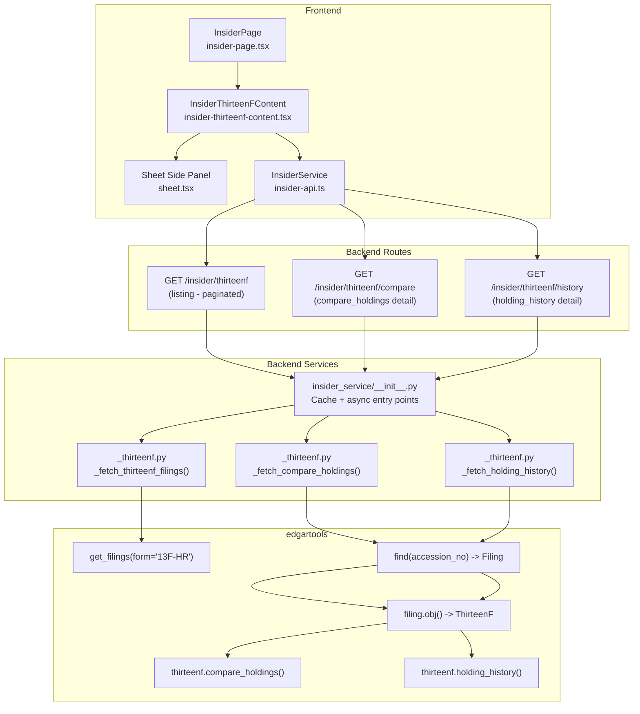
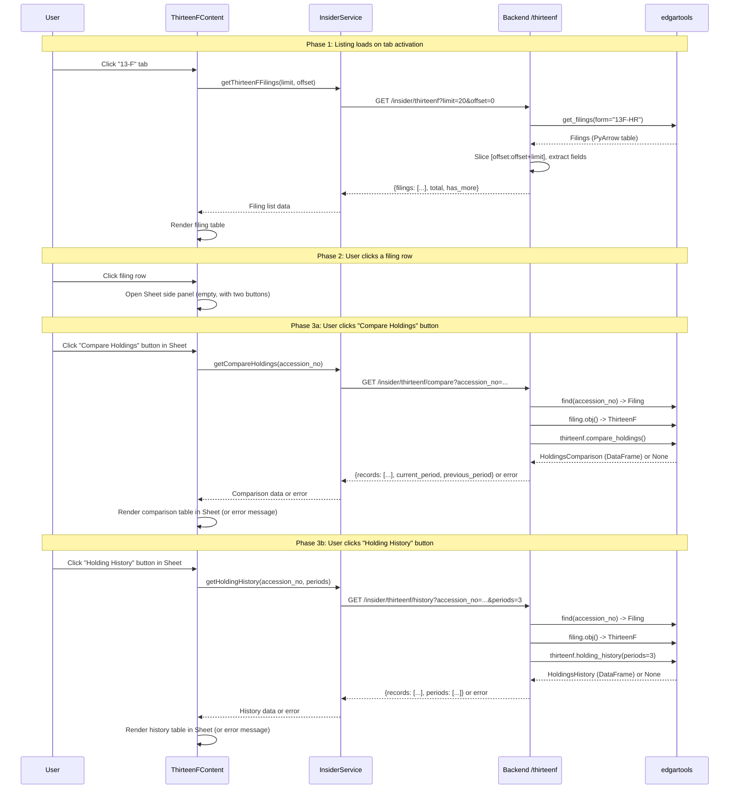

# Research: 13-F Tab Redesign -- All-Companies Listing with Drill-Down Detail

## Metadata
- **Requested By**: orchestrator
- **Created**: 2026-04-05
- **Scope**: Redesign the 13-F tab in the Edgar Insider page to show all recent 13F-HR filings across all companies (not ticker-dependent), with drill-down detail showing compare_holdings() and holding_history() in a side panel.

## Executive Summary

- The current 13F implementation is ticker-dependent: `_fetch_thirteenf(ticker)` calls `Company(ticker).get_filings(form="13F-HR")` and returns filings + holdings for one company only.
- The redesign requires switching to the module-level `edgar.get_filings(form="13F-HR")` which returns all 13F-HR filings across all companies for a given year/quarter, with each filing having `cik`, `company`, `form`, `filing_date`, `accession_no` attributes.
- The edgartools `ThirteenF` class already has `compare_holdings()` and `holding_history()` methods that return `HoldingsComparison` and `HoldingsHistory` objects respectively, each wrapping a pandas DataFrame with an iterable `__iter__` interface yielding dicts.
- A `Sheet` component (shadcn/ui slide-out panel) already exists in the frontend at `/app/frontend/src/components/ui/sheet.tsx` and can be used for the detail side panel.
- The existing LRU+TTL cache pattern in `insider_service/__init__.py` is directly reusable for the new endpoints.
- Filing lookup by accession number for detail endpoints is supported via `edgar.find(accession_no)` which returns a `Filing` object, and also via `edgar.get_by_accession_number(accession_no)`.

## Relevant Files

### Backend
- `/Users/dmytroshendryk/Documents/Projects/finance/ai-hedge-fund/app/backend/services/insider_service/_thirteenf.py` -- Current ticker-based 13F fetch worker (to be rewritten)
- `/Users/dmytroshendryk/Documents/Projects/finance/ai-hedge-fund/app/backend/services/insider_service/__init__.py` -- Cache layer and async entry points (lines 117-125: `get_thirteenf_holdings`)
- `/Users/dmytroshendryk/Documents/Projects/finance/ai-hedge-fund/app/backend/models/insider_schemas.py` -- Pydantic schemas (lines 174-206: ThirteenF schemas)
- `/Users/dmytroshendryk/Documents/Projects/finance/ai-hedge-fund/app/backend/routes/insider.py` -- Route definitions (lines 144-167: `/insider/thirteenf`)
- `/Users/dmytroshendryk/Documents/Projects/finance/ai-hedge-fund/app/backend/services/insider_service/_helpers.py` -- Shared helpers (`_ensure_identity`, `_coerce_int`, `_coerce_float`)

### Frontend
- `/Users/dmytroshendryk/Documents/Projects/finance/ai-hedge-fund/app/frontend/src/components/insider/insider-thirteenf-content.tsx` -- Current 13F tab UI (to be rewritten)
- `/Users/dmytroshendryk/Documents/Projects/finance/ai-hedge-fund/app/frontend/src/pages/insider-page.tsx` -- Parent page hosting the 13F tab (line 604: `<InsiderThirteenFContent ticker={submittedTicker} />`)
- `/Users/dmytroshendryk/Documents/Projects/finance/ai-hedge-fund/app/frontend/src/services/insider-api.ts` -- API client (lines 325-339: `getThirteenF` method, lines 142-172: ThirteenF types)
- `/Users/dmytroshendryk/Documents/Projects/finance/ai-hedge-fund/app/frontend/src/components/ui/sheet.tsx` -- shadcn/ui Sheet (slide-out panel) component

### edgartools Library (read-only reference)
- `/Users/dmytroshendryk/Library/Caches/pypoetry/virtualenvs/ai-hedge-fund-U06eZBFM-py3.11/lib/python3.11/site-packages/edgar/__init__.py` -- Module-level `find()` (line 135), `get_by_accession_number` (line 15)
- `/Users/dmytroshendryk/Library/Caches/pypoetry/virtualenvs/ai-hedge-fund-U06eZBFM-py3.11/lib/python3.11/site-packages/edgar/thirteenf/models.py` -- ThirteenF class with `compare_holdings()` (line 904) and `holding_history()` (line 989)
- `/Users/dmytroshendryk/Library/Caches/pypoetry/virtualenvs/ai-hedge-fund-U06eZBFM-py3.11/lib/python3.11/site-packages/edgar/_filings.py` -- `get_filings()` (line 1240), `Filing` class (line 1411), `Filings` class (line 527)

## Systems and Components

### Key Discoveries

1. **Module-level `get_filings()` API**: `edgar.get_filings(form="13F-HR")` returns a `Filings` object (PyArrow-backed) containing all 13F-HR filings for the current year-to-date by default. Supports `year` and `quarter` params. Each filing in the iterable has: `cik` (int), `company` (str), `form` (str), `filing_date` (str), `accession_no` (str). This replaces `Company(ticker).get_filings(form="13F-HR")`.

2. **Filings pagination via slicing**: The `Filings` class supports `__getitem__` with slices (line 849-856): `filings[offset:offset+limit]` returns a new `Filings` object. Also supports `len()`, `head(n)`, `tail(n)`. This enables backend pagination without materializing all filings.

3. **`filing.obj()` returns `ThirteenF`**: Calling `filing.obj()` on a 13F-HR filing returns a `ThirteenF` instance. This is already used in the current code (line 103 of `_thirteenf.py`).

4. **`compare_holdings()` returns `HoldingsComparison`**: Method on `ThirteenF` (line 904). Returns `None` if previous holdings unavailable (first filing for a company). The `.data` attribute is a pandas DataFrame with columns: `Cusip`, `Ticker`, `Issuer`, `Shares`, `PrevShares`, `Value`, `PrevValue`, `ShareChange`, `ShareChangePct`, `ValueChange`, `ValueChangePct`, `Status` (NEW/CLOSED/INCREASED/DECREASED/UNCHANGED). Sorted by absolute `ValueChange` descending. Iterable via `__iter__` yielding dicts.

5. **`holding_history()` returns `HoldingsHistory`**: Method on `ThirteenF` (line 989). Default `periods=3`. Returns `None` if current holdings unavailable. The `.data` attribute is a DataFrame with columns: `Cusip`, `Ticker`, `Issuer`, plus one column per quarter period label (e.g. `2025-03-31`, `2025-06-30`). The `.periods` attribute is a `list[str]` of period labels. Iterable via `__iter__` yielding dicts.

6. **Both detail calls are slow**: `compare_holdings()` internally calls `previous_holding_report()` which fetches related filings and parses XML infotables. `holding_history()` walks backward through multiple quarters. These MUST be lazy-loaded on demand, not preloaded.

7. **Sheet component is available**: The frontend has a fully configured shadcn/ui `Sheet` component at `sheet.tsx` with `SheetContent`, `SheetHeader`, `SheetTitle`, `SheetDescription`, `SheetFooter`. Default side is `right` with `sm:max-w-sm` width (will need wider for tables).

8. **Cache pattern**: The existing LRU+TTL cache in `__init__.py` uses `_cache_get(key)` / `_cache_put(key, response)` with 5-minute TTL and 50-entry max. Cache keys follow the pattern `"thirteenf:{ticker}:{limit}"`. For the new endpoints, keys should be structured like `"thirteenf:filings:{year}:{quarter}:{limit}:{offset}"` and `"thirteenf:compare:{accession_no}"` / `"thirteenf:history:{accession_no}:{periods}"`.

9. **Current 13F tab requires ticker**: The `InsiderThirteenFContent` component takes a `ticker` prop (line 127) and shows "Search a ticker above" when empty (line 167). The redesign removes this dependency -- the 13F tab should auto-load filings on mount.

10. **Filing object company name**: The `Filing` class (line 1418) has a `company` attribute which is the filer name (e.g. "BERKSHIRE HATHAWAY INC"). This can be used for the listing without calling `filing.obj()` (which is expensive).

11. **Filing lookup by accession number -- VERIFIED**: `edgar.find(accession_no)` (line 135 of `__init__.py`) accepts an accession number string (format `XXXXXXXXXX-XX-XXXXXX`) and returns a `Filing` object via `get_by_accession_number_enriched()` (line 149). Also available directly: `from edgar import get_by_accession_number`. This is the recommended approach for the detail endpoints (`/thirteenf/compare` and `/thirteenf/history`) -- no need to cache the full Filings index or re-fetch filings by CIK.

### Component Diagram



### Interaction Diagram



## Contracts and Interfaces

### New Backend Endpoints

**GET /insider/thirteenf** (rewritten -- no longer requires ticker)
- Request: `?limit=20&offset=0` (optional: `year`, `quarter`)
- Response:
```json
{
  "filings": [
    {
      "filing_date": "2026-03-15",
      "accession_no": "0001234567-26-000001",
      "company": "BERKSHIRE HATHAWAY INC",
      "cik": 1067983,
      "form": "13F-HR"
    }
  ],
  "total": 5000,
  "has_more": true,
  "skipped_count": 0
}
```

**GET /insider/thirteenf/compare** (new)
- Request: `?accession_no=0001234567-26-000001`
- Response (success):
```json
{
  "accession_no": "0001234567-26-000001",
  "current_period": "2025-12-31",
  "previous_period": "2025-09-30",
  "manager_name": "BERKSHIRE HATHAWAY INC",
  "records": [
    {
      "cusip": "023135106",
      "ticker": "AMZN",
      "issuer": "AMAZON COM INC",
      "shares": 10000000,
      "prev_shares": 8000000,
      "value": 1500000,
      "prev_value": 1200000,
      "share_change": 2000000,
      "share_change_pct": 25.0,
      "value_change": 300000,
      "value_change_pct": 25.0,
      "status": "INCREASED"
    }
  ],
  "total": 150
}
```
- Response (no comparison available -- first filing): HTTP 404 with `{"detail": "No comparison data available for this filing (no previous quarter found)"}`

**GET /insider/thirteenf/history** (new)
- Request: `?accession_no=0001234567-26-000001&periods=3`
- Response (success):
```json
{
  "accession_no": "0001234567-26-000001",
  "manager_name": "BERKSHIRE HATHAWAY INC",
  "periods": ["2025-06-30", "2025-09-30", "2025-12-31"],
  "records": [
    {
      "cusip": "023135106",
      "ticker": "AMZN",
      "issuer": "AMAZON COM INC",
      "2025-06-30": 7000000,
      "2025-09-30": 8000000,
      "2025-12-31": 10000000
    }
  ],
  "total": 150
}
```
- Response (no history available): HTTP 404 with `{"detail": "No holding history available for this filing"}`

### API Surface -- edgartools Key Methods

**`edgar.get_filings(form="13F-HR")`** (module-level, line 1240 of `_filings.py`)
- Returns `Filings` object; supports `year`, `quarter`, `filing_date` params
- Default: current year-to-date
- `len(filings)` returns total count
- `filings[offset:offset+limit]` returns sliced `Filings`
- Iterating yields `Filing` objects with: `.cik`, `.company`, `.form`, `.filing_date`, `.accession_no`

**`edgar.find(accession_no)`** (module-level, line 135 of `__init__.py`)
- Accepts accession number string (format `XXXXXXXXXX-XX-XXXXXX`, regex `\d{10}-\d{2}-\d{6}`)
- Returns `Filing` object via `get_by_accession_number_enriched()`
- Returns `None` if not found

**`filing.obj()`** -- returns `ThirteenF` instance for 13F-HR filings

**`ThirteenF.compare_holdings(display_limit=200)`** (line 904 of models.py)
- Returns `HoldingsComparison` or `None`
- `.data` DataFrame columns: `Cusip`, `Ticker`, `Issuer`, `Shares`, `PrevShares`, `Value`, `PrevValue`, `ShareChange`, `ShareChangePct`, `ValueChange`, `ValueChangePct`, `Status`
- `.current_period`, `.previous_period`, `.manager_name` attributes
- `None` when previous holdings are unavailable (first filing)

**`ThirteenF.holding_history(periods=3, display_limit=100)`** (line 989 of models.py)
- Returns `HoldingsHistory` or `None`
- `.data` DataFrame columns: `Cusip`, `Ticker`, `Issuer`, plus dynamic period columns
- `.periods` list of period labels (e.g. `["2025-03-31", "2025-06-30", "2025-09-30"]`)
- `.manager_name` attribute
- `None` when current holdings are unavailable

### Frontend API Client Methods (new/modified in insider-api.ts)

```typescript
// Replaces current getThirteenF(ticker, limit)
async getThirteenFFilings(limit?: number, offset?: number): Promise<ThirteenFListResponse>

// New
async getCompareHoldings(accessionNo: string): Promise<CompareHoldingsResponse>

// New
async getHoldingHistory(accessionNo: string, periods?: number): Promise<HoldingHistoryResponse>
```

## Code Overview

### Architecture and Design

- **Current**: Ticker-dependent pipeline: `Company(ticker).get_filings(form="13F-HR")` -> parse each filing via `.obj()` -> extract summary + holdings from latest filing.
- **Target**: Company-independent listing: `get_filings(form="13F-HR")` -> paginated filing list (lightweight, no `.obj()` call) + on-demand detail via `find(accession_no)` -> `.obj().compare_holdings()` and `.obj().holding_history()`.
- **Key design change**: The listing endpoint MUST NOT call `filing.obj()` for each filing (too slow). Instead, use the lightweight `Filing` attributes (`company`, `cik`, `filing_date`, `accession_no`) directly from the index. Detail endpoints use `edgar.find(accession_no)` to look up a single filing, then call `.obj()` only for that one filing.

### Dependencies

- `edgartools >= 5.27.0` -- provides `get_filings()`, `find()`, `ThirteenF.compare_holdings()`, `ThirteenF.holding_history()`
- `@radix-ui/react-dialog` -- used by shadcn/ui `Sheet` component
- `class-variance-authority` -- used by Sheet variants

### Data Flow

1. **Listing**: `get_filings(form="13F-HR")` returns PyArrow table -> slice for pagination -> extract `Filing` attributes -> return JSON list
2. **Compare**: `find(accession_no)` -> `Filing` -> `filing.obj()` -> `ThirteenF.compare_holdings()` -> serialize `.data` DataFrame rows to JSON
3. **History**: `find(accession_no)` -> `Filing` -> `filing.obj()` -> `ThirteenF.holding_history(periods)` -> serialize `.data` DataFrame rows to JSON

## Constraints and Risks

1. **Performance of `get_filings()` for current year**: Returns ALL filings of the given form for the year-to-date. For 13F-HR, this could be tens of thousands of filings per quarter. The PyArrow table is efficient for slicing, but the initial download of the quarterly index may take a few seconds on first call. **Mitigation**: Cache the `Filings` object itself (not just the response) or rely on edgartools internal caching.

2. **`filing.obj()` is slow (~1-3s per filing)**: It downloads and parses the XML primary document. This is why the listing endpoint must NOT call `.obj()`. Detail endpoints must be lazy-loaded. **Evidence**: Current code at `_thirteenf.py` line 103 calls `filing.obj()` for every filing in the loop.

3. **`compare_holdings()` returns `None` for first filing**: When a company's first 13F-HR has no predecessor, `previous_holding_report()` returns `None`, causing `compare_holdings()` to return `None`. The backend must handle this and return HTTP 404 with a clear message. The frontend must show a per-filing error state in the side panel. **Evidence**: Line 925-927 of models.py.

4. **`holding_history()` may return fewer periods**: If the company has fewer historical filings than `periods`, the result will contain fewer columns. The frontend must handle dynamic column counts. **Evidence**: Lines 1009-1013 of models.py -- loop breaks when `prev is None`.

5. **HoldingsComparison/HoldingsHistory `.data` columns are dynamic**: The history DataFrame has columns named after period dates (e.g. `"2025-03-31"`). The backend must serialize these dynamic columns properly and communicate the period list to the frontend via a separate `periods` field in the response.

6. **Sheet component width**: The default `Sheet` `sm:max-w-sm` (384px) is too narrow for data tables. The `SheetContent` accepts a `className` prop that can override the width (e.g. `className="sm:max-w-2xl"` or `className="w-[800px] sm:max-w-[800px]"`).

7. **Current `ThirteenFResponse` schema has `ticker` field**: The rewritten listing endpoint removes ticker dependency. The schema must be redesigned: remove `ticker`, remove `holdings` (no longer returned in listing), add `cik`, `company` per filing, add `has_more` for pagination.

8. **`edgar.find()` for detail endpoints -- VERIFIED**: `edgar.find(accession_no)` (line 135-149 of `__init__.py`) accepts accession number strings matching regex `\d{10}-\d{2}-\d{6}` and calls `get_by_accession_number_enriched()`. Returns a `Filing` object or `None`. This is the recommended approach for the detail endpoints -- no need to cache the full Filings index or pass CIK from the frontend.

9. **NaN handling in DataFrame serialization**: `compare_holdings()` and `holding_history()` DataFrames may contain `NaN` values (e.g. `ShareChangePct` when `PrevShares` is 0, or period columns for securities not held in a quarter). Python `NaN` serializes to JSON `null` via `float('nan')` but pandas `.to_dict()` may produce `nan` strings. The backend must explicitly convert NaN to `None` before serialization. **Evidence**: Lines 952-954 and 956-961 of models.py show NaN is used for missing numeric values.

## Appendix

### edgartools Filing Object Attributes (from `_filings.py` line 1416-1427)
```python
class Filing:
    def __init__(self, cik: int, company: str, form: str, filing_date: str, accession_no: str, related_entities=None):
        self.cik = cik
        self.company = company
        self.form = form
        self.filing_date = filing_date
        self.accession_no = accession_no
```

### edgartools `find()` Function (from `__init__.py` line 135-152)
```python
def find(search_id):
    # For accession numbers matching r"\d{10}-\d{2}-\d{6}":
    return get_by_accession_number_enriched(search_id)
    # For 18-digit numeric strings (no dashes):
    accession_number = search_id[:10] + "-" + search_id[10:12] + "-" + search_id[12:]
    return get_by_accession_number_enriched(accession_number)
```

### HoldingsComparison DataFrame Columns
`Cusip`, `Ticker`, `Issuer`, `Shares`, `PrevShares`, `Value`, `PrevValue`, `ShareChange`, `ShareChangePct`, `ValueChange`, `ValueChangePct`, `Status`

Status values: `NEW`, `CLOSED`, `INCREASED`, `DECREASED`, `UNCHANGED`

### HoldingsHistory DataFrame Columns
`Cusip`, `Ticker`, `Issuer`, plus one column per period (e.g. `2025-03-31`, `2025-06-30`, `2025-09-30`)

### Files Requiring Modification
| File | Action |
|------|--------|
| `app/backend/services/insider_service/_thirteenf.py` | Rewrite: replace `_fetch_thirteenf` with 3 new workers (`_fetch_thirteenf_filings`, `_fetch_compare_holdings`, `_fetch_holding_history`) |
| `app/backend/services/insider_service/__init__.py` | Update: replace `get_thirteenf_holdings` with 3 new async entry points (`get_thirteenf_filings`, `get_compare_holdings`, `get_holding_history`) |
| `app/backend/models/insider_schemas.py` | Update: redesign ThirteenF schemas -- new `ThirteenFListResponse`, `CompareHoldingsRecord`, `CompareHoldingsResponse`, `HoldingHistoryResponse`; deprecate old `ThirteenFResponse`, `ThirteenFHoldingRecord` |
| `app/backend/routes/insider.py` | Update: rewrite `/thirteenf` route (remove ticker param, add offset/limit), add `/thirteenf/compare` and `/thirteenf/history` routes |
| `app/frontend/src/services/insider-api.ts` | Update: replace `getThirteenF` with `getThirteenFFilings`, add `getCompareHoldings` and `getHoldingHistory` methods; add new TypeScript interfaces |
| `app/frontend/src/components/insider/insider-thirteenf-content.tsx` | Rewrite: auto-loading paginated filing table + Sheet side panel with lazy-loaded Compare Holdings and Holding History sections |
| `app/frontend/src/pages/insider-page.tsx` | Minor: remove `ticker` prop from `<InsiderThirteenFContent>` (line 605), component now takes no props |
