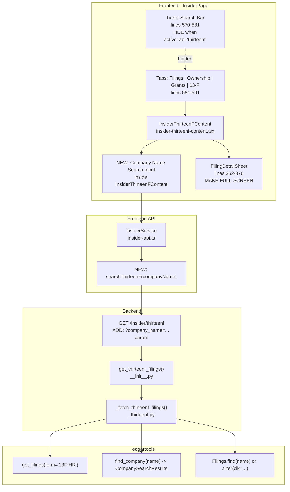
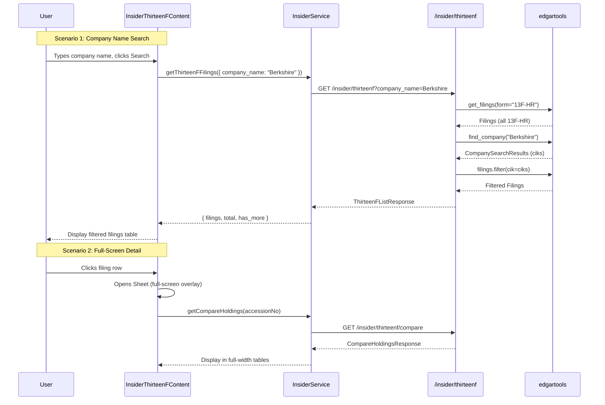

# Research: 13-F Tab UI Improvements (Company Search, Hide Ticker, Full-Screen Sheet)

## Metadata
- **Requested By**: user
- **Created**: 2026-04-06
- **Scope**: Three UI improvements to the 13-F tab: (1) company name search backend endpoint, (2) hide ticker search bar on 13-F tab, (3) full-screen filing detail overlay

## Executive Summary

- **Company name search**: The edgartools library provides `find_company(name, top_n=10)` in `edgar.entity.search` which returns `CompanySearchResults` with `cik`, `ticker`, `company`, `score` columns. Additionally, the `Filings` class has a `.find(company_search_str)` method that combines `find_company()` with `.filter(cik=...)` to return matching filings. Two approaches are viable: (A) a two-step search-then-filter using `find_company()` + `get_filings(form="13F-HR").filter(cik=ciks)`, or (B) direct `get_filings(form="13F-HR").find(company_name)`.
- **Hide ticker search bar**: The ticker input and search button are rendered unconditionally at lines 570-581 of `insider-page.tsx`. The `activeTab` state variable (type `EdgarTab`, line 450) already tracks which tab is active. A simple conditional `{activeTab !== 'thirteenf' && (...)}` wrapper will hide the search bar.
- **Full-screen sheet**: The `SheetContent` at line 355 of `insider-thirteenf-content.tsx` currently uses `className="w-[800px] sm:max-w-[800px]"`. The underlying Sheet component (shadcn/ui) applies default `sm:max-w-sm` for the right side variant. These classes must be overridden to achieve full width. The inner tables for Compare Holdings (line 201) and Holding History (line 310) have `max-h-[400px]` constraints that should also be expanded.

## Relevant Files

### Frontend
- `/Users/dmytroshendryk/Documents/Projects/finance/ai-hedge-fund/app/frontend/src/pages/insider-page.tsx` -- Parent page with ticker search bar (lines 570-581) and tab state (line 450)
- `/Users/dmytroshendryk/Documents/Projects/finance/ai-hedge-fund/app/frontend/src/components/insider/insider-thirteenf-content.tsx` -- 13F tab content with SheetContent sizing (line 355) and detail tables
- `/Users/dmytroshendryk/Documents/Projects/finance/ai-hedge-fund/app/frontend/src/services/insider-api.ts` -- API client, `InsiderService` class (line 235), 13F types (lines 142-206)
- `/Users/dmytroshendryk/Documents/Projects/finance/ai-hedge-fund/app/frontend/src/components/ui/sheet.tsx` -- shadcn/ui Sheet component with `sheetVariants` (line 33)

### Backend
- `/Users/dmytroshendryk/Documents/Projects/finance/ai-hedge-fund/app/backend/routes/insider.py` -- Route definitions, current `/insider/thirteenf` at line 163
- `/Users/dmytroshendryk/Documents/Projects/finance/ai-hedge-fund/app/backend/services/insider_service/_thirteenf.py` -- Worker functions, `_fetch_thirteenf_filings()` at line 155
- `/Users/dmytroshendryk/Documents/Projects/finance/ai-hedge-fund/app/backend/services/insider_service/__init__.py` -- Cache layer and async entry points, `get_thirteenf_filings()` at line 134
- `/Users/dmytroshendryk/Documents/Projects/finance/ai-hedge-fund/app/backend/models/insider_schemas.py` -- Pydantic schemas, `ThirteenFListResponse` at line 189

### edgartools Library (read-only reference)
- `/Users/dmytroshendryk/Library/Caches/pypoetry/virtualenvs/ai-hedge-fund-U06eZBFM-py3.11/lib/python3.11/site-packages/edgar/entity/search.py` -- `find_company()` (line 105), `CompanySearchResults` class (line 24)
- `/Users/dmytroshendryk/Library/Caches/pypoetry/virtualenvs/ai-hedge-fund-U06eZBFM-py3.11/lib/python3.11/site-packages/edgar/_filings.py` -- `Filings.find()` (line 836), `Filings.filter()` (line 654), `get_filings()` (line 1240)

## Systems and Components

### Key Discoveries

#### Discovery 1: edgartools `find_company()` API
The `edgar.entity.search.find_company(company: str, top_n: int = 10)` function returns a `CompanySearchResults` object containing a DataFrame with columns: `cik` (int), `ticker` (str), `company` (str), `score` (float -- percentage match). The function is LRU-cached (maxsize=16). It uses a `CompanySearchIndex` built from `get_company_tickers()` data with fuzzy matching.

```python
# From edgar/entity/search.py line 105
@lru_cache(maxsize=16)
def find_company(company: str, top_n: int = 10):
    return _get_company_search_index().search(company, top_n=top_n)
```

Key properties on `CompanySearchResults`:
- `.results` -- pandas DataFrame with cik, ticker, company, score columns
- `.ciks` -- list of CIK integers
- `.tickers` -- list of ticker strings
- `.empty` -- bool
- `[index]` -- returns `Company(cik)` for the given result index

#### Discovery 2: `Filings.find()` combines search + filter
The `Filings` class at line 836 has a `.find(company_search_str)` method that calls `find_company()` internally and filters the filings by matching CIKs:

```python
# From edgar/_filings.py line 836
def find(self, company_search_str: str):
    from edgar.entity import find_company
    search_results = find_company(company_search_str)
    return self.filter(cik=search_results.ciks)
```

This returns a new `Filings` object containing only filings from companies matching the search.

#### Discovery 3: `Filings.filter()` supports CIK filtering
The `Filings.filter()` method (line 654) accepts `cik` as `Union[IntString, List[IntString]]`, meaning it can filter by a single CIK or a list of CIKs. It also supports `form`, `date`, `ticker`, `accession_number`, and `exchange` filters.

#### Discovery 4: Two viable backend approaches for company search
**Approach A -- Add `company_name` param to existing `/insider/thirteenf` endpoint:**
Modify `_fetch_thirteenf_filings()` to accept an optional `company_name` parameter. When provided, use `filings.find(company_name)` or `filings.filter(cik=find_company(company_name).ciks)` to narrow results before pagination.

**Approach B -- New dedicated `/insider/thirteenf/search` endpoint:**
Create a separate endpoint that takes a company name query and returns matching 13F filings. This keeps the listing endpoint clean.

Approach A is simpler (fewer new endpoints/methods) and aligns with how the existing endpoint already works (add one optional query parameter).

#### Discovery 5: Ticker search bar rendering location
The ticker search bar is rendered at lines 570-581 of `insider-page.tsx`:

```tsx
{/* Search bar */}
<div className="flex gap-2 max-w-md">
  <Input
    placeholder="Enter ticker (e.g. AAPL)"
    value={ticker}
    onChange={(e) => setTicker(e.target.value.toUpperCase())}
    onKeyDown={(e) => e.key === 'Enter' && handleSearch()}
  />
  <Button onClick={() => handleSearch()} disabled={loading || !ticker.trim()}>
    {loading ? <Loader2 className="h-4 w-4 animate-spin" /> : <Search className="h-4 w-4" />}
    Search
  </Button>
</div>
```

The `activeTab` state is defined at line 450:
```tsx
const [activeTab, setActiveTab] = useState<EdgarTab>('filings');
```

The tab bar is at lines 584-591, rendered after the search bar. The `InsiderThirteenFContent` component (line 604-606) takes no props and auto-loads filings on mount.

#### Discovery 6: SheetContent current sizing
In `insider-thirteenf-content.tsx` line 355:
```tsx
<SheetContent className="w-[800px] sm:max-w-[800px] overflow-y-auto">
```

The shadcn/ui Sheet component's default `sheetVariants` for `side: "right"` at line 42-43 of `sheet.tsx` applies:
```
"inset-y-0 right-0 h-full w-3/4 border-l data-[state=closed]:slide-out-to-right data-[state=open]:slide-in-from-right sm:max-w-sm"
```

The `SheetContent` component merges these using `cn()` (line 63), so the className prop in `insider-thirteenf-content.tsx` overrides the defaults. To make full-screen, the className needs to override `w-3/4` and `sm:max-w-sm` with full-width classes.

#### Discovery 7: Inner table height constraints
- Compare Holdings table (line 201): `max-h-[400px]` on the table wrapper div
- Holding History table (line 310): `max-h-[400px]` on the table wrapper div

These should be increased or removed for the full-screen layout.

#### Discovery 8: 13F tab currently takes no props and auto-loads on mount
The `InsiderThirteenFContent` component (line 388) takes no props. It auto-loads filings via `useEffect` on mount (lines 400-421). The company search functionality would need to be added inside this component (its own search input), since the parent page's ticker search bar will be hidden for the 13-F tab.

### Component Diagram



### Interaction Diagram



## Contracts and Interfaces

### Modified Backend Endpoint

**GET /insider/thirteenf** (existing, modified):
- New optional query parameter: `company_name: str | None = Query(None, min_length=2, max_length=100)`
- When `company_name` is provided:
  1. Call `find_company(company_name)` to get matching CIKs
  2. Call `get_filings(form="13F-HR").filter(cik=ciks)` or use `filings.find(company_name)`
  3. Apply pagination (offset/limit) to filtered results
  4. Return same `ThirteenFListResponse` shape
- When `company_name` is omitted: behavior unchanged (all 13F-HR filings)

### Modified Frontend API Method

**`getThirteenFFilings()` in InsiderService** (existing, modified):
- Add optional `companyName?: string` parameter
- When provided, append `company_name` to URLSearchParams

### Frontend Component Changes

**insider-page.tsx:**
- Wrap search bar div (lines 570-581) in `{activeTab !== 'thirteenf' && (...)}`

**insider-thirteenf-content.tsx:**
- Add company name search input inside the component
- Change `SheetContent` className from `"w-[800px] sm:max-w-[800px] overflow-y-auto"` to `"w-full sm:max-w-full overflow-y-auto"`
- Remove or increase `max-h-[400px]` on inner table wrapper divs (lines 201, 310)

## Code Overview

### Architecture and Design
- The backend uses a thin-wrapper pattern around edgartools (`_get_filings`, `_find_filing`) to enable test patching
- The same pattern should be used for `find_company` -- add a `_find_company()` wrapper in `_thirteenf.py`
- The async entry point in `__init__.py` uses `asyncio.to_thread()` to run blocking edgartools calls
- Cache keys should include `company_name` when present: `f"thirteenf:filings:{date.today().isoformat()}:{year}:{quarter}:{company_name}:{limit}:{offset}"`

### Dependencies
- `edgar.entity.search.find_company` -- company name fuzzy search (LRU-cached in edgartools)
- `edgar._filings.Filings.filter` -- CIK-based filtering on PyArrow tables
- `@radix-ui/react-dialog` -- underlying Sheet/Dialog primitive

### Data Flow
1. User enters company name in 13-F tab search input
2. Frontend calls `insiderService.getThirteenFFilings(limit, offset, year, quarter, companyName)`
3. Backend receives `company_name` query param, calls `find_company(company_name)` to resolve CIKs
4. Backend calls `get_filings(form="13F-HR").filter(cik=ciks)` then paginates with slice
5. Returns same `ThirteenFListResponse` with filtered results

## Constraints and Risks

1. **`find_company()` first-call latency**: The `CompanySearchIndex` is built on first call from `get_company_tickers()` which downloads SEC ticker data. Subsequent calls are LRU-cached (maxsize=16 in edgartools, plus the search index itself is cached with maxsize=1). First search may be slow (~2-5s).

2. **`Filings.find()` does double work**: `Filings.find()` calls `find_company()` internally and filters by CIKs. If we need the search results separately (e.g., to show which companies matched), we should call `find_company()` first, extract CIKs, and call `filings.filter(cik=ciks)` separately.

3. **Sheet full-screen override**: The `cn()` utility merges Tailwind classes, but the default `sm:max-w-sm` from `sheetVariants` may conflict with a custom `sm:max-w-full`. The `cn()` function uses `tailwind-merge` which handles this correctly -- later classes win for conflicting properties.

4. **Company name search returns CIKs, not necessarily 13F filers**: `find_company()` searches all SEC registrants, not just those who file 13F-HR. After filtering `get_filings(form="13F-HR")` by the matched CIKs, the result may be empty if none of the matched companies are institutional investors. This is expected behavior.

5. **Pagination with company filter**: When `company_name` is provided, `total` in the response will reflect the filtered count (filings from matching CIKs only), not the global 13F-HR count. The `has_more` flag will correctly reflect whether more filtered results exist.

## Appendix

### edgartools API Reference

```python
# Company name search
from edgar.entity.search import find_company
results = find_company("Berkshire", top_n=10)
# results.results -> DataFrame with cik, ticker, company, score
# results.ciks -> [1067983, ...]
# results.tickers -> ["BRK-B", ...]

# Filings with company filter
from edgar import get_filings
filings = get_filings(form="13F-HR", year=2025)
filtered = filings.find("Berkshire")  # or filings.filter(cik=results.ciks)
# len(filtered), filtered[0:20], etc.

# Filings.filter signature
filings.filter(
    form=None,           # str or List[str]
    amendments=None,     # bool
    filing_date=None,    # str date or range
    date=None,           # alias for filing_date
    cik=None,            # int, str, or List
    exchange=None,       # str or List
    ticker=None,         # str or List
    accession_number=None  # str or List
)
```

### Current SheetContent className chain
1. Base from `sheetVariants` (side="right"): `"fixed z-50 gap-4 bg-background p-6 shadow-lg transition ... inset-y-0 right-0 h-full w-3/4 border-l ... sm:max-w-sm"`
2. Override in `insider-thirteenf-content.tsx`: `"w-[800px] sm:max-w-[800px] overflow-y-auto"`
3. Merged by `cn()` (tailwind-merge): `w-[800px]` wins over `w-3/4`, `sm:max-w-[800px]` wins over `sm:max-w-sm`
4. For full-screen: use `"w-full sm:max-w-full overflow-y-auto"` -- `w-full` wins over `w-3/4`, `sm:max-w-full` wins over `sm:max-w-sm`
