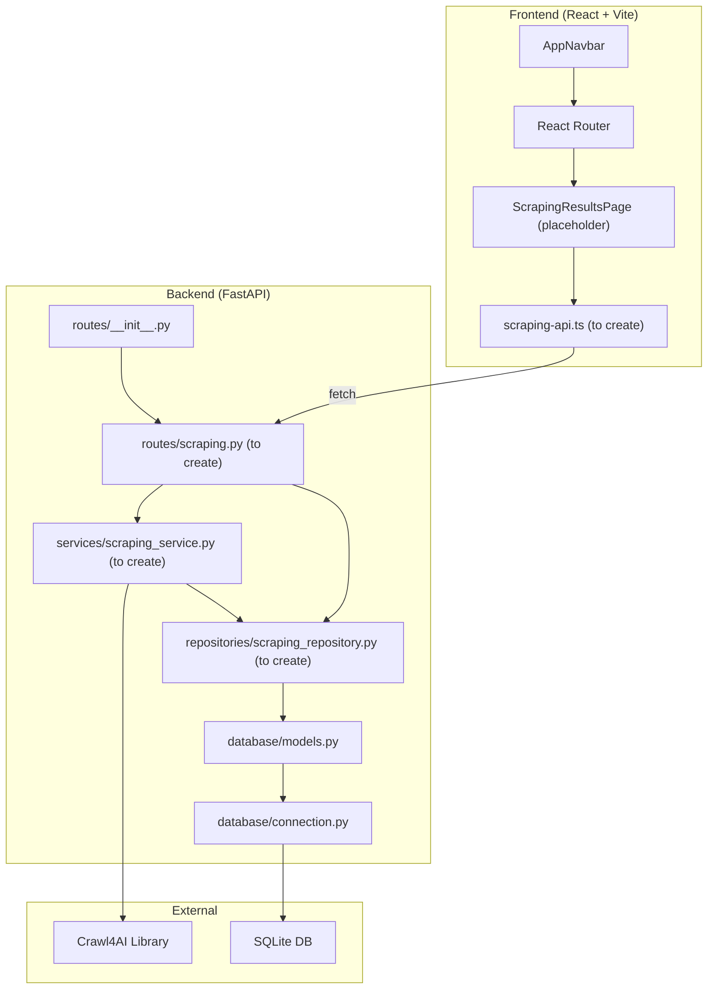
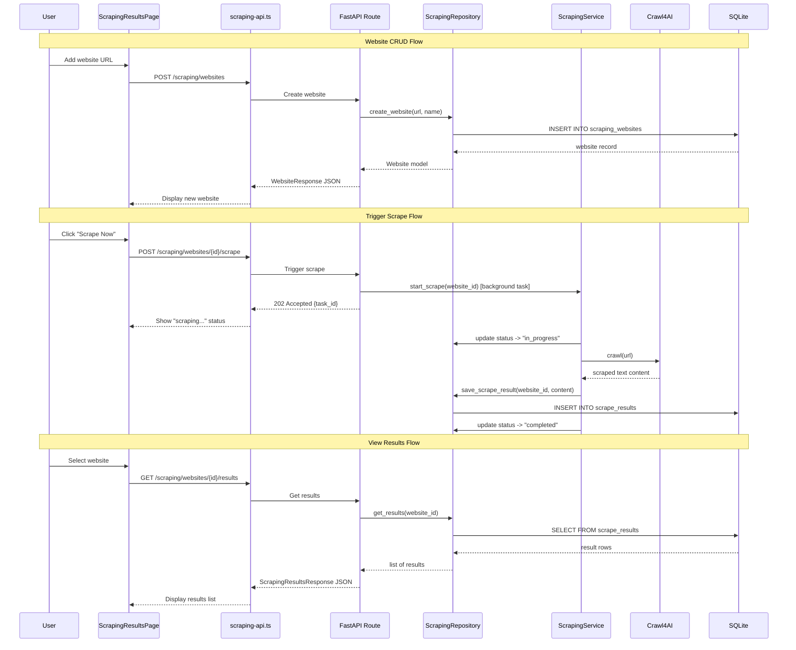

# Research: Web Scraping Feature

## Metadata
- **Requested By**: orchestrator
- **Created**: 2026-03-14
- **Scope**: Analyze existing codebase patterns to support implementing website CRUD, scraping with Crawl4AI, DB storage, and UI display

## Executive Summary
- The codebase follows a consistent layered architecture: Routes -> Repositories -> DB Models, with Pydantic schemas for request/response validation
- SQLAlchemy models live in a single file (`database/models.py`), and Alembic migrations are fully configured with a linear revision chain
- The frontend has been recently restructured with React Router, a top-level navbar, and page-level components; a placeholder scraping page already exists
- Crawl4AI is **not** yet added to `pyproject.toml` -- it must be added as a dependency
- Background task execution is handled via `asyncio.create_task` within SSE streaming endpoints; for simpler non-streaming background tasks, FastAPI's `BackgroundTasks` can be used (not yet used in codebase)
- The frontend uses plain `fetch` calls (no axios/tanstack-query) with a class-based service pattern for API communication
- **No scheduling infrastructure exists** in the codebase -- scheduled scraping will need a new mechanism

## Relevant Files

### Backend - Core Infrastructure
- `/Users/dmytroshendryk/Documents/Projects/finance/ai-hedge-fund/app/backend/main.py` -- FastAPI app setup, CORS config, router inclusion, DB table creation
- `/Users/dmytroshendryk/Documents/Projects/finance/ai-hedge-fund/app/backend/database/connection.py` -- SQLAlchemy engine, SessionLocal, `get_db()` dependency
- `/Users/dmytroshendryk/Documents/Projects/finance/ai-hedge-fund/app/backend/database/models.py` -- All SQLAlchemy ORM models (HedgeFundFlow, HedgeFundFlowRun, HedgeFundFlowRunCycle, ApiKey)
- `/Users/dmytroshendryk/Documents/Projects/finance/ai-hedge-fund/app/backend/database/__init__.py` -- Exports get_db, engine, SessionLocal, Base
- `/Users/dmytroshendryk/Documents/Projects/finance/ai-hedge-fund/app/backend/models/schemas.py` -- All Pydantic request/response schemas
- `/Users/dmytroshendryk/Documents/Projects/finance/ai-hedge-fund/app/backend/models/events.py` -- SSE event models (BaseEvent, StartEvent, ProgressUpdateEvent, etc.)

### Backend - Route/Repository Pattern (exemplar: API Keys)
- `/Users/dmytroshendryk/Documents/Projects/finance/ai-hedge-fund/app/backend/routes/__init__.py` -- Central router aggregation
- `/Users/dmytroshendryk/Documents/Projects/finance/ai-hedge-fund/app/backend/routes/api_keys.py` -- CRUD route pattern to follow
- `/Users/dmytroshendryk/Documents/Projects/finance/ai-hedge-fund/app/backend/repositories/api_key_repository.py` -- Repository pattern to follow
- `/Users/dmytroshendryk/Documents/Projects/finance/ai-hedge-fund/app/backend/services/api_key_service.py` -- Service layer pattern

### Backend - Background Task Pattern
- `/Users/dmytroshendryk/Documents/Projects/finance/ai-hedge-fund/app/backend/routes/hedge_fund.py` -- SSE streaming with `asyncio.create_task` for long-running operations (lines 79-93)

### Backend - Alembic
- `/Users/dmytroshendryk/Documents/Projects/finance/ai-hedge-fund/app/backend/alembic.ini` -- Alembic config, DB URL: `sqlite:///./hedge_fund.db`
- `/Users/dmytroshendryk/Documents/Projects/finance/ai-hedge-fund/app/backend/alembic/env.py` -- Migration environment, imports `Base` from `database.models`
- `/Users/dmytroshendryk/Documents/Projects/finance/ai-hedge-fund/app/backend/alembic/versions/add_api_keys_table.py` -- Latest migration (revision `d5e78f9a1b2c`, down_revision `3f9a6b7c8d2e`)

### Frontend - App Shell & Routing
- `/Users/dmytroshendryk/Documents/Projects/finance/ai-hedge-fund/app/frontend/src/App.tsx` -- React Router setup with 3 routes: `/`, `/editor`, `/scraping`
- `/Users/dmytroshendryk/Documents/Projects/finance/ai-hedge-fund/app/frontend/src/main.tsx` -- App entrypoint with ThemeProvider and NodeProvider
- `/Users/dmytroshendryk/Documents/Projects/finance/ai-hedge-fund/app/frontend/src/components/navigation/app-navbar.tsx` -- Top navbar with NavLink items
- `/Users/dmytroshendryk/Documents/Projects/finance/ai-hedge-fund/app/frontend/src/components/Layout.tsx` -- Editor layout (VSCode-style with sidebars, tab bar, bottom panel)

### Frontend - Pages & Services
- `/Users/dmytroshendryk/Documents/Projects/finance/ai-hedge-fund/app/frontend/src/pages/home-page.tsx` -- Home page with feature cards
- `/Users/dmytroshendryk/Documents/Projects/finance/ai-hedge-fund/app/frontend/src/pages/scraping-results-page.tsx` -- Placeholder page (currently just icon + text)
- `/Users/dmytroshendryk/Documents/Projects/finance/ai-hedge-fund/app/frontend/src/services/api.ts` -- Main API service (fetch-based, SSE streaming)
- `/Users/dmytroshendryk/Documents/Projects/finance/ai-hedge-fund/app/frontend/src/services/api-keys-api.ts` -- API keys service (class-based, fetch, typed)

### Config
- `/Users/dmytroshendryk/Documents/Projects/finance/ai-hedge-fund/pyproject.toml` -- Python dependencies (no crawl4ai yet)
- `/Users/dmytroshendryk/Documents/Projects/finance/ai-hedge-fund/app/frontend/package.json` -- Frontend dependencies (React 18, React Router, shadcn/ui, lucide-react, Tailwind)
- `/Users/dmytroshendryk/Documents/Projects/finance/ai-hedge-fund/todo/milestone-1-web-scraping.md` -- Original scraping milestone (focused on CLI/agent integration, not web UI)

## Systems and Components

### Key Discoveries

1. **Layered Backend Architecture**: Every feature follows Route -> Repository -> DB Model, with Pydantic schemas for validation. Routes instantiate repositories with `db: Session = Depends(get_db)`. No service layer is required between route and repository for simple CRUD (ApiKey routes call repository directly). Services exist only when business logic is needed (e.g., `ApiKeyService.get_api_keys_dict()`).

2. **Database Setup**: SQLite at `app/backend/hedge_fund.db`. Tables are auto-created on startup via `Base.metadata.create_all(bind=engine)` (line 18 of `main.py`). Alembic is configured but table creation also happens at startup, so new models added to `database/models.py` will be created automatically. The latest Alembic revision is `d5e78f9a1b2c` (add_api_keys_table).

3. **No Crawl4AI Dependency**: `pyproject.toml` does not include `crawl4ai`. It must be added under `[tool.poetry.dependencies]`.

4. **Background Tasks Pattern**: The codebase uses `asyncio.create_task` within SSE streaming generators for long-running operations (hedge fund runs, backtests). FastAPI's `BackgroundTasks` is **not used anywhere** in the codebase. For web scraping, either approach works: `BackgroundTasks` for fire-and-forget simplicity, or `asyncio.create_task` for more control. Since scraping does not need real-time streaming, `BackgroundTasks` is the simpler choice.

5. **No Scheduling Infrastructure**: The codebase has **no periodic task runner, no cron integration, and no scheduling library** (no APScheduler, Celery, etc.). The `schedule` column on `HedgeFundFlowRun` (line 45 of `database/models.py`) is purely metadata storage -- it records the intended schedule but nothing actually executes it. For scheduled scraping, there are two options:
   - **Simple in-process approach**: Use `asyncio` background loop in FastAPI's startup event to check for due scrapes periodically
   - **Library approach**: Add `apscheduler` to dependencies for proper job scheduling
   This is a decision point that the architect needs to resolve.

6. **Frontend Routing Already Set Up**: `App.tsx` already has a `/scraping` route pointing to `ScrapingResultsPage`, and the navbar already includes a "Scraping Results" link. The placeholder page just needs to be replaced with the actual implementation.

7. **Frontend API Pattern**: Two patterns exist:
   - **Object literal** (`api.ts`): `export const api = { method: async () => {...} }` -- used for the main hedge fund API
   - **Class-based singleton** (`api-keys-api.ts`): `class ApiKeysService { ... } export const apiKeysService = new ApiKeysService()` -- used for API keys
   Both use raw `fetch` with `API_BASE_URL = import.meta.env.VITE_API_URL || 'http://localhost:8000'`. The class-based pattern is cleaner for CRUD resources.

8. **UI Component Library**: shadcn/ui components are available at `app/frontend/src/components/ui/` including: Button, Card, Dialog, Input, Table, Tabs, Badge, Skeleton, Separator, Tooltip. All styled with Tailwind CSS. Icons come from `lucide-react`.

9. **CORS Configuration**: Backend allows origins `http://localhost:5173` and `http://127.0.0.1:5173` (lines 21-27 of `main.py`).

### Component Diagram



### Interaction Diagram



## Contracts and Interfaces

### Existing Patterns to Follow

**Route Registration** (`app/backend/routes/__init__.py`):
```python
from app.backend.routes.scraping import router as scraping_router
api_router.include_router(scraping_router, tags=["scraping"])
```

**Route Pattern** (from `api_keys.py`):
- Prefix: `APIRouter(prefix="/scraping", tags=["scraping"])`
- DB dependency: `db: Session = Depends(get_db)`
- Repository instantiation: `repo = ScrapingRepository(db)`
- Error handling: try/except with `HTTPException(status_code=500, detail=...)`
- Response models: `response_model=...` on each endpoint decorator
- Error responses: `responses={404: {"model": ErrorResponse, ...}}`

**Repository Pattern** (from `api_key_repository.py`):
- Constructor takes `Session`
- Methods return ORM model instances or None
- Handles `db.add()`, `db.commit()`, `db.refresh()` internally

**Pydantic Schema Pattern** (from `schemas.py`):
- Separate Create/Update/Response/Summary models
- Response models have `class Config: from_attributes = True`
- Fields use `Field(...)` for required, `Field(None)` for optional
- Enums as `str, Enum` for JSON serialization

**Frontend API Service Pattern** (from `api-keys-api.ts`):
- Class with `private baseUrl`
- Methods return typed promises
- Error handling with response status checks
- Exported as singleton instance

### Proposed API Surface

Based on the patterns discovered, the scraping feature would need these endpoints:

| Method | Endpoint | Purpose |
|--------|----------|---------|
| GET | `/scraping/websites` | List all websites |
| POST | `/scraping/websites` | Add a website |
| DELETE | `/scraping/websites/{id}` | Remove a website |
| POST | `/scraping/websites/{id}/scrape` | Trigger scrape (returns 202) |
| GET | `/scraping/websites/{id}/results` | Get scrape results for a website |
| GET | `/scraping/websites/{id}/status` | Get current scrape status |

### Proposed DB Models

Two new SQLAlchemy models needed in `database/models.py`:

**ScrapingWebsite**: id, url, name, created_at, updated_at, last_scraped_at, scrape_status (idle/in_progress/completed/error), scrape_interval (optional, for scheduling)

**ScrapeResult**: id, website_id (FK), scraped_at, content (Text), content_length, error_message, status (success/error)

## Code Overview

### Architecture & Design
- **Backend**: FastAPI with synchronous SQLAlchemy (no async engine). Routes are async but DB operations are sync through `SessionLocal`.
- **Frontend**: React 18 with Vite, TypeScript strict mode, Tailwind CSS, shadcn/ui. No state management library -- uses React Context for shared state.
- **DB**: SQLite with `check_same_thread=False`. Tables auto-created on startup via `Base.metadata.create_all()`. Alembic available for formal migrations.

### Dependencies
- **Backend**: FastAPI, SQLAlchemy, Alembic, Pydantic v2, httpx. **Missing**: `crawl4ai`
- **Frontend**: React 18, React Router v7, @xyflow/react, shadcn/ui (Radix primitives), lucide-react, Tailwind CSS, react-resizable-panels

### Data Flow
1. Frontend `fetch` -> FastAPI route (async) -> Repository (sync SQLAlchemy) -> SQLite
2. Background scraping: FastAPI route -> `BackgroundTasks` or `asyncio.create_task` -> ScrapingService -> Crawl4AI -> Repository -> SQLite
3. Frontend polls or refreshes to get updated status/results

## Constraints and Risks

1. **SQLite Concurrency**: SQLite has limited concurrent write support. Background scraping tasks writing to DB while the API serves reads could cause `database is locked` errors under heavy load. The `check_same_thread=False` flag is already set. For the expected low-volume use case (one scrape at a time), this should be acceptable.

2. **Synchronous SQLAlchemy with Async Routes**: The codebase uses sync `SessionLocal` inside async route handlers. This blocks the event loop during DB operations. For consistency, the scraping feature should follow the same pattern. Background tasks that do DB writes should create their own `SessionLocal()` session (not use the request-scoped `get_db()` dependency, which will be closed after the response).

3. **Crawl4AI Async Nature**: Crawl4AI is natively async. The scraping service will need to run Crawl4AI calls with `await` inside an async background task. This is compatible with `asyncio.create_task` but requires careful session management.

4. **No WebSocket/SSE for Scraping Status**: The existing SSE pattern (used for hedge fund runs) is complex and request-scoped. For scraping status, polling via GET `/status` endpoint is simpler and sufficient given the non-real-time nature of the feature.

5. **Alembic Migration Chain**: The latest revision is `d5e78f9a1b2c`. New migrations must use this as `down_revision`. Alembic must be run from the `app/backend/` directory: `cd app/backend && alembic revision --autogenerate -m "add scraping tables"`.

6. **`Base.metadata.create_all()` Shortcut**: Since `main.py` line 18 calls `Base.metadata.create_all(bind=engine)` on startup, adding models to `database/models.py` will auto-create tables without running Alembic. However, a proper Alembic migration should still be created for production correctness.

7. **No Scheduling Infrastructure (Decision Required)**: The codebase has zero scheduling capability. The `schedule` column on `HedgeFundFlowRun` is metadata-only; nothing executes scheduled tasks. For the "scheduled scraping" requirement, a scheduling mechanism must be introduced. Options include: a simple `asyncio` loop in the FastAPI startup event, or adding a library like `apscheduler`. This is an architectural decision point.

## Appendix

### Alembic Migration Revision Chain
```
5274886e5bee  (add_hedgefundflow_table)
    -> 2f8c5d9e4b1a  (add_hedgefundflowrun_table)
        -> 3f9a6b7c8d2e  (add_hedgefundflowruncycle_table)
            -> d5e78f9a1b2c  (add_api_keys_table) [HEAD]
```

### Files to Create (New)
| File | Purpose |
|------|---------|
| `app/backend/routes/scraping.py` | Scraping website CRUD + trigger endpoints |
| `app/backend/repositories/scraping_repository.py` | DB operations for websites and results |
| `app/backend/services/scraping_service.py` | Crawl4AI integration, background scraping logic |
| `app/backend/alembic/versions/xxx_add_scraping_tables.py` | Alembic migration |
| `app/frontend/src/services/scraping-api.ts` | Frontend API service for scraping |

### Files to Modify (Existing)
| File | Change |
|------|--------|
| `pyproject.toml` | Add `crawl4ai` dependency |
| `app/backend/database/models.py` | Add ScrapingWebsite and ScrapeResult models |
| `app/backend/models/schemas.py` | Add scraping Pydantic schemas |
| `app/backend/routes/__init__.py` | Register scraping router |
| `app/frontend/src/pages/scraping-results-page.tsx` | Replace placeholder with full UI |

### Frontend UI Components Available (shadcn/ui)
- `Button`, `Card`, `Dialog`, `Input`, `Table`, `Tabs`, `Badge`, `Skeleton`, `Separator`, `Tooltip`
- Icons: `lucide-react` (already using `Newspaper`, `Brain`, `Workflow`, `Home`)
- Layout utilities: `cn()` from `@/lib/utils` for conditional classNames
