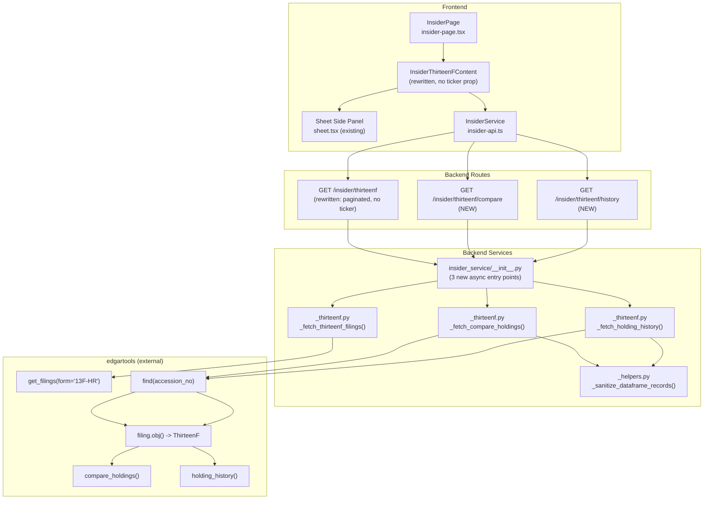
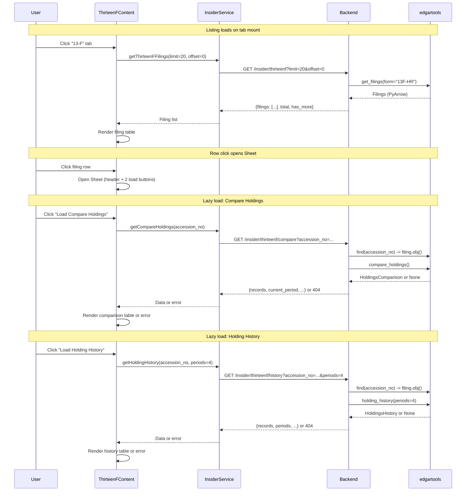

# 13-F Tab Redesign: All-Company Filings with Drill-Down Detail

> **Breaking-change coordination note**: The backend API contracts and frontend API client/components are tightly coupled in this redesign. Backend and frontend changes MUST ship together in a single deployment. Do not merge or deploy backend-only or frontend-only changes independently, as the old frontend will break against the new backend endpoints (removed ticker param, changed response shapes) and vice versa.

## Metadata
- **Branch**: feature/agentic-thirteenf-redesign
- **Core Skills**: afe-config:unit-tester, afe-config:code-documenter
- **Language Skills**: afe-python:python-developer
- **Primary Language**: Python (backend), TypeScript (frontend)
- **Created**: 2026-04-06

## Executive Summary
- Rewrite the 13-F tab from a ticker-dependent single-company view to an all-company paginated filing listing using `edgar.get_filings(form="13F-HR")`
- Add two new detail endpoints (`/thirteenf/compare`, `/thirteenf/history`) that lazy-load `compare_holdings()` and `holding_history()` data for a specific filing by accession number
- Rewrite the frontend component to auto-load filings on mount (no ticker required), with a slide-out Sheet panel for drill-down detail containing two independently lazy-loaded sections

## Goals
- Remove ticker dependency from the 13-F tab so users see all recent 13F-HR filings across all companies
- Enable drill-down detail with quarter-over-quarter comparison and multi-period holding history
- Keep SEC API calls performant by never calling `filing.obj()` in the listing endpoint and lazy-loading detail sections independently

## Architecture Overview

### Key Design Decisions
- **Listing avoids `filing.obj()`**: The listing endpoint extracts lightweight `Filing` attributes (`company`, `cik`, `filing_date`, `accession_no`) directly from the PyArrow-backed `Filings` index. This keeps the listing fast (no XML parsing).
- **Detail via `edgar.find(accession_no)`**: Detail endpoints look up a single filing by accession number rather than caching the full Filings index or passing CIK from the frontend. This is a clean, stateless API design.
- **Independent lazy-load for compare and history**: Each detail section has its own endpoint and is loaded on-demand via a button click in the Sheet panel. This avoids blocking the panel open on two slow SEC calls.
- **NaN-to-None sanitization**: DataFrame serialization must explicitly replace NaN with None before returning JSON. A shared helper handles this.
- **Reuse existing cache pattern**: All three new async entry points follow the same `_cache_get`/`_cache_put` pattern in `__init__.py`. The listing cache key includes today's date string (`date.today().isoformat()`) as a temporal dimension so that stale filing indices are not served across days.
- **LRU cache on report loading**: `_load_thirteenf_report(accession_no)` uses `@lru_cache(maxsize=32)` to avoid duplicate `filing.obj()` calls when the same accession number is used for both compare and history within a short time window. The cache is bounded and lightweight since it only holds parsed ThirteenF objects.
- **Sheet width override**: The Sheet panel uses `className="w-[800px] sm:max-w-[800px]"` to accommodate data tables.
- **`periods_data` nested dict for history records**: Dynamic period columns are nested under a `periods_data: dict[str, int | None]` field rather than using top-level dynamic keys. This provides clean TypeScript typing (`Record<string, number | null>`) and avoids Pydantic `extra="allow"` complexity.
- **`_ensure_identity()` guard**: Both `_fetch_thirteenf_filings()` and `_load_thirteenf_report()` call `_ensure_identity()` as their first operation to guarantee a valid SEC identity is set before any edgar API calls. This follows the existing pattern in other worker functions.
- **accession_no validation**: The `/thirteenf/compare` and `/thirteenf/history` route handlers validate the `accession_no` parameter format using `pattern=r"^\d{10}-\d{2}-\d{6}$"` in the `Query()` definition, rejecting malformed accession numbers at the route level before they reach the service layer.
- **Optional year/quarter filtering**: The listing endpoint accepts optional `year` and `quarter` parameters, passed through to `get_filings(form="13F-HR", ...)`, allowing users to narrow filings to a specific reporting period.

### System Components Diagram
Overview of new and modified components with their relationships.


### Sequence Diagram
User interaction flow from tab click through listing, row selection, and lazy-loaded detail sections.


### API Contracts

#### GET /insider/thirteenf (rewritten)
**Request**: `?limit=20&offset=0&year=2026&quarter=1`
Parameters:
- `limit: int = Query(20, ge=1, le=100)` -- page size
- `offset: int = Query(0, ge=0, le=100000)` -- pagination offset
- `year: int | None = Query(None)` -- optional filter by filing year
- `quarter: int | None = Query(None, ge=1, le=4)` -- optional filter by quarter
**Response**:
```json
{
  "filings": [
    {
      "filing_date": "2026-03-15",
      "accession_no": "0001234567-26-000001",
      "company": "BERKSHIRE HATHAWAY INC",
      "cik": 1067983,
      "form": "13F-HR"
    }
  ],
  "total": 5000,
  "has_more": true,
  "skipped_count": 0
}
```

#### GET /insider/thirteenf/compare (new)
**Request**: `?accession_no=0001234567-26-000001`
Parameters:
- `accession_no: str = Query(..., pattern=r"^\d{10}-\d{2}-\d{6}$")` -- SEC accession number
**Response (success)**:
```json
{
  "accession_no": "0001234567-26-000001",
  "current_period": "2025-12-31",
  "previous_period": "2025-09-30",
  "manager_name": "BERKSHIRE HATHAWAY INC",
  "records": [
    {
      "cusip": "023135106",
      "ticker": "AMZN",
      "issuer": "AMAZON COM INC",
      "shares": 10000000,
      "prev_shares": 8000000,
      "value": 1500000,
      "prev_value": 1200000,
      "share_change": 2000000,
      "share_change_pct": 25.0,
      "value_change": 300000,
      "value_change_pct": 25.0,
      "status": "INCREASED"
    }
  ],
  "total": 150
}
```
**Response (no comparison)**: HTTP 404 `{"detail": "No comparison data available for this filing (no previous quarter found)"}`
**Response (invalid accession_no)**: HTTP 422 (FastAPI automatic validation error)

#### GET /insider/thirteenf/history (new)
**Request**: `?accession_no=0001234567-26-000001&periods=4`
Parameters:
- `accession_no: str = Query(..., pattern=r"^\d{10}-\d{2}-\d{6}$")` -- SEC accession number
- `periods: int = Query(4, ge=1, le=8)` -- number of historical periods
**Response (success)**:
```json
{
  "accession_no": "0001234567-26-000001",
  "manager_name": "BERKSHIRE HATHAWAY INC",
  "periods": ["2025-03-31", "2025-06-30", "2025-09-30", "2025-12-31"],
  "records": [
    {
      "cusip": "023135106",
      "ticker": "AMZN",
      "issuer": "AMAZON COM INC",
      "periods_data": {
        "2025-03-31": 7000000,
        "2025-06-30": 8000000,
        "2025-09-30": 9000000,
        "2025-12-31": 10000000
      }
    }
  ],
  "total": 150
}
```
**Response (no history)**: HTTP 404 `{"detail": "No holding history available for this filing"}`
**Response (invalid accession_no)**: HTTP 422 (FastAPI automatic validation error)

#### Frontend API Client (insider-api.ts)
```typescript
// Replaces getThirteenF(ticker, limit)
async getThirteenFFilings(limit?: number, offset?: number, year?: number, quarter?: number): Promise<ThirteenFListResponse>

// New
async getCompareHoldings(accessionNo: string): Promise<CompareHoldingsResponse>

// New
async getHoldingHistory(accessionNo: string, periods?: number): Promise<HoldingHistoryResponse>
```

## Implementation Plan

> Tasks use Phase.Task numbering for unambiguous reference.
> TDD flow: Red (failing test) -> Green (minimal implementation) -> Refactor

### Progress Tracker
- PENDING: Phase 1: Backend Schemas and Helpers
- PENDING: Phase 2: Backend Service Workers and Cache Entry Points
- PENDING: Phase 3: Backend Routes
- PENDING: Phase 4: Frontend API Client and Types
- PENDING: Phase 5: Frontend 13-F Content Component Rewrite
- PENDING: Phase 6: Frontend Tests

### Phase 1: Backend Schemas and Helpers
**Goal**: Define new Pydantic schemas for listing, compare, and history responses; add NaN sanitization helper.

#### Task 1.1: Add NaN sanitization helper to _helpers.py
**Files to modify:**
- `/Users/dmytroshendryk/Documents/Projects/finance/ai-hedge-fund/app/backend/services/insider_service/_helpers.py`
- `/Users/dmytroshendryk/Documents/Projects/finance/ai-hedge-fund/tests/backend/insider/test_thirteenf_helpers.py` (new)

**Semantic targets:**
- Function: `_sanitize_dataframe_records(df)` -- converts a pandas DataFrame to `list[dict]` with NaN replaced by None
- Test: `test_sanitize_replaces_nan_with_none`
- Test: `test_sanitize_preserves_non_nan_values`
- Test: `test_sanitize_handles_empty_dataframe`

**TDD Steps:**
- DONE: 1.1.1: Red - Write failing tests for `_sanitize_dataframe_records()` covering NaN replacement, empty DataFrame, and mixed types
- DONE: 1.1.2: Green - Implement `_sanitize_dataframe_records()` in `_helpers.py` using `df.where(df.notna(), None).to_dict(orient="records")`
- DONE: 1.1.3: Refactor - Ensure function handles edge cases (all-NaN columns, integer columns with NaN)

#### Task 1.2: Replace ThirteenF schemas in insider_schemas.py
**Files to modify:**
- `/Users/dmytroshendryk/Documents/Projects/finance/ai-hedge-fund/app/backend/models/insider_schemas.py`
- `/Users/dmytroshendryk/Documents/Projects/finance/ai-hedge-fund/tests/backend/insider/test_thirteenf_schemas.py` (new)

**Semantic targets:**
- Remove: `ThirteenFHoldingRecord`, `ThirteenFFilingSummary`, `ThirteenFResponse` (old schemas)
- Class: `ThirteenFFilingListItem` -- lightweight filing entry for listing (fields: `filing_date`, `accession_no`, `company`, `cik: int`, `form`)
- Class: `ThirteenFListResponse` -- paginated listing response (fields: `filings: list[ThirteenFFilingListItem]`, `total: int`, `has_more: bool`, `skipped_count: int = 0`)
- Class: `CompareHoldingsRecord` -- one row from compare_holdings DataFrame (fields: `cusip`, `ticker`, `issuer`, `shares: int | None`, `prev_shares: int | None`, `value: int | None`, `prev_value: int | None`, `share_change: int | None`, `share_change_pct: float | None`, `value_change: int | None`, `value_change_pct: float | None`, `status: str`)
- Class: `CompareHoldingsResponse` -- response for `/thirteenf/compare` (fields: `accession_no`, `current_period: str`, `previous_period: str`, `manager_name: str`, `records: list[CompareHoldingsRecord]`, `total: int`)
- Class: `HoldingHistoryRecord` -- one row from holding_history DataFrame (fields: `cusip`, `ticker`, `issuer`, `periods_data: dict[str, int | None]`)
- Class: `HoldingHistoryResponse` -- response for `/thirteenf/history` (fields: `accession_no`, `manager_name: str`, `periods: list[str]`, `records: list[HoldingHistoryRecord]`, `total: int`)
- Test: `test_thirteenf_filing_list_item_required_fields`
- Test: `test_compare_holdings_record_all_fields`
- Test: `test_holding_history_record_periods_data`
- Test: `test_holding_history_response_serialization`

**TDD Steps:**
- DONE: 1.2.1: Red - Write failing tests for new schema classes: required fields, optional defaults, `periods_data` dict serialization in `HoldingHistoryRecord`
- DONE: 1.2.2: Green - Define new Pydantic models; remove old `ThirteenFHoldingRecord`, `ThirteenFFilingSummary`, `ThirteenFResponse`
- DONE: 1.2.3: Refactor - Verify all schema docstrings are concise and follow project conventions

### Phase 2: Backend Service Workers and Cache Entry Points
**Goal**: Rewrite `_thirteenf.py` with three worker functions and add corresponding async cache entry points in `__init__.py`.

#### Task 2.1: Rewrite _thirteenf.py with three worker functions
**Files to modify:**
- `/Users/dmytroshendryk/Documents/Projects/finance/ai-hedge-fund/app/backend/services/insider_service/_thirteenf.py` (rewrite)
- `/Users/dmytroshendryk/Documents/Projects/finance/ai-hedge-fund/tests/backend/insider/test_thirteenf_workers.py` (new)

**Semantic targets:**
- Remove: `ThirteenFReport` protocol, `ReportFields` dataclass, `_extract_report_fields()`, `_extract_holdings()`, `_fetch_thirteenf()`
- Function: `_fetch_thirteenf_filings(limit, offset, year, quarter)` -- calls `_ensure_identity()` first, then `get_filings(form="13F-HR")` with optional `year` and `quarter` kwargs passed through when not None, slices `[offset:offset+limit]`, extracts lightweight attributes (`company`, `cik`, `filing_date`, `accession_no`, `form`), returns `ThirteenFListResponse`. Uses `len(filings)` for total and computes `has_more = (offset + limit) < total`. Wraps the `get_filings()` call in try/except to catch SEC API errors and raise `RuntimeError` with a descriptive message.
- Function: `_fetch_compare_holdings(accession_no)` -- calls `_load_thirteenf_report(accession_no)` then `compare_holdings()`, sanitizes DataFrame via `_sanitize_dataframe_records()`, returns `CompareHoldingsResponse` or raises `ValueError` when comparison is None
- Function: `_fetch_holding_history(accession_no, periods)` -- calls `_load_thirteenf_report(accession_no)` then `holding_history(periods)`, transforms DataFrame: extracts fixed columns (`Cusip`, `Ticker`, `Issuer`) and nests dynamic period columns into `periods_data` dict, returns `HoldingHistoryResponse` or raises `ValueError`
- Private helper: `_load_thirteenf_report(accession_no)` -- calls `_ensure_identity()` first, then shared logic for `find()` -> `filing.obj()` with error handling for not-found and non-13F filings. Decorated with `@lru_cache(maxsize=32)` to avoid duplicate `filing.obj()` calls for the same accession number. Wraps the `find()` call in try/except to catch SEC API errors and raise `RuntimeError` with a clear message (e.g., "SEC API error while looking up filing {accession_no}: {original_error}").
- Test: `test_fetch_filings_returns_paginated_list` (mock `get_filings`)
- Test: `test_fetch_filings_has_more_true_when_more_filings_exist`
- Test: `test_fetch_filings_has_more_false_at_end`
- Test: `test_fetch_filings_calls_ensure_identity_first`
- Test: `test_fetch_filings_passes_year_quarter_to_get_filings`
- Test: `test_fetch_filings_raises_runtime_error_on_sec_failure`
- Test: `test_fetch_compare_holdings_returns_records` (mock `find` + `filing.obj()`)
- Test: `test_fetch_compare_holdings_raises_when_none` (compare_holdings returns None)
- Test: `test_fetch_compare_holdings_raises_when_filing_not_found` (find returns None)
- Test: `test_load_thirteenf_report_calls_ensure_identity`
- Test: `test_load_thirteenf_report_raises_on_sec_error`
- Test: `test_load_thirteenf_report_caches_repeated_calls`
- Test: `test_fetch_holding_history_returns_records_with_periods_data`
- Test: `test_fetch_holding_history_raises_when_none`
- Test: `test_fetch_holding_history_raises_when_filing_not_found`

**TDD Steps:**
- DONE: 2.1.1: Red - Write failing tests for `_fetch_thirteenf_filings()` with mocked `edgar.get_filings`, testing pagination (offset/limit), `has_more` flag, `total` count, `_ensure_identity()` call order, year/quarter passthrough, and SEC error wrapping
- DONE: 2.1.2: Red - Write failing tests for `_load_thirteenf_report()` covering `_ensure_identity()` call, SEC error wrapping via try/except, and LRU cache hit on repeated calls
- DONE: 2.1.3: Red - Write failing tests for `_fetch_compare_holdings()` with mocked `_load_thirteenf_report`, testing success path, None return from `compare_holdings()`, and filing-not-found
- DONE: 2.1.4: Red - Write failing tests for `_fetch_holding_history()` with mocked `_load_thirteenf_report`, testing success with `periods_data` nested dict, None return, and filing-not-found
- DONE: 2.1.5: Green - Implement `_load_thirteenf_report()` helper (with `@lru_cache`, `_ensure_identity()`, try/except) and all three worker functions in `_thirteenf.py`
- DONE: 2.1.6: Refactor - Verify error messages are descriptive; ensure deferred imports follow project pattern

#### Task 2.2: Update __init__.py with new async entry points
**Files to modify:**
- `/Users/dmytroshendryk/Documents/Projects/finance/ai-hedge-fund/app/backend/services/insider_service/__init__.py`
- `/Users/dmytroshendryk/Documents/Projects/finance/ai-hedge-fund/tests/backend/insider/test_thirteenf_cache.py` (new)

**Semantic targets:**
- Remove: `get_thirteenf_holdings()` async function, `ThirteenFResponse` import
- Add imports: `_fetch_thirteenf_filings`, `_fetch_compare_holdings`, `_fetch_holding_history` from `._thirteenf`
- Add imports: `ThirteenFListResponse`, `CompareHoldingsResponse`, `HoldingHistoryResponse` from schemas
- Function: `get_thirteenf_filings(limit, offset, year, quarter)` -- async entry point with cache key `"thirteenf:filings:{date.today().isoformat()}:{year}:{quarter}:{limit}:{offset}"`, calls `asyncio.to_thread(_fetch_thirteenf_filings, limit, offset, year, quarter)`. The `date.today().isoformat()` segment ensures the listing cache expires daily so new SEC filings are picked up.
- Function: `get_compare_holdings(accession_no)` -- async entry point with cache key `"thirteenf:compare:{accession_no}"`, calls `asyncio.to_thread(_fetch_compare_holdings, accession_no)`. Note: does NOT catch `ValueError` -- lets it propagate to the route handler for 404 mapping.
- Function: `get_holding_history(accession_no, periods)` -- async entry point with cache key `"thirteenf:history:{accession_no}:{periods}"`, calls `asyncio.to_thread(_fetch_holding_history, accession_no, periods)`. Note: does NOT catch `ValueError` -- lets it propagate.
- Test: `test_get_thirteenf_filings_cache_hit_returns_cached`
- Test: `test_get_thirteenf_filings_cache_miss_calls_worker`
- Test: `test_get_thirteenf_filings_cache_key_includes_date`
- Test: `test_get_compare_holdings_cache_hit_skips_fetch`
- Test: `test_get_compare_holdings_propagates_value_error`
- Test: `test_get_holding_history_cache_miss_calls_worker`

**TDD Steps:**
- DONE: 2.2.1: Red - Write failing tests verifying cache hit/miss behavior for all three new async entry points, date-based cache key for listings, and ValueError propagation for detail endpoints
- DONE: 2.2.2: Green - Implement three async entry points following the existing `get_ownership_changes` pattern
- DONE: 2.2.3: Refactor - Remove old `get_thirteenf_holdings` function, clean up old imports, ensure all noqa comments are accurate

### Phase 3: Backend Routes
**Goal**: Rewrite the `/thirteenf` route and add `/thirteenf/compare` and `/thirteenf/history` routes.

#### Task 3.1: Rewrite and add routes in insider.py
**Files to modify:**
- `/Users/dmytroshendryk/Documents/Projects/finance/ai-hedge-fund/app/backend/routes/insider.py`
- `/Users/dmytroshendryk/Documents/Projects/finance/ai-hedge-fund/tests/backend/insider/test_thirteenf_routes.py` (new)

**Semantic targets:**
- Rewrite: `insider_thirteenf()` route handler -- remove `ticker` param, add `limit: int = Query(20, ge=1, le=100)`, `offset: int = Query(0, ge=0, le=100000)`, `year: int | None = Query(None)`, and `quarter: int | None = Query(None, ge=1, le=4)`, change response_model to `ThirteenFListResponse`, call `get_thirteenf_filings(limit, offset, year, quarter)`
- New: `insider_thirteenf_compare()` route handler at `/thirteenf/compare` -- accepts `accession_no: str = Query(..., pattern=r"^\d{10}-\d{2}-\d{6}$")`, returns `CompareHoldingsResponse`, catches `ValueError` -> HTTPException(404), catches generic Exception -> HTTPException(500)
- New: `insider_thirteenf_history()` route handler at `/thirteenf/history` -- accepts `accession_no: str = Query(..., pattern=r"^\d{10}-\d{2}-\d{6}$")` and `periods: int = Query(4, ge=1, le=8)`, returns `HoldingHistoryResponse`, catches `ValueError` -> HTTPException(404), catches generic Exception -> HTTPException(500)
- Update imports: replace `ThirteenFResponse` with `ThirteenFListResponse, CompareHoldingsResponse, HoldingHistoryResponse`; replace `get_thirteenf_holdings` with `get_thirteenf_filings, get_compare_holdings, get_holding_history`
- Update module docstring to include new endpoints
- Test: `test_thirteenf_listing_returns_200_with_filings` (mock service, verify response shape)
- Test: `test_thirteenf_listing_passes_year_quarter_params`
- Test: `test_thirteenf_compare_returns_200_with_records` (mock service success)
- Test: `test_thirteenf_compare_returns_404_when_no_data` (mock service raising ValueError)
- Test: `test_thirteenf_compare_returns_422_for_malformed_accession_no`
- Test: `test_thirteenf_history_returns_200_with_periods` (mock service success)
- Test: `test_thirteenf_history_returns_404_when_no_data` (mock service raising ValueError)
- Test: `test_thirteenf_history_returns_422_for_malformed_accession_no`
- Test: `test_thirteenf_compare_returns_500_on_unexpected_error`

**TDD Steps:**
- DONE: 3.1.1: Red - Write failing tests using FastAPI TestClient for all three endpoints: listing 200 (with and without year/quarter), compare 200/404/422/500, history 200/404/422
- DONE: 3.1.2: Green - Implement route handlers following existing patterns (error wrapping, logging, response_model declarations), including `pattern=r"^\d{10}-\d{2}-\d{6}$"` on `accession_no` Query params and `year`/`quarter` optional params on the listing route
- DONE: 3.1.3: Refactor - Update module docstring to document new endpoints

### Phase 4: Frontend API Client and Types
**Goal**: Replace old TypeScript types and API methods with new ones matching the redesigned backend.

#### Task 4.1: Update TypeScript types and API methods in insider-api.ts
**Files to modify:**
- `/Users/dmytroshendryk/Documents/Projects/finance/ai-hedge-fund/app/frontend/src/services/insider-api.ts`

**Semantic targets:**
- Remove: `ThirteenFHoldingRecord`, `ThirteenFFilingSummary`, `ThirteenFResponse` interfaces
- Remove: `getThirteenF(ticker, limit)` method on `InsiderService` class
- Interface: `ThirteenFFilingListItem` -- `filing_date: string`, `accession_no: string`, `company: string`, `cik: number`, `form: string`
- Interface: `ThirteenFListResponse` -- `filings: ThirteenFFilingListItem[]`, `total: number`, `has_more: boolean`, `skipped_count: number`
- Interface: `CompareHoldingsRecord` -- `cusip: string`, `ticker: string | null`, `issuer: string`, `shares: number | null`, `prev_shares: number | null`, `value: number | null`, `prev_value: number | null`, `share_change: number | null`, `share_change_pct: number | null`, `value_change: number | null`, `value_change_pct: number | null`, `status: string`
- Interface: `CompareHoldingsResponse` -- `accession_no: string`, `current_period: string`, `previous_period: string`, `manager_name: string`, `records: CompareHoldingsRecord[]`, `total: number`
- Interface: `HoldingHistoryRecord` -- `cusip: string`, `ticker: string | null`, `issuer: string`, `periods_data: Record<string, number | null>`
- Interface: `HoldingHistoryResponse` -- `accession_no: string`, `manager_name: string`, `periods: string[]`, `records: HoldingHistoryRecord[]`, `total: number`
- Method: `getThirteenFFilings(limit?: number, offset?: number, year?: number, quarter?: number): Promise<ThirteenFListResponse>` -- GET `/thirteenf` with URLSearchParams (include `year` and `quarter` only when defined)
- Method: `getCompareHoldings(accessionNo: string): Promise<CompareHoldingsResponse>` -- GET `/thirteenf/compare` with URLSearchParams
- Method: `getHoldingHistory(accessionNo: string, periods?: number): Promise<HoldingHistoryResponse>` -- GET `/thirteenf/history` with URLSearchParams

**TDD Steps:**
- DONE: 4.1.1: Green - Define new TypeScript interfaces and implement three API methods following the existing `getSummary()` pattern (URLSearchParams, error handling with body?.detail fallback)
- DONE: 4.1.2: Refactor - Remove old types and method; verify no other files import the removed types (check `insider-thirteenf-content.tsx` imports are updated in Phase 5)

### Phase 5: Frontend 13-F Content Component Rewrite
**Goal**: Rewrite the ThirteenFContent component to auto-load filings, show a paginated table, and open a Sheet panel with lazy-loaded detail sections.

#### Task 5.1: Rewrite InsiderThirteenFContent component
**Files to modify:**
- `/Users/dmytroshendryk/Documents/Projects/finance/ai-hedge-fund/app/frontend/src/components/insider/insider-thirteenf-content.tsx` (rewrite)

**Semantic targets:**
- Remove: `ticker` prop, `FilingHistoryTable` sub-component, holdings table, all old sorting logic, old type imports
- Component: `InsiderThirteenFContent` -- no props, auto-loads filings on mount via `useEffect`
- State: `filings: ThirteenFFilingListItem[]` (accumulated across pages), `total: number`, `hasMore: boolean`, `loading: boolean`, `error: string | null`, `offset: number`, `selectedFiling: ThirteenFFilingListItem | null`, `sheetOpen: boolean`
- Load more: Appends to `filings` array, increments `offset` by page size (20)
- Sub-component: `FilingsTable` -- table with columns: Filing Date, Company, CIK, Accession No. Rows are clickable (`onClick` sets `selectedFiling` and opens Sheet). "Load More" button at bottom when `hasMore` is true.
- Sub-component: `FilingDetailSheet` -- Sheet side panel using `SheetContent className="w-[800px] sm:max-w-[800px]"`. Header shows company name and filing date. Body contains two independent sections stacked vertically.
- Sub-component: `CompareHoldingsSection` -- local state: `data: CompareHoldingsResponse | null`, `loading: boolean`, `error: string | null`. Shows "Load Compare Holdings" button. On click, calls `insiderService.getCompareHoldings(accessionNo)`. On success, renders table with columns: Status (color-coded badge), Ticker, Issuer, Shares, Prev Shares, Share Change %, Value ($000s), Prev Value, Value Change %. On 404 error, shows "No comparison data available" message. Resets state when `selectedFiling` changes.
- Sub-component: `HoldingHistorySection` -- local state: `data: HoldingHistoryResponse | null`, `loading: boolean`, `error: string | null`. Shows "Load Holding History" button. On click, calls `insiderService.getHoldingHistory(accessionNo, 4)`. On success, renders table with columns: Ticker, Issuer, then one column per period from `data.periods`. Cell values from `record.periods_data[period]`. On 404 error, shows "No holding history available" message. Resets state when `selectedFiling` changes.
- Status badge colors: `NEW` = green (`bg-green-100 text-green-800`), `CLOSED` = red (`bg-red-100 text-red-800`), `INCREASED` = blue (`bg-blue-100 text-blue-800`), `DECREASED` = orange (`bg-orange-100 text-orange-800`), `UNCHANGED` = gray (`bg-gray-100 text-gray-800`)

**TDD Steps:**
- DONE: 5.1.1: Green - Implement `InsiderThirteenFContent` with auto-loading filing list, paginated table with "Load More", and clickable rows that open Sheet
- DONE: 5.1.2: Green - Implement `CompareHoldingsSection` and `HoldingHistorySection` sub-components inside the Sheet, each with independent load button, loading spinner, error state, and data table
- DONE: 5.1.3: Refactor - Extract table rendering helpers if needed; ensure component stays under 500 LOC by splitting sub-components into separate files if approaching the limit

#### Task 5.2: Update InsiderPage to remove ticker prop from ThirteenFContent
**Files to modify:**
- `/Users/dmytroshendryk/Documents/Projects/finance/ai-hedge-fund/app/frontend/src/pages/insider-page.tsx`

**Semantic targets:**
- Near `activeTab === 'thirteenf'` conditional: Change `<InsiderThirteenFContent ticker={submittedTicker} />` to `<InsiderThirteenFContent />`
- Verify import of `InsiderThirteenFContent` from `@/components/insider/insider-thirteenf-content` remains correct

**TDD Steps:**
- DONE: 5.2.1: Green - Remove `ticker` prop from `<InsiderThirteenFContent />` usage
- DONE: 5.2.2: Refactor - Verify no TypeScript compilation errors from the prop removal

### Phase 6: Frontend Tests
**Goal**: Add test coverage for the TypeScript API client and basic React component render tests.

#### Task 6.1: Add TypeScript API client tests
**Files to modify:**
- `/Users/dmytroshendryk/Documents/Projects/finance/ai-hedge-fund/app/frontend/src/services/__tests__/insider-api.test.ts` (new)

**Semantic targets:**
- Test: `test_getThirteenFFilings_builds_correct_url_params` -- verify URLSearchParams include limit, offset, and optional year/quarter
- Test: `test_getThirteenFFilings_omits_undefined_year_quarter` -- verify year/quarter excluded from params when not provided
- Test: `test_getCompareHoldings_sends_accession_no_param` -- verify accession_no in query string
- Test: `test_getHoldingHistory_sends_accession_no_and_periods` -- verify both params in query string
- Test: `test_getCompareHoldings_throws_on_404_with_detail_message` -- verify error message extraction from 404 response body
- Test: `test_getHoldingHistory_throws_on_404_with_detail_message`
- Mock `fetch` globally to intercept HTTP calls; verify URL construction and error handling logic

**TDD Steps:**
- PENDING: 6.1.1: Red - Write failing tests for all three API methods covering URL param construction, optional param omission, and error handling for 404 responses
- PENDING: 6.1.2: Green - Tests should pass against the API client implementation from Task 4.1; if any fail, fix the API client
- PENDING: 6.1.3: Refactor - Consolidate shared mock setup into a helper or beforeEach block

#### Task 6.2: Add basic React component render tests
**Files to modify:**
- `/Users/dmytroshendryk/Documents/Projects/finance/ai-hedge-fund/app/frontend/src/components/insider/__tests__/insider-thirteenf-content.test.tsx` (new)

**Semantic targets:**
- Test: `test_renders_loading_spinner_on_mount` -- verify loading state appears before API resolves
- Test: `test_renders_filing_table_after_load` -- mock API to return filings, verify table rows render with company names
- Test: `test_renders_error_message_on_api_failure` -- mock API to throw, verify error message displays
- Test: `test_load_more_button_visible_when_has_more` -- mock API with `has_more: true`, verify button renders
- Uses React Testing Library (`@testing-library/react`) with mocked `InsiderService`

**TDD Steps:**
- PENDING: 6.2.1: Red - Write failing render tests for `InsiderThirteenFContent` covering loading, success, error, and pagination states
- PENDING: 6.2.2: Green - Tests should pass against the component implementation from Task 5.1; if any fail, fix the component
- PENDING: 6.2.3: Refactor - Extract shared render helpers if test file approaches 300 LOC

## Appendix

### Files Modified (summary)

| File | Action |
|------|--------|
| `app/backend/services/insider_service/_helpers.py` | Add `_sanitize_dataframe_records()` |
| `app/backend/models/insider_schemas.py` | Remove 3 old 13F schemas, add 6 new schemas |
| `app/backend/services/insider_service/_thirteenf.py` | Full rewrite: 3 new worker functions + 1 shared helper with LRU cache |
| `app/backend/services/insider_service/__init__.py` | Replace 1 async entry point with 3 new ones (date-aware cache key for listings) |
| `app/backend/routes/insider.py` | Rewrite 1 route (add year/quarter params), add 2 new routes (with accession_no pattern validation) |
| `app/frontend/src/services/insider-api.ts` | Replace 3 interfaces + 1 method with 6 interfaces + 3 methods (add year/quarter support) |
| `app/frontend/src/components/insider/insider-thirteenf-content.tsx` | Full rewrite: paginated list + Sheet with lazy-loaded detail |
| `app/frontend/src/pages/insider-page.tsx` | Remove ticker prop from ThirteenFContent usage |

### New Test Files

| File | Covers |
|------|--------|
| `tests/backend/insider/test_thirteenf_helpers.py` | `_sanitize_dataframe_records()` |
| `tests/backend/insider/test_thirteenf_schemas.py` | 6 new Pydantic schemas |
| `tests/backend/insider/test_thirteenf_workers.py` | 3 worker functions + shared helper (LRU cache, `_ensure_identity()`, SEC error handling) in `_thirteenf.py` |
| `tests/backend/insider/test_thirteenf_cache.py` | 3 cache entry points in `__init__.py` (date-aware listing cache key) |
| `tests/backend/insider/test_thirteenf_routes.py` | 3 route handlers via TestClient (accession_no pattern validation, year/quarter params) |
| `app/frontend/src/services/__tests__/insider-api.test.ts` | TypeScript API client URL construction and error handling |
| `app/frontend/src/components/insider/__tests__/insider-thirteenf-content.test.tsx` | React component render states (loading, success, error, pagination) |

### edgartools Import Pattern
All edgartools imports are deferred (inside function bodies) following the existing pattern in `_thirteenf.py` and `_helpers.py`. This avoids import-time side effects from the edgar library.

---

## Code Simplification Report

**Validation Date**: 2026-04-06
**Validator**: afe-config:code-simplifier
**Status**: WARNINGS (0 critical, 2 warnings, 0 info)

### Skill Check: `afe-config:code-simplifier` -- EXECUTED

### Files Analyzed

| File | Patterns Found | Assessment |
|------|---------------|------------|
| `_thirteenf.py` | 1 (verbose types) | 6 Protocol classes used only in this module; inconsistent with sibling modules |
| `insider-thirteenf-content.tsx` | 1 (duplication) | Duplicated lazy-load state pattern across 2 sub-components |
| `_helpers.py` | 0 | Clean, minimal helper |
| `insider_schemas.py` | 0 | Data containers, not abstractions |
| `__init__.py` | 0 | Follows established cache pattern |
| `insider.py` | 0 | Follows established route pattern |
| `insider-api.ts` | 0 | Follows established API client pattern |
| `insider-page.tsx` | 0 | Trivial prop removal |

### Findings

| # | Severity | File | Category | Description |
|---|----------|------|----------|-------------|
| 1 | WARNING | `_thirteenf.py:41-83` | Verbose Type Gymnastics | 6 Protocol classes (43 lines) for edgartools structural typing -- only used in this module, inconsistent with sibling modules that use untyped access |
| 2 | WARNING | `insider-thirteenf-content.tsx:138-340` | Code Duplication | CompareHoldingsSection and HoldingHistorySection share identical state management pattern; extractable to useLazyLoad custom hook |

### Recommendations

Neither finding blocks completion. Both are optional follow-up tasks:
- PENDING: (Optional) Replace 6 Protocol classes in `_thirteenf.py` with `Any` to align with sibling module patterns, or keep for self-documenting value
- PENDING: (Optional) Extract `useLazyLoad<T>` custom hook from duplicated lazy-load pattern in `insider-thirteenf-content.tsx` (only recommended if a third lazy section is planned)

---

## Quality Assurance Report

**Validation Date**: 2026-04-06 (re-validated by Software Architect)
**Validator**: validator agent
**Status**: WARNINGS (0 critical issues, 4 warnings, 2 info)

### Coverage Analysis (re-validated)

| File | Coverage | Target | Status |
|------|----------|--------|--------|
| `insider_schemas.py` | 100% | 80% | PASS |
| `insider_service/__init__.py` | 100% | 80% | PASS |
| `insider_service/_thirteenf.py` | 88% | 80% | PASS |
| `insider_service/_helpers.py` | 89% | 80% | PASS |
| `insider_service/_detail.py` | 100% | 80% | PASS |
| `insider_service/_grants.py` | 83% | 80% | PASS |
| `insider_service/_ownership.py` | 84% | 80% | PASS |
| `insider_service/_summary.py` | 97% | 80% | PASS |

**Overall Coverage**: 95% (Target: 80%)

**Uncovered Code in `_thirteenf.py`** (non-blocking):
- Lines 99-101, 106-108: Inner `from edgar import ...` in shim functions (replaced by mocks in tests)
- Lines 252-270, 322-332: Record mapping paths (covered via mocked `_load_thirteenf_report` but coverage attribution differs)

### Skill Checks Executed

| Skill | Status | Issues Found |
|-------|--------|--------------|
| `afe-config:unit-tester` | EXECUTED | 1 (minor anti-pattern) |
| `afe-config:code-review` | EXECUTED | 0 |
| `afe-config:code-documenter` | EXECUTED | 0 |
| `afe-config:code-simplifier` | EXECUTED | 2 (both WARNING, from prior run) |

### Test Results

- **Total Tests (insider module)**: 331
- **Passed**: 331
- **Failed**: 0
- **Skipped**: 0
- **New 13F Tests**: 87 (all passing)

Test breakdown by file:
- `test_thirteenf_helpers.py`: 6 tests (NaN sanitization helper)
- `test_thirteenf_schemas.py`: 31 tests (6 new Pydantic schemas)
- `test_thirteenf_workers.py`: 19 tests (3 workers + shared helper)
- `test_thirteenf_cache.py`: 16 tests (3 async cache entry points)
- `test_thirteenf_routes.py`: 15 tests (3 route handlers via httpx)

No regressions detected in existing insider tests (244 pre-existing tests still pass).

### Code Quality

**Ruff**: SKIPPED (not installed; `ruff` is not a project dependency)
**Mypy**: SKIPPED (not installed; `mypy` is not a project dependency)

Note: The project uses Black with `line_length = 420` (see `pyproject.toml`). Neither ruff nor mypy are project dependencies. No functional linting issues detected via manual review.

### Plan Completion Audit

**Completed Tasks**: 28 (all Phase 1-5 tasks marked DONE)
**Verified Implementations**: 28 (100%)
**Suspicious Completions**: 0

**Pending Tasks**: Phase 6 (Tasks 6.1, 6.2) -- Frontend tests for TypeScript API client and React component render tests. These are correctly marked PENDING in the plan.

**Files Changed** (from git diff d08271e..HEAD, 17 files, +3670/-190 lines):
- `app/backend/routes/insider.py` (+120 lines)
- `app/backend/services/insider_service/__init__.py` (+109 lines)
- `app/backend/services/insider_service/_helpers.py` (+28 lines)
- `app/backend/services/insider_service/_thirteenf.py` (+338 lines, full rewrite)
- `app/backend/models/insider_schemas.py` (+93 lines, new schemas)
- `app/frontend/src/services/insider-api.ts` (+121 lines)
- `app/frontend/src/components/insider/insider-thirteenf-content.tsx` (+475 lines, full rewrite)
- `app/frontend/src/pages/insider-page.tsx` (ticker prop removed, restructured)
- `tests/backend/insider/test_thirteenf_helpers.py` (+80 lines, new)
- `tests/backend/insider/test_thirteenf_schemas.py` (+424 lines, new)
- `tests/backend/insider/test_thirteenf_workers.py` (+392 lines, new)
- `tests/backend/insider/test_thirteenf_cache.py` (+294 lines, new)
- `tests/backend/insider/test_thirteenf_routes.py` (+339 lines, new)

All completed tasks have matching code changes verified via git diff.

### Code Review (from afe-config:code-review skill)

**Files Reviewed**: 8 (all modified backend and frontend files)
**P0/P1 Issues (Critical)**: 0
**P2/P3 Issues (Warning)**: 1
**Review Confidence**: High

Findings from systematic review:

**Security**: No hardcoded secrets. Accession number validated via regex `^\d{10}-\d{2}-\d{6}$` at route level (FastAPI Query pattern). No command injection vectors.

**Error Handling**: All three route handlers follow consistent pattern: ValueError -> 404, HTTPException -> re-raise, generic Exception -> 500 with `logger.exception()`. Worker functions wrap SEC API errors in RuntimeError with descriptive messages. No silent exception swallowing.

**Logic Correctness**: LRU cache on `_load_thirteenf_report` is correct -- `@lru_cache` does not cache exceptions, only successful returns. Cache is bounded (maxsize=32). Date-aware listing cache key (`date.today().isoformat()`) ensures daily expiry.

**API Design**: Clean separation of concerns: routes handle HTTP, service handles caching, workers handle SEC API. Paginated listing avoids `filing.obj()` (fast). Detail endpoints lazy-load via separate calls (performant).

**Logging**: P3 finding -- `_thirteenf.py` defines `logger = logging.getLogger(__name__)` on line 33 but never uses it. Sibling modules (`_grants.py`, `_detail.py`, `_ownership.py`, `_summary.py`) all use `logger.warning()` and `logger.debug()` within worker functions. The 13F worker functions have no operational logging (e.g., no debug log when fetching filings, no warning when `compare_holdings()` returns None before raising ValueError). Route-level `logger.exception()` catches 500 errors, but worker-level logging would aid debugging SEC API issues, slow calls, and cache behavior. Remediation: add `logger.debug("Fetching 13F-HR filings ...")` at entry points and `logger.warning(...)` for the None-return paths that raise ValueError.

**Frontend**: React component properly cancels stale requests via `cancelled` flag in useEffect cleanup. Lazy-load sections reset state on accession number change. Error retry is supported (loaded=false on error).

### Test Quality (from afe-config:unit-tester skill)

**Anti-Patterns Detected**: 1 (minor)

- WARNING: `test_thirteenf_schemas.py` contains several tests that verify Pydantic serialization behavior (e.g., `test_serialization_includes_all_fields`, `test_cik_is_int`) which border on coverage theater -- they test framework behavior rather than application logic. The validation error tests and `periods_data` nesting tests in the same file are valuable. Not blocking.

**Positive observations**: Tests follow Arrange-Act-Assert pattern. Mocking is scoped to external boundaries (edgartools API). LRU cache cleared in `setup_method` for test isolation. Route tests use httpx ASGITransport for realistic HTTP testing. No over-mocking detected -- workers are tested with mocked edgartools, cache layer with mocked workers, routes with mocked service functions.

### Documentation Quality (from afe-config:code-documenter skill)

**Files Checked**: 8
**Issues Found**: 0

All Python modules have appropriate module-level and function-level docstrings with Args/Returns/Raises sections. No markers (TODO/FIXME/HACK/XXX) were removed. TypeScript interfaces have JSDoc comments. No type-signature restating detected. Docstrings describe "why" and contract, not just "what".

### Code Simplification (from afe-config:code-simplifier skill)

**Files Analyzed**: 8
**Patterns Detected**: 2
**Cross-Repo Findings**: 0 (not applicable -- Python web app, not Apple platform)

1. WARNING: 6 Protocol classes in `_thirteenf.py:41-83` -- verbose type gymnastics for edgartools structural typing, inconsistent with sibling modules
2. WARNING: Duplicated lazy-load state pattern in `insider-thirteenf-content.tsx:138-340` -- extractable to `useLazyLoad` custom hook

Neither finding blocks completion.

### Recommendations

#### Critical (Must Fix)
None -- all quality checks passed.

#### Warnings (Should Fix)
1. PENDING: Phase 6 frontend tests (Tasks 6.1, 6.2) are still PENDING -- consider implementing before merge for full coverage
2. DONE: Add operational logging to `_thirteenf.py` worker functions -- `logger` is defined but never used, inconsistent with sibling modules that log at debug/warning level within workers
3. PENDING: (Optional) Simplify or remove Protocol classes in `_thirteenf.py` or keep for self-documenting value
4. PENDING: (Optional) Extract `useLazyLoad<T>` hook from duplicated lazy-load pattern

#### Info (Optional)
1. Consider trimming low-value schema serialization tests in `test_thirteenf_schemas.py` that test Pydantic framework behavior
2. Install `ruff` and `mypy` as dev dependencies for future validation runs: `poetry add --group dev ruff mypy`

### Software Architecture Assessment (Architect Validation)

**API Design Quality**: PASS
- RESTful endpoint structure follows existing project conventions (GET with Query params)
- Clear resource hierarchy: `/insider/thirteenf`, `/thirteenf/compare`, `/thirteenf/history`
- Paginated listing with `limit`/`offset` and `has_more` flag matches existing `/ownership` pattern
- Input validation at route level (regex pattern on `accession_no`, range constraints on `limit`/`offset`/`periods`)
- Consistent error response shapes (404 with `detail` message, 422 for validation, 500 for unexpected)

**Extensibility and Modularity**: PASS
- New worker functions follow the established `_fetch_*` pattern in the insider service package
- Adding a new detail endpoint requires only: new worker, new async entry point, new route, new schema
- `_load_thirteenf_report` shared helper with LRU cache is well-positioned for reuse by future detail endpoints

**Separation of Concerns**: PASS
- Routes handle HTTP (parameter extraction, error-to-status mapping, logging)
- Service `__init__.py` handles caching (LRU+TTL, date-aware keys, `asyncio.to_thread`)
- Workers handle SEC API interaction (edgartools calls, DataFrame transformation, error wrapping)
- Schemas handle data validation and serialization (Pydantic models with typed fields)
- Frontend separates API client (insider-api.ts) from presentation (tsx component)

**Backward Compatibility**: PASS (coordinated breaking change)
- Plan explicitly notes backend and frontend must ship together
- Old schemas and methods fully replaced, no other components depend on removed types

**Integration Patterns**: PASS
- `asyncio.to_thread` bridges sync edgartools calls to async FastAPI handlers (consistent with existing patterns)
- Deferred imports avoid import-time side effects
- Cache pattern reuses existing infrastructure without modification
- Frontend lazy-load pattern avoids blocking the Sheet open on slow SEC calls

**Technical Debt Introduction**: MINIMAL
- Two optional simplification items (Protocol classes, duplicated lazy-load) are not structural debt
- Phase 6 frontend tests are PENDING but correctly tracked
- No new global state; LRU cache bounded (maxsize=32) and process-scoped
