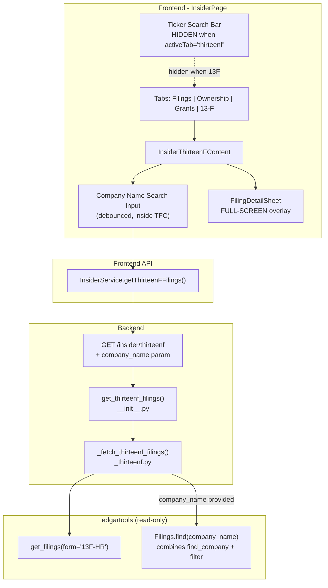
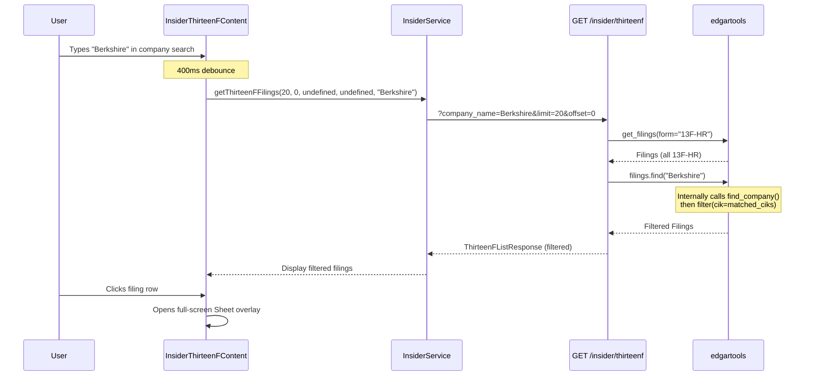

# 13-F Tab UI Improvements

## Metadata
- **Branch**: feature/agentic-thirteenf-redesign
- **Core Skills**: afe-config:unit-tester, afe-config:code-documenter
- **Language Skills**: afe-python:python-developer
- **Primary Language**: Python (backend), TypeScript (frontend)
- **Created**: 2026-04-06

## Executive Summary
- Add company name search to the 13-F tab via a new `company_name` query parameter on the existing `GET /insider/thirteenf` endpoint, using edgartools `Filings.find(company_name)` which internally combines `find_company()` fuzzy matching with `Filings.filter(cik=...)` in a single call.
- Hide the ticker search bar in the parent `InsiderPage` when the 13-F tab is active, since 13-F filings load independently without ticker context.
- Make the filing detail side panel (`SheetContent`) expand to full-screen width with unconstrained table heights for better data visibility.

## Goals
- Enable users to search 13F-HR filings by company name (e.g., "Berkshire") instead of only browsing all filings
- Reduce UI confusion by hiding the irrelevant ticker search bar when on the 13-F tab
- Improve data readability by giving the filing detail overlay full viewport width and removing table height caps

## Architecture Overview

### Key Design Decisions
- **Approach A (add param to existing endpoint)**: Adding `company_name` as an optional query parameter to `GET /insider/thirteenf` is simpler than a new endpoint, keeps the response contract identical, and reuses existing pagination/caching infrastructure.
- **Use `Filings.find()` instead of two-step**: Instead of a separate `_find_company()` shim plus `filings.filter(cik=ciks)`, use `filings.find(company_name)` which combines both steps internally (calls `find_company()` then `.filter(cik=...)`). This removes the need for a separate `_find_company` shim function and simplifies the worker logic. The `_FilingsProto` protocol is extended with `find()` and `filter()` methods for type safety.
- **Cache key includes company_name**: The cache key in `get_thirteenf_filings()` must incorporate the `company_name` parameter so that searches produce distinct cache entries from unfiltered listings. Empty/whitespace-only `company_name` values are normalized to `None` before cache key construction.
- **Error handling for company search**: The `filings.find(company_name)` call is wrapped in try/except, raising `RuntimeError` on failure to provide clear error messages for SEC API or search index failures.
- **Frontend debounce**: Company name search input inside `InsiderThirteenFContent` uses a 400ms debounce to avoid hammering the SEC API on every keystroke.
- **Full-screen via Tailwind override**: `cn()` (tailwind-merge) correctly resolves conflicting width classes, so `w-full sm:max-w-full` overrides the default `w-3/4 sm:max-w-sm` from `sheetVariants`.

### System Components Diagram

### Sequence Diagram

### API Contracts

#### Modified Backend Endpoint

**GET /insider/thirteenf** (existing, modified):
- **New query param**: `company_name: str | None = Query(None, min_length=2, max_length=100)`
- **Request**: `GET /insider/thirteenf?company_name=Berkshire&limit=20&offset=0`
- **Response**: Same `ThirteenFListResponse` shape -- `{ filings, total, has_more, skipped_count }`
- When `company_name` provided: calls `filings.find(company_name)` to get filtered filings (combines company search + CIK filter internally), then paginates the filtered set
- When `company_name` omitted: behavior unchanged

#### Modified Frontend API

**`InsiderService.getThirteenFFilings()`** (existing, modified):
- Add optional parameter: `companyName?: string`
- When provided, appends `company_name` to URLSearchParams

## Implementation Plan

> Tasks use Phase.Task numbering for unambiguous reference.
> TDD flow: Red (failing test) -> Green (minimal implementation) -> Refactor

### Progress Tracker
- PENDING: Phase 1: Backend -- Company name search parameter
- PENDING: Phase 2: Frontend -- Company search, hide ticker, full-screen sheet

### Phase 1: Backend -- Company name search parameter
**Goal**: Add `company_name` optional query parameter to the thirteenf endpoint, with `_FilingsProto` protocol updates, `filings.find()` call in worker logic, error handling, cache key update, and route passthrough.

#### Task 1.1: Update `_FilingsProto` protocol and `_fetch_thirteenf_filings()` worker to support company search via `filings.find()`
**Files to modify:**
- `/Users/dmytroshendryk/Documents/Projects/finance/ai-hedge-fund/app/backend/services/insider_service/_thirteenf.py`
- `/Users/dmytroshendryk/Documents/Projects/finance/ai-hedge-fund/tests/backend/insider/test_thirteenf_workers.py`

**Semantic targets:**
- Protocol (modify): `_FilingsProto` -- add two methods for type safety:
  - `filter(*, cik: object = None) -> "_FilingsProto"` -- structural match for edgartools `Filings.filter()` CIK filtering.
  - `find(name: str) -> "_FilingsProto"` -- structural match for edgartools `Filings.find()` which combines `find_company()` + `filter(cik=...)` internally.
- Function (modify): `_fetch_thirteenf_filings()` -- add `company_name: str | None = None` parameter. When provided: call `filings.find(company_name)` wrapped in try/except (raising `RuntimeError` on failure). Apply pagination to the filtered filings. When `filings.find()` returns an empty collection (len == 0), return an empty `ThirteenFListResponse` with `total=0`. When `company_name` is `None`, behavior unchanged.
- Test: `test_fetch_thirteenf_filings_with_company_name_filters_via_find` -- patch `_get_filings` to return a mock with `.find("Berkshire")` returning a filtered collection. Assert the worker calls `filings.find("Berkshire")` and returns only matching filings.
- Test: `test_fetch_thirteenf_filings_company_name_empty_results` -- mock `filings.find()` returns a collection with `len() == 0`. Assert response has `total=0` and `filings=[]`.
- Test: `test_fetch_thirteenf_filings_without_company_name_unchanged` -- pass `company_name=None`. Assert `filings.find` is NOT called. Assert existing behavior is preserved.
- Test: `test_fetch_thirteenf_filings_company_search_error_raises_runtime_error` -- mock `filings.find()` to raise `Exception("SEC search index unavailable")`. Assert `RuntimeError` is raised with descriptive message wrapping the original exception.

**TDD Steps:**
- DONE: 1.1.1: Red -- Write 4 failing tests for `_fetch_thirteenf_filings()` with company_name parameter (including error handling test)
- DONE: 1.1.2: Green -- Update `_FilingsProto` with `filter()` and `find()` methods, update `_fetch_thirteenf_filings()` to call `filings.find(company_name)` with try/except error handling
- DONE: 1.1.3: Refactor -- Ensure logging is clean, verify protocol methods match edgartools signatures

#### Task 1.2: Update async entry point and cache key with company_name normalization
**Files to modify:**
- `/Users/dmytroshendryk/Documents/Projects/finance/ai-hedge-fund/app/backend/services/insider_service/__init__.py`
- `/Users/dmytroshendryk/Documents/Projects/finance/ai-hedge-fund/tests/backend/insider/test_thirteenf_cache.py`

**Semantic targets:**
- Function (modify): `get_thirteenf_filings()` -- add `company_name: str | None = None` parameter. Normalize `company_name` to `None` if it is empty or whitespace-only (`company_name = company_name.strip() or None if company_name else None`). Update cache key to include normalized `company_name`: `f"thirteenf:filings:{date.today().isoformat()}:{year}:{quarter}:{company_name}:{limit}:{offset}"`. Pass normalized `company_name` through to `_fetch_thirteenf_filings()`.
- Test: `test_get_thirteenf_filings_cache_key_includes_company_name` -- call with `company_name="Berkshire"`, assert cache key contains "Berkshire". Call again with same params, assert worker is NOT called (cache hit). Call with different `company_name`, assert worker IS called (cache miss).
- Test: `test_get_thirteenf_filings_empty_company_name_normalized_to_none` -- call with `company_name="  "` (whitespace only), assert cache key contains `None` (not whitespace). Call with `company_name=""` (empty string), assert same normalization. Verify both produce cache hits against `company_name=None`.

**TDD Steps:**
- DONE: 1.2.1: Red -- Write failing cache tests for company_name in cache key and normalization
- DONE: 1.2.2: Green -- Update `get_thirteenf_filings()` signature, add normalization, update cache key, and worker call
- DONE: 1.2.3: Refactor -- Verify import of `_fetch_thirteenf_filings` re-export is unchanged

#### Task 1.3: Update route handler to accept `company_name` query parameter
**Files to modify:**
- `/Users/dmytroshendryk/Documents/Projects/finance/ai-hedge-fund/app/backend/routes/insider.py`
- `/Users/dmytroshendryk/Documents/Projects/finance/ai-hedge-fund/tests/backend/insider/test_thirteenf_routes.py`

**Semantic targets:**
- Function (modify): `insider_thirteenf()` route handler -- add `company_name: str | None = Query(None, min_length=2, max_length=100, description="Optional company name for fuzzy search")`. Pass to `get_thirteenf_filings()`. Update the docstring.
- Test: `test_thirteenf_with_company_name_passes_param` -- GET `/insider/thirteenf?company_name=Berkshire`, mock `get_thirteenf_filings` to assert it receives `company_name="Berkshire"`, returns 200.
- Test: `test_thirteenf_company_name_too_short_returns_422` -- GET `/insider/thirteenf?company_name=B`, assert 422 from FastAPI validation (`min_length=2`).
- Test: `test_thirteenf_without_company_name_unchanged` -- GET `/insider/thirteenf`, assert `get_thirteenf_filings` receives `company_name=None`.

**TDD Steps:**
- DONE: 1.3.1: Red -- Write 3 failing route tests for company_name parameter
- DONE: 1.3.2: Green -- Add `company_name` query parameter to route handler, pass through to service
- DONE: 1.3.3: Refactor -- Update route docstring

### Phase 2: Frontend -- Company search, hide ticker, full-screen sheet
**Goal**: Add company name search input to the 13-F tab, hide ticker search bar when 13-F is active, and make the filing detail sheet full-screen.

#### Task 2.1: Hide ticker search bar when 13-F tab is active
**Files to modify:**
- `/Users/dmytroshendryk/Documents/Projects/finance/ai-hedge-fund/app/frontend/src/pages/insider-page.tsx`

**Semantic targets:**
- Component (modify): `InsiderPage` return JSX -- wrap the search bar `
` in `{activeTab !== 'thirteenf' && (...)}` conditional rendering.

**TDD Steps:**
- DONE: 2.1.1: Green -- Add conditional `{activeTab !== 'thirteenf' && (...)}` wrapper around the ticker search bar div

#### Task 2.2: Update `getThirteenFFilings()` API method to accept `companyName`
**Files to modify:**
- `/Users/dmytroshendryk/Documents/Projects/finance/ai-hedge-fund/app/frontend/src/services/insider-api.ts`

**Semantic targets:**
- Method (modify): `InsiderService.getThirteenFFilings()` -- add optional `companyName?: string` parameter after `quarter`. When provided, append `company_name` to `URLSearchParams`.

**TDD Steps:**
- DONE: 2.2.1: Green -- Add `companyName` parameter to `getThirteenFFilings()`, append to URLSearchParams when truthy

#### Task 2.3: Add company name search input to `InsiderThirteenFContent`
**Files to modify:**
- `/Users/dmytroshendryk/Documents/Projects/finance/ai-hedge-fund/app/frontend/src/components/insider/insider-thirteenf-content.tsx`

**Semantic targets:**
- Component (modify): `InsiderThirteenFContent` -- add state: `companySearch` (string), `debouncedSearch` (string via `useEffect` with 400ms timeout). Add a search input above the filings table with placeholder "Search by company name (e.g. Berkshire)". When `debouncedSearch` changes, reset offset to 0, call `insiderService.getThirteenFFilings(PAGE_SIZE, 0, undefined, undefined, debouncedSearch || undefined)` and replace filings. Update `handleLoadMore` to pass `debouncedSearch`. Update initial `useEffect` to also depend on `debouncedSearch`. Add a clear button (X icon) to reset search.

**TDD Steps:**
- DONE: 2.3.1: Green -- Add `companySearch` state, debounce logic, search input UI, and wire to API calls
- DONE: 2.3.2: Refactor -- Extract debounce into a `useDebounce` hook if complexity warrants it

#### Task 2.4: Make filing detail sheet full-screen with unconstrained tables
**Files to modify:**
- `/Users/dmytroshendryk/Documents/Projects/finance/ai-hedge-fund/app/frontend/src/components/insider/insider-thirteenf-content.tsx`

**Semantic targets:**
- Component (modify): `FilingDetailSheet` -- change `SheetContent` className from `"w-[800px] sm:max-w-[800px] overflow-y-auto"` to `"w-full sm:max-w-full overflow-y-auto"`.
- Component (modify): `CompareHoldingsSection` -- change inner table wrapper div from `"rounded-md border overflow-auto max-h-[400px]"` to `"rounded-md border overflow-auto"` (remove `max-h-[400px]`).
- Component (modify): `HoldingHistorySection` -- change inner table wrapper div from `"rounded-md border overflow-auto max-h-[400px]"` to `"rounded-md border overflow-auto"` (remove `max-h-[400px]`).

**TDD Steps:**
- DONE: 2.4.1: Green -- Update className strings on `SheetContent`, compare holdings table wrapper, and holding history table wrapper

## Appendix
- edgartools `find_company()` API: `edgar.entity.search.find_company(company: str, top_n: int = 10)` returns `CompanySearchResults` with `.ciks` (list of ints), `.tickers`, `.results` (DataFrame), `.empty` (bool)
- edgartools `Filings.find(company_search_str)` API: combines `find_company()` + `filter(cik=...)` internally, returns a new `Filings` object containing only filings from matching companies
- `Filings.filter(cik=...)` accepts `Union[IntString, List[IntString]]` for CIK filtering
- `cn()` uses `tailwind-merge` which resolves conflicting Tailwind width/max-width classes correctly (later class wins)
- Existing test infrastructure: `test_thirteenf_workers.py` uses `patch.object` on `_thirteenf` module shims; `test_thirteenf_routes.py` uses `httpx.AsyncClient` with `ASGITransport`
