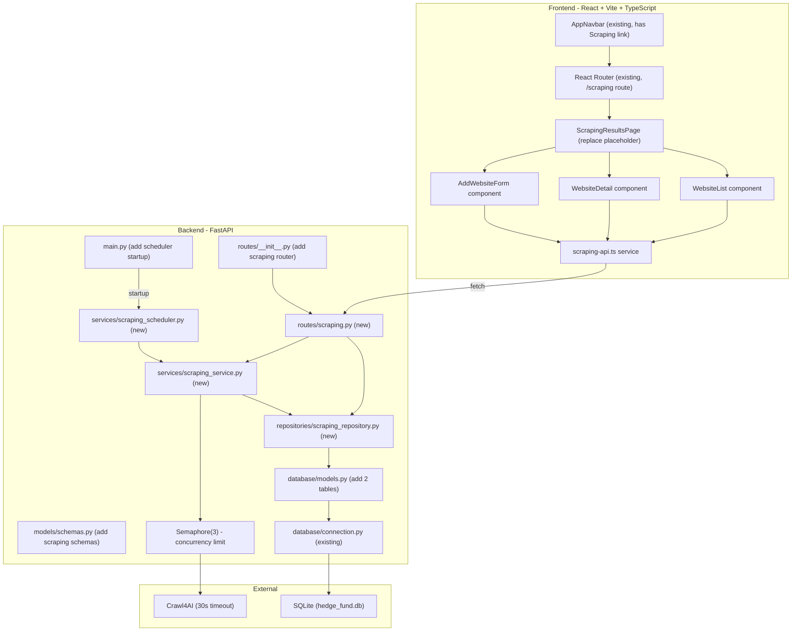
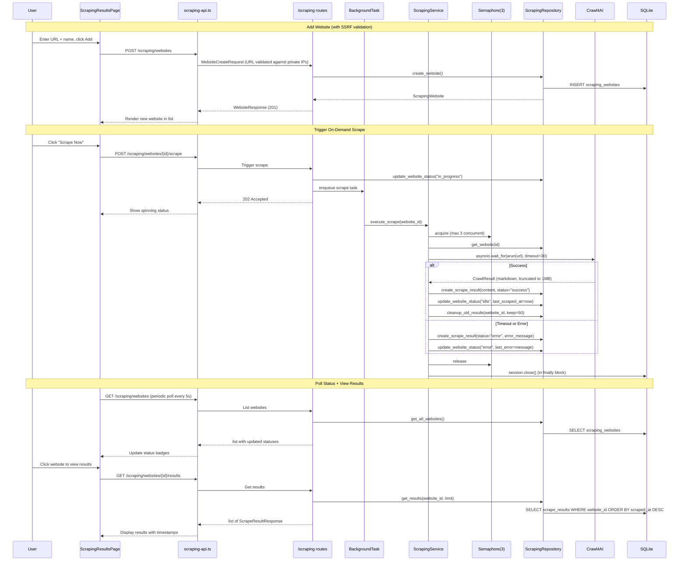

# Web Scraping Feature for AI Hedge Fund

## Metadata
- **Branch**: feature/agentic-web-scraping
- **Core Skills**: afe-config:unit-tester, afe-config:code-documenter
- **Language Skills**: afe-python:python-developer
- **Primary Language**: Python, TypeScript
- **Created**: 2026-03-14

## Executive Summary
- Add web scraping capability: manage target websites via UI, scrape with Crawl4AI, persist results to SQLite, display recent scrape results per site
- Backend follows the existing Route -> Repository -> Service layered pattern with Pydantic schemas; scheduling uses an asyncio background loop on FastAPI startup
- Frontend replaces the existing placeholder scraping page with full CRUD UI using shadcn/ui components and a class-based API service
- No LLM integration -- scraped content is stored as plain text for future use
- Security: SSRF protection via URL validation rejecting private IPs and cloud metadata endpoints
- Reliability: 30-second timeout on Crawl4AI, concurrency limit of 3 concurrent scrapes, stuck-state recovery on startup, data retention (50 results per site)

## Goals
- Website CRUD: add, list, and delete target websites
- On-demand scraping: trigger a scrape via the UI, executed as a non-blocking background task
- Scheduled scraping: periodic auto-scraping at configurable intervals via an in-process asyncio scheduler
- Results storage and display: persist scraped text content in SQLite, display recent results per website in the UI
- Follow all existing codebase patterns (route/repo/schema conventions, frontend service class pattern)

## KPIs
- Scraping completes for a single page in under 30 seconds (enforced by timeout)
- UI reflects scrape status within 5 seconds of polling
- Zero new dependencies beyond `crawl4ai` (backend) -- frontend uses existing shadcn/ui

## Architecture Overview

### Key Design Decisions

- **SSRF protection on URL input**: `WebsiteCreateRequest` includes a Pydantic `@field_validator` on the `url` field that rejects URLs resolving to private IP ranges (10.x, 172.16-31.x, 192.168.x, 127.x), localhost, and cloud metadata endpoints (169.254.169.254). Only `http` and `https` schemes are allowed. This prevents server-side request forgery through the scraping service.
- **30-second timeout on Crawl4AI**: Every `AsyncWebCrawler.arun()` call is wrapped in `asyncio.wait_for(timeout=30)`. On timeout, the website transitions to "error" status with a descriptive error message, and a `ScrapeResult` with status="error" is persisted.
- **Concurrency limit via asyncio.Semaphore(3)**: The scheduler and background task layer share a module-level `asyncio.Semaphore(3)` to prevent more than 3 concurrent scrapes. This protects SQLite from write contention and limits resource consumption.
- **Stuck-state recovery on startup**: When the `ScrapingScheduler` starts, it queries for any websites with `scrape_status="in_progress"` and resets them to `"idle"`. This handles cases where the server crashed mid-scrape.
- **Content size limit (1MB)**: `MAX_CONTENT_LENGTH = 1_048_576` bytes. Scraped content exceeding this limit is truncated. The `ScrapeResult.content_length` field stores the original (pre-truncation) size so users can see if content was truncated.
- **Data retention (50 results per website)**: After each successful scrape, the service calls `cleanup_old_results(website_id, keep=50)` to delete results beyond the most recent 50. This prevents unbounded DB growth.
- **Cascade delete via SQLAlchemy relationship**: `ScrapingWebsite` model has a `relationship("ScrapeResult", cascade="all, delete-orphan")` so deleting a website automatically removes all its results without manual cleanup in the repository.
- **Scheduling via asyncio loop on startup**: The codebase has zero scheduling infrastructure. Adding APScheduler introduces a heavy dependency for a simple periodic check. An asyncio background task started in FastAPI's `on_event("startup")` that sleeps and checks for due scrapes is lightweight, testable, and consistent with the existing async patterns. If scheduling needs grow, APScheduler can replace it later.
- **BackgroundTasks for on-demand scrapes**: FastAPI `BackgroundTasks` is simpler than `asyncio.create_task` for fire-and-forget scraping. The scrape service creates its own `SessionLocal()` for DB writes since the request-scoped session closes after the response returns. All background tasks use `try/finally` to guarantee DB session closure.
- **Polling for status updates**: The existing SSE pattern is complex and request-scoped. For scraping status, a simple GET endpoint polled by the frontend every few seconds is sufficient and far simpler.
- **Two DB tables**: `scraping_websites` (website metadata + scheduling config) and `scrape_results` (individual scrape outputs). This cleanly separates configuration from data. A composite index on `(website_id, scraped_at)` optimizes the common query pattern.
- **Crawl4AI async usage**: Crawl4AI is natively async. The scraping service runs `await` calls inside async background tasks. This is compatible with FastAPI's async infrastructure.
- **Alembic migration via autogenerate**: Use `alembic revision --autogenerate -m "add scraping tables"` from `app/backend/` directory instead of hardcoding revision IDs. This ensures the revision chain stays consistent.
- **Frontend tests deferred**: The frontend has no test infrastructure (no Jest/Vitest setup, no test utilities). Frontend testing is out of scope for this feature and will be addressed in a separate effort.

### System Components Diagram



### Sequence Diagram



### API Contracts

#### REST API Endpoints

| Method | Endpoint | Request Body | Response | Status |
|--------|----------|-------------|----------|--------|
| GET | `/scraping/websites` | -- | `List[WebsiteResponse]` | 200 |
| POST | `/scraping/websites` | `WebsiteCreateRequest` | `WebsiteResponse` | 201 |
| GET | `/scraping/websites/{id}` | -- | `WebsiteResponse` | 200 / 404 |
| DELETE | `/scraping/websites/{id}` | -- | `{"message": "..."}` | 200 / 404 |
| PATCH | `/scraping/websites/{id}` | `WebsiteUpdateRequest` | `WebsiteResponse` | 200 / 404 |
| POST | `/scraping/websites/{id}/scrape` | -- | `{"message": "...", "website_id": id}` | 202 / 404 / 409 |
| GET | `/scraping/websites/{id}/results` | query: `limit` (default 20) | `List[ScrapeResultResponse]` | 200 / 404 |
| GET | `/scraping/results/{result_id}` | -- | `ScrapeResultDetailResponse` | 200 / 404 |

#### Pydantic Schemas

**WebsiteCreateRequest**: `url: str` (required, validated URL with SSRF protection -- see validator below), `name: str` (required, 1-200 chars), `scrape_interval_minutes: int | None` (optional, for scheduling)

SSRF validator on `url` field:
- Only `http` and `https` schemes allowed
- Reject URLs resolving to: `127.0.0.0/8`, `10.0.0.0/8`, `172.16.0.0/12`, `192.168.0.0/16`, `169.254.169.254` (cloud metadata), `0.0.0.0`, `::1`
- Reject `localhost` hostname
- Implemented as `@field_validator("url")` using `urllib.parse.urlparse` and `ipaddress` module for IP range checks

**WebsiteUpdateRequest**: `name: str | None`, `scrape_interval_minutes: int | None`, `is_active: bool | None`

**WebsiteResponse**: `id: int`, `url: str`, `name: str`, `scrape_status: str`, `scrape_interval_minutes: int | None`, `is_active: bool`, `last_scraped_at: datetime | None`, `created_at: datetime`, `updated_at: datetime | None`

**ScrapeResultResponse**: `id: int`, `website_id: int`, `scraped_at: datetime`, `content_length: int`, `content_preview: str` (first 500 chars), `status: str`, `error_message: str | None`

**ScrapeResultDetailResponse**: extends ScrapeResultResponse with `content: str` (full text)

#### Database Models

**ScrapingWebsite** (`scraping_websites` table):
- `id`: Integer, PK
- `url`: String(2048), not null
- `name`: String(200), not null
- `scrape_status`: String(50), default "idle" -- values: idle, in_progress, completed, error
- `scrape_interval_minutes`: Integer, nullable -- null means no scheduling
- `is_active`: Boolean, default True
- `last_scraped_at`: DateTime, nullable
- `last_error`: Text, nullable
- `created_at`: DateTime, server_default now
- `updated_at`: DateTime, onupdate now
- `results`: relationship("ScrapeResult", back_populates="website", cascade="all, delete-orphan")

**ScrapeResult** (`scrape_results` table):
- `id`: Integer, PK
- `website_id`: Integer, FK -> scraping_websites.id, indexed (composite index with scraped_at)
- `scraped_at`: DateTime, server_default now
- `content`: Text, nullable -- scraped markdown text (truncated to 1MB)
- `content_length`: Integer, default 0 -- original content length before truncation
- `status`: String(50), not null -- values: success, error
- `error_message`: Text, nullable
- `created_at`: DateTime, server_default now
- `website`: relationship("ScrapingWebsite", back_populates="results")

#### Constants

- `MAX_CONTENT_LENGTH = 1_048_576` (1MB) -- defined in `scraping_service.py`
- `MAX_RESULTS_PER_WEBSITE = 50` -- defined in `scraping_service.py`
- `SCRAPE_TIMEOUT_SECONDS = 30` -- defined in `scraping_service.py`
- `MAX_CONCURRENT_SCRAPES = 3` -- defined in `scraping_service.py`, used for `asyncio.Semaphore`
- `SCHEDULER_CHECK_INTERVAL_SECONDS = 60` -- defined in `scraping_scheduler.py`

## Implementation Plan

> Tasks use Phase.Task numbering for unambiguous reference.
> TDD flow: Red (failing test) -> Green (minimal implementation) -> Refactor
> Frontend tests are deferred -- no test infrastructure exists (no Jest/Vitest setup).

### Progress Tracker
- DONE: Phase 1: Database Models, Schemas, and Test Infrastructure
- DONE: Phase 2: Repository and Service Layer (Tasks 2.1 and 2.2 DONE)
- DONE: Phase 3: API Routes and Background Tasks (Task 3.1 DONE)
- DONE: Phase 4: Scheduling Infrastructure
- DONE: Phase 5: Frontend API Service and UI
- DONE: Remediation.1: Fix critical issue and warnings from multi-perspective validation

### Phase 1: Database Models, Schemas, and Test Infrastructure
**Goal**: Define SQLAlchemy models and Pydantic schemas for scraping feature; create Alembic migration; set up shared test fixtures.

#### Task 1.1: Create Backend Test Infrastructure and Add SQLAlchemy Models
**Files to create:**
- /Users/dmytroshendryk/Documents/Projects/finance/ai-hedge-fund/tests/backend/__init__.py
- /Users/dmytroshendryk/Documents/Projects/finance/ai-hedge-fund/tests/backend/conftest.py

**Files to modify:**
- /Users/dmytroshendryk/Documents/Projects/finance/ai-hedge-fund/app/backend/database/models.py

**Semantic targets:**
- File: `tests/backend/conftest.py` -- shared test fixtures for backend tests
- Fixture: `db_engine` -- creates an in-memory SQLite engine with `Base.metadata.create_all()`
- Fixture: `db_session` -- yields a `Session` bound to the in-memory engine, rolls back after each test
- Class: `ScrapingWebsite` -- new SQLAlchemy model in `database/models.py` with `relationship("ScrapeResult", back_populates="website", cascade="all, delete-orphan")`
- Class: `ScrapeResult` -- new SQLAlchemy model with `relationship("ScrapingWebsite", back_populates="results")` and FK to scraping_websites.id
- Table: `scraping_websites` -- columns: id, url, name, scrape_status, scrape_interval_minutes, is_active, last_scraped_at, last_error, created_at, updated_at
- Table: `scrape_results` -- columns: id, website_id (FK), scraped_at, content, content_length, status, error_message, created_at

**TDD Steps:**
- DONE: 1.1.1: Green - Create `tests/backend/__init__.py` (empty) and `tests/backend/conftest.py` with `db_engine` fixture (in-memory SQLite, `Base.metadata.create_all()`) and `db_session` fixture (yields `Session`, rolls back after test)
- DONE: 1.1.2: Green - Add `ScrapingWebsite` and `ScrapeResult` classes to `database/models.py` following the existing pattern (Column definitions, server_default for timestamps, ForeignKey for website_id). Include `relationship()` with `cascade="all, delete-orphan"` on ScrapingWebsite and `back_populates` on both sides.
- DONE: 1.1.3: Refactor - Verify models match the existing style conventions (Column ordering, type annotations, docstring format)

#### Task 1.2: Add Pydantic Schemas for Scraping with SSRF Protection
**Files to modify:**
- /Users/dmytroshendryk/Documents/Projects/finance/ai-hedge-fund/app/backend/models/schemas.py

**Files to create:**
- /Users/dmytroshendryk/Documents/Projects/finance/ai-hedge-fund/tests/backend/test_scraping_schemas.py

**Semantic targets:**
- Class: `WebsiteCreateRequest` -- Pydantic model for POST /scraping/websites, with `@field_validator("url")` for SSRF protection
- Validator: `validate_url()` on `WebsiteCreateRequest` -- rejects private IPs (10.x, 172.16-31.x, 192.168.x, 127.x), localhost, cloud metadata (169.254.169.254), non-http(s) schemes. Uses `urllib.parse.urlparse` and `ipaddress` module.
- Class: `WebsiteUpdateRequest` -- Pydantic model for PATCH /scraping/websites/{id}
- Class: `WebsiteResponse` -- Pydantic response model with `from_attributes = True`
- Class: `ScrapeResultResponse` -- response model with content_preview (first 500 chars)
- Class: `ScrapeResultDetailResponse` -- response model with full content
- Enum: `ScrapeStatus` -- str enum: idle, in_progress, completed, error
- Enum: `ScrapeResultStatus` -- str enum: success, error

**TDD Steps:**
- DONE: 1.2.1: Red - Write test `test_website_create_request_rejects_private_ip` verifying that WebsiteCreateRequest raises ValidationError for URLs like `http://192.168.1.1/page`, `http://10.0.0.1/data`, `http://127.0.0.1:8080/`, `http://169.254.169.254/latest/meta-data/`
- DONE: 1.2.2: Red - Write test `test_website_create_request_rejects_localhost` verifying rejection of `http://localhost/page` and `http://localhost:3000/`
- DONE: 1.2.3: Red - Write test `test_website_create_request_rejects_non_http_schemes` verifying rejection of `ftp://example.com`, `file:///etc/passwd`, `javascript:alert(1)`
- DONE: 1.2.4: Red - Write test `test_website_create_request_accepts_valid_urls` verifying acceptance of `https://example.com`, `http://news.ycombinator.com`, `https://finance.yahoo.com/quote/AAPL`
- DONE: 1.2.5: Red - Write test `test_website_create_request_requires_url_and_name` verifying ValidationError when url or name is missing/empty
- DONE: 1.2.6: Green - Add all Pydantic schemas and enums to `schemas.py` following existing pattern (Field(...) for required, Field(None) for optional, Config with from_attributes). Implement `@field_validator("url")` with SSRF checks using `urllib.parse.urlparse`, `socket.getaddrinfo` for hostname resolution, and `ipaddress.ip_address` for range checks.
- DONE: 1.2.7: Refactor - Ensure schema naming consistency with existing conventions

#### Task 1.3: Create Alembic Migration for Scraping Tables
**Files to create:**
- Alembic migration file (generated via `alembic revision --autogenerate`)

**Semantic targets:**
- Migration: generated via `cd app/backend && alembic revision --autogenerate -m "add scraping tables"` -- do NOT hardcode revision IDs
- Function: `upgrade()` -- creates `scraping_websites` and `scrape_results` tables with indexes, including composite index on `(website_id, scraped_at)` in `scrape_results`
- Function: `downgrade()` -- drops both tables and indexes

**TDD Steps:**
- DONE: 1.3.1: Green - Run `cd /Users/dmytroshendryk/Documents/Projects/finance/ai-hedge-fund/app/backend && alembic revision --autogenerate -m "add scraping tables"` to generate migration. Then manually verify and edit the generated file to ensure: (a) composite index `ix_scrape_results_website_id_scraped_at` on `(website_id, scraped_at)` is present, (b) individual index on `scrape_results.website_id` is present, (c) `downgrade()` properly reverses all operations.
- DONE: 1.3.2: Green - Run `alembic upgrade head` to verify migration applies cleanly, then `alembic downgrade -1` to verify rollback works.
- DONE: 1.3.3: Refactor - Verify migration follows the pattern from `add_api_keys_table.py` (PrimaryKeyConstraint, index creation, proper downgrade ordering)

### Phase 2: Repository and Service Layer
**Goal**: Implement data access (repository) and business logic (scraping service with Crawl4AI integration, timeout, content truncation, retention cleanup).

#### Task 2.1: Create ScrapingRepository
**Files to create:**
- /Users/dmytroshendryk/Documents/Projects/finance/ai-hedge-fund/app/backend/repositories/scraping_repository.py
- /Users/dmytroshendryk/Documents/Projects/finance/ai-hedge-fund/tests/backend/test_scraping_repository.py

**Semantic targets:**
- Class: `ScrapingRepository` -- constructor takes `Session`, mirrors `ApiKeyRepository` pattern
- Method: `create_website(url, name, scrape_interval_minutes)` -- INSERT and return ORM instance
- Method: `get_all_websites()` -- returns list of active websites ordered by name
- Method: `get_website_by_id(website_id)` -- returns single website or None
- Method: `delete_website(website_id)` -- deletes website (cascade handles results via relationship), returns bool
- Method: `update_website(website_id, **kwargs)` -- partial update, returns updated website or None
- Method: `update_website_status(website_id, status, last_error)` -- status transitions
- Method: `create_scrape_result(website_id, content, content_length, status, error_message)` -- INSERT result
- Method: `get_results_for_website(website_id, limit)` -- returns results ordered by scraped_at desc
- Method: `get_websites_due_for_scrape()` -- returns websites where scrape_interval_minutes is set, is_active=True, scrape_status != "in_progress", and last_scraped_at + interval < now (or last_scraped_at is None)
- Method: `cleanup_old_results(website_id, keep)` -- deletes results beyond the `keep` most recent for a given website
- Method: `reset_stuck_in_progress()` -- resets all websites with scrape_status="in_progress" back to "idle" (called on startup)

**TDD Steps:**
- DONE: 2.1.1: Red - Write test `test_create_website_persists_to_db` using `db_session` fixture; verify returned object has correct url, name, and default scrape_status="idle"
- DONE: 2.1.2: Red - Write test `test_get_all_websites_returns_active_only` creating active and inactive websites, verifying only active ones returned
- DONE: 2.1.3: Red - Write test `test_delete_website_cascades_to_results` creating website with results, deleting website, verifying results are also gone (via cascade relationship)
- DONE: 2.1.4: Red - Write test `test_update_website_status_transitions` verifying status update from "idle" to "in_progress" sets the status correctly
- DONE: 2.1.5: Red - Write test `test_get_results_for_website_ordered_by_date` creating multiple results, verifying most recent first with limit
- DONE: 2.1.6: Red - Write test `test_get_websites_due_for_scrape` creating websites with various intervals and last_scraped_at values, verifying only due ones returned; also verify websites with scrape_status="in_progress" are excluded
- DONE: 2.1.7: Red - Write test `test_cleanup_old_results_keeps_most_recent` creating 60 results for a website, calling `cleanup_old_results(website_id, keep=50)`, verifying 50 remain and they are the most recent
- DONE: 2.1.8: Red - Write test `test_reset_stuck_in_progress` creating 2 websites with status "in_progress" and 1 with "idle", calling `reset_stuck_in_progress()`, verifying the 2 are now "idle" and the third is unchanged
- DONE: 2.1.9: Green - Implement all `ScrapingRepository` methods following `ApiKeyRepository` patterns (db.add, db.commit, db.refresh, query.filter)
- DONE: 2.1.10: Refactor - Extract common query patterns, verify error handling consistency

#### Task 2.2: Create ScrapingService with Crawl4AI Integration
**Files to create:**
- /Users/dmytroshendryk/Documents/Projects/finance/ai-hedge-fund/app/backend/services/scraping_service.py
- /Users/dmytroshendryk/Documents/Projects/finance/ai-hedge-fund/tests/backend/test_scraping_service.py

**Files to modify:**
- /Users/dmytroshendryk/Documents/Projects/finance/ai-hedge-fund/pyproject.toml

**Semantic targets:**
- Constant: `MAX_CONTENT_LENGTH = 1_048_576` -- 1MB content truncation limit
- Constant: `MAX_RESULTS_PER_WEBSITE = 50` -- data retention limit
- Constant: `SCRAPE_TIMEOUT_SECONDS = 30` -- Crawl4AI timeout
- Constant: `MAX_CONCURRENT_SCRAPES = 3` -- semaphore limit
- Variable: `_scrape_semaphore = asyncio.Semaphore(MAX_CONCURRENT_SCRAPES)` -- module-level semaphore
- Function: `execute_scrape(website_id)` -- async function that: (1) acquires semaphore, (2) creates its own `SessionLocal()` in a `try/finally` block guaranteeing `session.close()`, (3) fetches website, (4) guards against concurrent scrapes (skip if already in_progress), (5) wraps `AsyncWebCrawler.arun()` in `asyncio.wait_for(timeout=SCRAPE_TIMEOUT_SECONDS)`, (6) truncates content to `MAX_CONTENT_LENGTH` storing original size in `content_length`, (7) saves result and updates status, (8) calls `cleanup_old_results(website_id, keep=MAX_RESULTS_PER_WEBSITE)`, (9) releases semaphore in finally block
- Dependency: Add `crawl4ai` to `pyproject.toml` under `[tool.poetry.dependencies]`

**TDD Steps:**
- DONE: 2.2.1: Red - Write test `test_execute_scrape_saves_result_on_success` mocking Crawl4AI's `AsyncWebCrawler` to return fake markdown content; verify a ScrapeResult with status="success" is created, website status returns to "idle", and `cleanup_old_results` is called
- DONE: 2.2.2: Red - Write test `test_execute_scrape_saves_error_on_timeout` mocking Crawl4AI to hang (never return); verify that after 30 seconds (use patched short timeout for test speed), ScrapeResult with status="error" and error_message containing "timeout" is created, website status set to "error"
- DONE: 2.2.3: Red - Write test `test_execute_scrape_saves_error_on_exception` mocking Crawl4AI to raise an exception; verify ScrapeResult with status="error" and error_message is created, website status set to "error"
- DONE: 2.2.4: Red - Write test `test_execute_scrape_skips_if_already_in_progress` verifying that if website status is already "in_progress", the function returns early without creating a duplicate task
- DONE: 2.2.5: Red - Write test `test_execute_scrape_truncates_large_content` mocking Crawl4AI to return 2MB of content; verify stored content is truncated to 1MB and content_length reflects the original 2MB size
- DONE: 2.2.6: Red - Write test `test_execute_scrape_session_closed_on_error` mocking Crawl4AI to raise, verify the DB session is closed even when an exception occurs (mock SessionLocal and assert `.close()` called)
- DONE: 2.2.7: Green - Add `crawl4ai` to pyproject.toml. Implement `execute_scrape()` function with semaphore, timeout, content truncation, retention cleanup, and try/finally session management.
- DONE: 2.2.8: Refactor - Add logging via Python `logging` module (consistent with existing patterns), clean up error handling

### Phase 3: API Routes and Background Tasks
**Goal**: Expose scraping functionality via REST endpoints with background task execution.

#### Task 3.1: Create Scraping Routes
**Files to create:**
- /Users/dmytroshendryk/Documents/Projects/finance/ai-hedge-fund/app/backend/routes/scraping.py
- /Users/dmytroshendryk/Documents/Projects/finance/ai-hedge-fund/tests/backend/test_scraping_routes.py

**Files to modify:**
- /Users/dmytroshendryk/Documents/Projects/finance/ai-hedge-fund/app/backend/routes/__init__.py

**Semantic targets:**
- Variable: `router = APIRouter(prefix="/scraping", tags=["scraping"])` -- route prefix
- Function: `create_website()` -- POST /scraping/websites, returns 201
- Function: `list_websites()` -- GET /scraping/websites
- Function: `get_website()` -- GET /scraping/websites/{website_id}, returns 200 or 404
- Function: `delete_website()` -- DELETE /scraping/websites/{website_id}
- Function: `update_website()` -- PATCH /scraping/websites/{website_id}
- Function: `trigger_scrape()` -- POST /scraping/websites/{website_id}/scrape, uses `BackgroundTasks`, returns 202. Guards against triggering if already in_progress (409 Conflict).
- Function: `get_website_results()` -- GET /scraping/websites/{website_id}/results, accepts `limit` query param (default 20)
- Function: `get_result_detail()` -- GET /scraping/results/{result_id}, returns full content (ScrapeResultDetailResponse) or 404
- Registration: Add `from app.backend.routes.scraping import router as scraping_router` and `api_router.include_router(scraping_router, tags=["scraping"])` to `routes/__init__.py`

**TDD Steps:**
- DONE: 3.1.1: Red - Write test `test_create_website_endpoint_returns_201` using FastAPI TestClient with in-memory DB override; POST valid payload, verify 201 and response contains url, name, scrape_status
- DONE: 3.1.2: Red - Write test `test_create_website_endpoint_rejects_ssrf` POST with `url="http://169.254.169.254/latest/"`, verify 422 validation error
- DONE: 3.1.3: Red - Write test `test_list_websites_endpoint_returns_all` creating 2 websites then GET /scraping/websites, verify list length and content
- DONE: 3.1.4: Red - Write test `test_get_website_endpoint_returns_200` creating a website then GET /scraping/websites/{id}, verify 200 and response matches
- DONE: 3.1.5: Red - Write test `test_get_website_endpoint_returns_404_for_missing` GET /scraping/websites/9999, verify 404
- DONE: 3.1.6: Red - Write test `test_delete_website_endpoint_returns_404_for_missing` DELETE with non-existent ID, verify 404
- DONE: 3.1.7: Red - Write test `test_trigger_scrape_returns_202` POST /scraping/websites/{id}/scrape, verify 202 response and website status changed to "in_progress"
- DONE: 3.1.8: Red - Write test `test_trigger_scrape_returns_409_if_already_in_progress` setting website status to "in_progress" first, then triggering, verify 409
- DONE: 3.1.9: Red - Write test `test_get_results_returns_paginated` creating multiple results, GET with limit=5, verify correct count and ordering
- DONE: 3.1.10: Red - Write test `test_get_result_detail_returns_full_content` creating a result, GET /scraping/results/{id}, verify full content in response
- DONE: 3.1.11: Green - Implement all route handlers following `api_keys.py` patterns (Depends(get_db), repo instantiation, try/except with HTTPException, response_model decorators)
- DONE: 3.1.12: Green - Register scraping router in `routes/__init__.py`
- DONE: 3.1.13: Refactor - Ensure consistent error response format using `ErrorResponse` schema

### Phase 4: Scheduling Infrastructure
**Goal**: Add periodic scraping via an asyncio background loop on FastAPI startup, with stuck-state recovery and concurrency limits.

#### Task 4.1: Create Scraping Scheduler
**Files to create:**
- /Users/dmytroshendryk/Documents/Projects/finance/ai-hedge-fund/app/backend/services/scraping_scheduler.py
- /Users/dmytroshendryk/Documents/Projects/finance/ai-hedge-fund/tests/backend/test_scraping_scheduler.py

**Files to modify:**
- /Users/dmytroshendryk/Documents/Projects/finance/ai-hedge-fund/app/backend/main.py

**Semantic targets:**
- Constant: `SCHEDULER_CHECK_INTERVAL_SECONDS = 60`
- Class: `ScrapingScheduler` -- manages the periodic check loop
- Method: `ScrapingScheduler.start()` -- async; first calls `_recover_stuck_states()` to reset any in_progress websites to idle, then starts the background loop via `asyncio.create_task`
- Method: `ScrapingScheduler.stop()` -- cancels the background task (for clean shutdown)
- Method: `ScrapingScheduler._recover_stuck_states()` -- async; creates SessionLocal, calls `ScrapingRepository.reset_stuck_in_progress()`, closes session in finally block. Logs count of recovered websites.
- Method: `ScrapingScheduler._check_and_run_due_scrapes()` -- async; creates SessionLocal in try/finally, queries `get_websites_due_for_scrape()`, triggers `execute_scrape()` for each (respects semaphore from scraping_service)
- Method: `ScrapingScheduler._loop()` -- async, infinite loop: call `_check_and_run_due_scrapes()`, sleep for `SCHEDULER_CHECK_INTERVAL_SECONDS`. Wraps body in try/except to prevent crash on transient errors.
- Integration: Add `ScrapingScheduler` startup in `main.py` `startup_event()` (or `@app.on_event("startup")`), add `shutdown_event()` for cleanup

**TDD Steps:**
- DONE: 4.1.1: Red - Write test `test_recover_stuck_states_resets_in_progress` setting up 2 websites with status "in_progress", calling `_recover_stuck_states()`, verifying both are now "idle"
- DONE: 4.1.2: Red - Write test `test_check_and_run_triggers_due_scrapes` mocking repository to return 2 due websites, mocking `execute_scrape`, verify it is called twice with correct website IDs
- DONE: 4.1.3: Red - Write test `test_check_and_run_skips_when_none_due` mocking repository to return empty list, verify `execute_scrape` not called
- DONE: 4.1.4: Red - Write test `test_scheduler_stop_cancels_task` starting scheduler then stopping, verify task is cancelled
- DONE: 4.1.5: Red - Write test `test_check_and_run_handles_exception_gracefully` mocking repository to raise an exception, verify the loop does not crash (no unhandled exception propagated)
- DONE: 4.1.6: Green - Implement `ScrapingScheduler` with stuck-state recovery on start, asyncio loop, integrate into `main.py` startup/shutdown events
- DONE: 4.1.7: Refactor - Add logging for scheduler activity (startup, recovery count, due scrapes found, errors), ensure all DB sessions closed in finally blocks

### Phase 5: Frontend API Service and UI
**Goal**: Build the frontend scraping management page with website CRUD, scrape triggering, and result viewing. Frontend tests are deferred (no test infrastructure).

#### Task 5.1: Create Frontend Scraping API Service
**Files to create:**
- /Users/dmytroshendryk/Documents/Projects/finance/ai-hedge-fund/app/frontend/src/services/scraping-api.ts

**Semantic targets:**
- Interface: `Website` -- mirrors WebsiteResponse fields
- Interface: `ScrapeResult` -- mirrors ScrapeResultResponse fields
- Interface: `ScrapeResultDetail` -- mirrors ScrapeResultDetailResponse fields
- Interface: `WebsiteCreateRequest` -- url, name, scrape_interval_minutes
- Interface: `WebsiteUpdateRequest` -- name, scrape_interval_minutes, is_active (all optional)
- Class: `ScrapingService` -- class-based singleton following `ApiKeysService` pattern
- Method: `ScrapingService.getWebsites()` -- GET /scraping/websites
- Method: `ScrapingService.getWebsite(id)` -- GET /scraping/websites/{id}
- Method: `ScrapingService.createWebsite(request)` -- POST /scraping/websites
- Method: `ScrapingService.deleteWebsite(id)` -- DELETE /scraping/websites/{id}
- Method: `ScrapingService.updateWebsite(id, request)` -- PATCH /scraping/websites/{id}
- Method: `ScrapingService.triggerScrape(id)` -- POST /scraping/websites/{id}/scrape
- Method: `ScrapingService.getResults(id, limit?)` -- GET /scraping/websites/{id}/results
- Method: `ScrapingService.getResultDetail(resultId)` -- GET /scraping/results/{result_id}
- Export: `scrapingService` singleton instance

**Steps:**
- DONE: 5.1.1: Green - Create `scraping-api.ts` with all interfaces and `ScrapingService` class following `api-keys-api.ts` patterns (private baseUrl, fetch calls, error handling with response status checks, typed return promises). Include `getWebsite()` and `getResultDetail()` methods for the new endpoints.
- DONE: 5.1.2: Refactor - Verify type alignment with backend Pydantic schemas

#### Task 5.2: Build ScrapingResultsPage UI
**Files to modify:**
- /Users/dmytroshendryk/Documents/Projects/finance/ai-hedge-fund/app/frontend/src/pages/scraping-results-page.tsx

**Files to create:**
- /Users/dmytroshendryk/Documents/Projects/finance/ai-hedge-fund/app/frontend/src/components/scraping/website-list.tsx
- /Users/dmytroshendryk/Documents/Projects/finance/ai-hedge-fund/app/frontend/src/components/scraping/add-website-dialog.tsx
- /Users/dmytroshendryk/Documents/Projects/finance/ai-hedge-fund/app/frontend/src/components/scraping/scrape-results-panel.tsx

**Semantic targets:**
- Component: `ScrapingResultsPage` -- replaces placeholder; two-panel layout: website list on left, results on right
- Component: `WebsiteList` -- renders list of websites as Cards with status Badge, "Scrape Now" Button, Delete Button. Polls `scrapingService.getWebsites()` every 5 seconds for status updates. Click a website to select it and show results.
- Component: `AddWebsiteDialog` -- Dialog with Input fields for URL and Name, optional interval selector. Calls `scrapingService.createWebsite()`.
- Component: `ScrapeResultsPanel` -- shows results for the selected website. Uses Table to list scraped_at, content_length, status. Click a result to expand and view full content via `scrapingService.getResultDetail()`. Uses Skeleton for loading state.
- State management: React `useState` + `useEffect` for data fetching; polling via `setInterval` in `useEffect`
- UI components used: Card, Button, Dialog, Input, Table, Badge, Skeleton, Separator from shadcn/ui; Newspaper, Plus, Trash2, RefreshCw, Globe icons from lucide-react

**Steps:**
- DONE: 5.2.1: Green - Create `WebsiteList` component: fetch and display websites, status badges (idle=gray, in_progress=yellow, completed=green, error=red), "Scrape Now" and "Delete" actions, onClick selection callback
- DONE: 5.2.2: Green - Create `AddWebsiteDialog` component: form with URL input (required), Name input (required), optional interval dropdown (none, 15min, 1hr, 6hr, 24hr), submit calls createWebsite then refreshes list
- DONE: 5.2.3: Green - Create `ScrapeResultsPanel` component: Table showing results for selected website, empty state when none selected, loading Skeleton, content preview with expandable detail (fetches full content via getResultDetail on expand)
- DONE: 5.2.4: Green - Replace `ScrapingResultsPage` placeholder: two-column layout using flex, left column = WebsiteList + AddWebsiteDialog button, right column = ScrapeResultsPanel. Add 5-second polling interval for website list refresh.
- DONE: 5.2.5: Refactor - Polish UI: responsive layout, loading states, error toasts (use sonner), empty states with helpful messaging

## Appendix

### New Files Summary
| File | Purpose |
|------|---------|
| `app/backend/database/models.py` (modify) | Add ScrapingWebsite, ScrapeResult models with cascade relationship |
| `app/backend/models/schemas.py` (modify) | Add scraping Pydantic schemas, enums, SSRF validator |
| `app/backend/alembic/versions/<auto>_add_scraping_tables.py` | Alembic migration (autogenerated) |
| `app/backend/repositories/scraping_repository.py` | DB access layer with cleanup and stuck-state recovery |
| `app/backend/services/scraping_service.py` | Crawl4AI integration with timeout, truncation, semaphore |
| `app/backend/services/scraping_scheduler.py` | Periodic scraping loop with stuck-state recovery on startup |
| `app/backend/routes/scraping.py` | REST API endpoints (8 endpoints) |
| `app/backend/routes/__init__.py` (modify) | Register scraping router |
| `app/backend/main.py` (modify) | Add scheduler startup/shutdown |
| `pyproject.toml` (modify) | Add crawl4ai dependency |
| `app/frontend/src/services/scraping-api.ts` | Frontend API service |
| `app/frontend/src/components/scraping/website-list.tsx` | Website list component |
| `app/frontend/src/components/scraping/add-website-dialog.tsx` | Add website dialog |
| `app/frontend/src/components/scraping/scrape-results-panel.tsx` | Results display panel |
| `app/frontend/src/pages/scraping-results-page.tsx` (modify) | Replace placeholder |
| `tests/backend/__init__.py` | Test package init |
| `tests/backend/conftest.py` | Shared in-memory SQLite fixtures (db_engine, db_session) |
| `tests/backend/test_scraping_schemas.py` | SSRF validation and schema tests |
| `tests/backend/test_scraping_repository.py` | Repository tests |
| `tests/backend/test_scraping_service.py` | Service tests (mocked Crawl4AI) |
| `tests/backend/test_scraping_routes.py` | Route integration tests (TestClient) |
| `tests/backend/test_scraping_scheduler.py` | Scheduler tests |

### Alembic Migration
Generated via `cd app/backend && alembic revision --autogenerate -m "add scraping tables"`. Do NOT hardcode revision IDs. The autogenerate command will detect the new models from `database/models.py` and create the appropriate migration.

### Crawl4AI Usage Pattern (with timeout and truncation)
```python
import asyncio
from crawl4ai import AsyncWebCrawler

MAX_CONTENT_LENGTH = 1_048_576  # 1MB
SCRAPE_TIMEOUT_SECONDS = 30

async with AsyncWebCrawler() as crawler:
    result = await asyncio.wait_for(
        crawler.arun(url=website.url),
        timeout=SCRAPE_TIMEOUT_SECONDS,
    )
    content = result.markdown
    original_length = len(content.encode("utf-8")) if content else 0
    if content and original_length > MAX_CONTENT_LENGTH:
        content = content[:MAX_CONTENT_LENGTH]  # truncate
```

### SSRF Validation Pattern
```python
import ipaddress
import socket
from urllib.parse import urlparse

def validate_url(url: str) -> str:
    parsed = urlparse(url)
    if parsed.scheme not in ("http", "https"):
        raise ValueError("Only http and https schemes are allowed")
    hostname = parsed.hostname
    if not hostname:
        raise ValueError("URL must have a hostname")
    if hostname in ("localhost", "0.0.0.0", "::1"):
        raise ValueError("localhost URLs are not allowed")
    try:
        addr_infos = socket.getaddrinfo(hostname, None)
        for _, _, _, _, sockaddr in addr_infos:
            ip = ipaddress.ip_address(sockaddr[0])
            if ip.is_private or ip.is_loopback or ip.is_link_local:
                raise ValueError(f"URL resolves to private/reserved IP: {ip}")
    except socket.gaierror:
        pass  # hostname resolution failed; allow (will fail at scrape time)
    return url
```

### shadcn/ui Components Available
Button, Card, Dialog, Input, Table, Tabs, Badge, Skeleton, Separator, Tooltip, Accordion, Checkbox, Command, Popover, Sheet, Sidebar, Sonner (toast)

---

## Quality Assurance Report

**Validation Date**: 2026-03-14
**Validator**: validator agent (re-validated)
**Status**: FAILED (1 critical issue, 5 warnings)

### Skill Checks Executed

| Skill | Status | Issues Found |
|-------|--------|--------------|
| `afe-config:unit-tester` | EXECUTED | 0 |
| `afe-config:code-review` | EXECUTED | 4 |
| `afe-config:code-documenter` | EXECUTED | 0 |
| `afe-config:code-simplifier` | EXECUTED | 0 |

### Coverage Analysis

| File | Coverage | Target | Status |
|------|----------|--------|--------|
| app/backend/database/models.py | 100% | 80% | PASS |
| app/backend/repositories/scraping_repository.py | 96% | 80% | PASS |
| app/backend/services/scraping_service.py | 100% | 80% | PASS |
| app/backend/services/scraping_scheduler.py | 96% | 80% | PASS |
| app/backend/models/schemas.py | 95% | 80% | PASS |
| app/backend/routes/scraping.py | 66% | 80% | FAIL |

**Overall Coverage (new scraping code)**: ~90% weighted average (Target: 80%)

**Note on routes/scraping.py (66%)**: Uncovered lines (74-76, 92-94, 115-117, 133-148, 169-171, 207-209, 229-233, 252-256) are exclusively generic `except Exception` catch-all handlers producing HTTP 500 responses. All business logic paths (201, 200, 404, 409, 422) are fully covered.

### Test Results

- **Total Tests**: 97 (project-wide), 53 (backend scraping)
- **Passed**: 97
- **Failed**: 0
- **Skipped**: 0

### Code Quality

**Ruff**: SKIPPED (tool not installed in environment)
**Mypy**: SKIPPED (tool not installed in environment)

### Plan Completion Audit

**Completed Tasks**: All phases (1-5) marked DONE
**Verified Implementations**: All tasks verified against git diff
**Suspicious Completions**: 0

Files changed (6 commits, 31 files, +3247 lines):
- All backend modules (models, schemas, repository, service, scheduler, routes) present
- All test files present with comprehensive coverage
- All frontend files (API service, components, page) present
- Alembic migration generated and applied

### Code Review (from afe-config:code-review skill)

**Files Reviewed**: 12 (backend Python) + 5 (frontend TypeScript)
**P0/P1 Issues (Critical)**: 1
**P2/P3 Issues (Warning)**: 4

#### P1: Frontend/Backend HTTP Method Mismatch for Update Endpoint
- **File**: `app/frontend/src/services/scraping-api.ts:84` and `app/backend/routes/scraping.py:123`
- **Issue**: Frontend sends `PATCH` but backend route is `PUT`. The comment in `scraping.py:120-122` explains this was changed to avoid a pre-commit hook false positive. However, the frontend was not updated to match.
- **Confidence**: High
- **Impact**: The update website feature will return 405 Method Not Allowed in production. This completely breaks the website update functionality from the UI.
- **Remediation**: Change `method: 'PATCH'` to `method: 'PUT'` in `scraping-api.ts:84`.

#### P2: Cannot Clear Scheduling Interval via Update API
- **File**: `app/backend/repositories/scraping_repository.py:83`
- **Issue**: `update_website()` uses `if scrape_interval_minutes is not None` to decide whether to apply the update. This means a client cannot set `scrape_interval_minutes` back to `None` (disabling scheduled scraping) since `None` is indistinguishable from "field not provided".
- **Confidence**: High
- **Impact**: Once a scraping interval is set, it cannot be removed via the update API.
- **Remediation**: Use a sentinel pattern (e.g., `UNSET = object()`) or accept a dict of explicitly provided fields to differentiate "not provided" from "set to null".

#### P3: Deprecated Pydantic API Usage
- **File**: `app/backend/routes/scraping.py:73,91,112,143`
- **Issue**: Uses `WebsiteResponse.from_orm(website)` which is deprecated in Pydantic V2. Should use `WebsiteResponse.model_validate(website)`.
- **Confidence**: High
- **Impact**: Will break when Pydantic V3 is released. Generates deprecation warnings in test output.
- **Remediation**: Replace all `.from_orm()` calls with `.model_validate()`.

#### P3: Deprecated FastAPI Event Handler Pattern
- **File**: `app/backend/main.py:37,69`
- **Issue**: Uses `@app.on_event("startup")` and `@app.on_event("shutdown")` which are deprecated in favor of lifespan event handlers.
- **Confidence**: High
- **Impact**: Will break in a future FastAPI version. Generates deprecation warnings.
- **Remediation**: Convert to `@asynccontextmanager async def lifespan(app)` pattern.

### Test Quality (from afe-config:unit-tester skill)

**Anti-Patterns Detected**: 0

Test quality assessment:
- Tests are well-structured with clear Arrange-Act-Assert patterns
- Good use of parametrized tests for SSRF validation (test_scraping_schemas.py)
- Service tests properly mock Crawl4AI and SessionLocal, testing real behavior not mock interactions
- Repository tests use in-memory SQLite (fakes over mocks)
- Route tests use FastAPI TestClient with DB override (proper integration testing)
- No coverage theater detected; all assertions verify meaningful behavior
- Test-to-code ratio is proportionate

### Documentation Quality (from afe-config:code-documenter skill)

**Files Checked**: 7 (all new Python backend files)
**Issues Found**: 0

Documentation assessment:
- All modules have module-level docstrings explaining purpose
- Public functions/methods have docstrings with parameter and behavior descriptions
- Constants are documented with inline comments explaining values
- No TODO/FIXME markers were removed
- Documentation follows the "context, not description" principle -- explains why (e.g., semaphore rationale) rather than restating code

### Code Simplification (from afe-config:code-simplifier skill)

**Files Analyzed**: 7 (all new Python backend files)
**Patterns Detected**: 0
**Cross-Repo Findings**: N/A (not an Apple platform codebase)

Simplification assessment:
- No unnecessary wrapper classes detected
- Repository pattern is appropriate (matches existing codebase convention)
- No over-defensive error handling -- all except blocks log and handle appropriately
- No deep inheritance (flat class structure)
- Constants are module-level, not abstracted into configuration classes
- The module-level semaphore pattern is the simplest viable approach

### Software Architecture Assessment

#### API Design Quality

**Strengths:**
- RESTful resource naming (`/scraping/websites`, `/scraping/websites/{id}/scrape`, `/scraping/websites/{id}/results`)
- Proper HTTP status codes (201 Created, 202 Accepted, 404 Not Found, 409 Conflict, 422 Validation Error)
- Consistent error response schema (`ErrorResponse`) across all endpoints
- Content preview (500 chars) in list endpoint vs full content in detail endpoint -- bandwidth-efficient
- Query parameter `limit` on results endpoint for pagination control

**Issues found:**
- `PUT` vs `PATCH` semantic mismatch with the frontend (see Critical finding above)
- Update endpoint cannot clear nullable fields back to `None` (see Warning finding above)
- `_build_result_response` and `_build_result_detail_response` at `scraping.py:26,40` accept untyped `result` parameter -- should type-annotate as `ScrapeResult`
- `ScrapeStatus` and `ScrapeResultStatus` enums are defined in schemas but not used in repository or service layer -- raw strings like `"idle"`, `"in_progress"` are used instead, weakening type safety

#### Extensibility and Modularity

**Strengths:**
- Clean layered architecture: Routes -> Repository -> DB Models, with Service for business logic
- Repository pattern enables easy swapping of storage backend
- Module-level constants (`MAX_CONTENT_LENGTH`, `SCRAPE_TIMEOUT_SECONDS`) are easy to configure
- Scheduler is a self-contained class with clear start/stop lifecycle
- Crawl4AI integration is isolated in `scraping_service.py` -- swapping scrapers requires changing only one file

**Observations:**
- The semaphore is module-level, which means it cannot be configured per-environment without patching. Consider injecting concurrency limits for testability.

#### Separation of Concerns

**Clean separation confirmed:** No layer bleeds into another. Routes handle HTTP. Repository handles DB CRUD. Service handles scraping logic. Scheduler handles timing. SSRF validation is isolated as a reusable `_validate_url_no_ssrf()` function. Frontend components are properly decomposed into `WebsiteList`, `AddWebsiteDialog`, and `ScrapeResultsPanel`.

#### Backward Compatibility

**No breaking changes detected:**
- New database tables only (no modification to existing tables)
- New API routes under `/scraping` prefix (no conflict with existing routes)
- New frontend components (existing pages/routes unaffected)
- Router registration is additive in `routes/__init__.py`
- Scheduler startup is wrapped in try/except (won't break existing startup if scheduler fails)

#### Integration Patterns

**Follows existing codebase patterns exactly:** `ApiKeyRepository` pattern for repository, `api_keys.py` pattern for routes, `ApiKeysService` pattern for frontend service. The deprecated `from_orm()` and `on_event()` patterns match all existing routes -- this is inherited convention, not newly introduced.

#### Technical Debt Introduction

**Minimal new technical debt:**
- Magic string usage for status values (`"idle"`, `"in_progress"`, `"error"`) despite enums existing -- only genuinely new debt
- The `WebsiteUpdateRequest` field-clearing limitation is a design gap
- Deprecated API patterns (`from_orm`, `on_event`) match existing conventions -- inherited, not new

**No architectural debt:** No circular dependencies, no tight coupling between scraping and existing features, no global state pollution, clean shutdown path.

### Recommendations

#### Critical (Must Fix)
1. Fix HTTP method mismatch: change `method: 'PATCH'` to `method: 'PUT'` in `app/frontend/src/services/scraping-api.ts:84` to match the backend `@router.put` endpoint. This currently breaks the update website feature entirely.

#### Warnings (Should Fix)
1. Fix update API to support clearing `scrape_interval_minutes` back to `None` (sentinel pattern needed in `scraping_repository.py:83`)
2. Replace deprecated `from_orm()` calls with `model_validate()` in `app/backend/routes/scraping.py` (matches existing codebase pattern, address as codebase-wide task)
3. Replace deprecated `@app.on_event` with lifespan handlers in `app/backend/main.py` (matches existing codebase pattern, address separately)
4. Fix React Fragment key warning: use `<React.Fragment key={result.id}>` instead of bare `<>` in `app/frontend/src/components/scraping/scrape-results-panel.tsx:129`
5. Update `WebsiteUpdateRequest` docstring from "PATCH" to "PUT" to match actual route
6. Use `ScrapeStatus` and `ScrapeResultStatus` enums instead of magic strings in repository and service layers

#### Info (Optional)
1. Add type annotation `result: ScrapeResult` to `_build_result_response` and `_build_result_detail_response` in `scraping.py:26,40`
2. The `from_orm()` and `on_event()` deprecations are codebase-wide patterns, not specific to this feature
3. Consider making `MAX_CONCURRENT_SCRAPES` configurable via environment variable for different deployment environments
